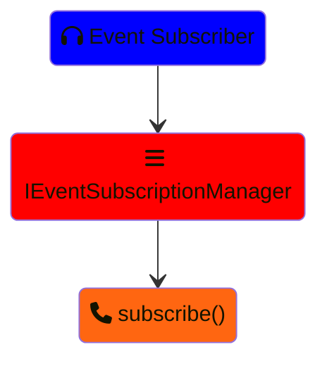

### Event Flow
---
#### Subscriber flow

```mermaid
---
config:
  title: Event Subscriber Flow Diagram
  class:
    theme: base
---
stateDiagram-v2
  classDef sub fill:#00f
  classDef evtsub fill:#f00
  classDef evtsub_sub fill:#f61

  sub: <i class="fas fa-headphones"></i> Event Subscriber
  evtsub: <i class="fas fa-bars"></i> IEventSubscriptionManager
  evtsub_sub:<i class="fas fa-phone"></i> subscribe()
  sub:::sub --> evtsub:::evtsub
  evtsub:::evtsub --> evtsub_sub:::evtsub_sub
```
---
&nbsp;
#### Publisher flow

```mermaid
---
config:
  title: Event Publisher Flow Diagram
  class:
    theme: base
---
stateDiagram-v2
  state if_external <<choice>>

  %% Color fills
  classDef pub fill:#00f
  classDef evtpub fill:#f00
  classDef evtpub_pub fill:#f51
  classDef ext fill:#080
  classDef int fill:#242
  classDef done fill:#717

  %% Aliases
  pub: <i class="fas fa-share"></i> Event Publisher
  pub2: <i class="fas fa-share"></i> Event Publisher
  evtpub: <i class="fas fa-envelope"></i> IEventPublicationManager
  evtpub2: <i class="fas fa-envelope"></i> IEventPublicationManager
  evtpub_pub:<i class="fas fa-download"></i> publish() (intra-service)
  evtpub_pub2:<i class="fas fa-download"></i> publish() (intra-service)
  if_ext: Is External?
  write_db: Create Event DB record
  send_ext_message: Send External Message (SQS)
  ext_service_recv: Call External Service endpoint (HTTP)
  de_serialize: Deserialize Event From DB

  %% States
  pub:::pub --> evtpub:::evtpub
  evtpub:::evtpub --> evtpub_pub:::evtpub_pub
  evtpub_pub:::evtpub_pub --> if_ext
  if_ext --> if_external
  if_external --> False:::int
  if_external --> True:::ext
  False --> complete
  True --> write_db:::ext
  write_db --> send_ext_message:::ext
  send_ext_message --> ext_service_recv:::ext
  ext_service_recv --> de_serialize:::ext
  de_serialize --> pub2:::pub
  pub2 --> evtpub2:::evtpub
  evtpub2 --> evtpub_pub2:::evtpub_pub
  evtpub_pub2 --> complete:::done
```