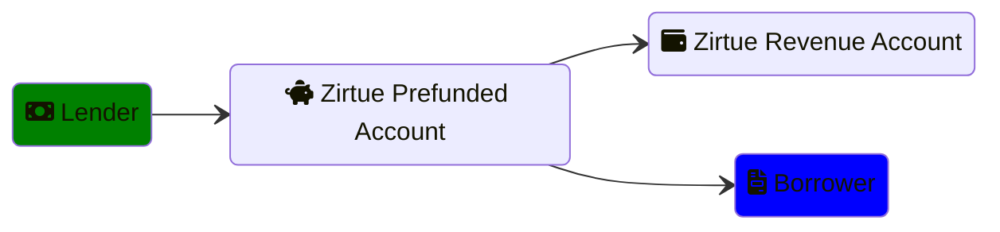
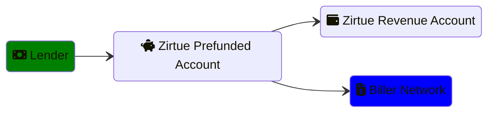

# Flow of funds

## Funding

### `Biller is Personal`

```mermaid
---
config:
  title: Flow of Funds
  class:
    theme: base
---

stateDiagram-v2
  direction LR
  classDef biller fill:#00f
  classDef lender fill:green

  zpre : <i class="fas fa-piggy-bank"></i> Zirtue Prefunded Account
  zrev : <i class="fas fa-wallet"></i> Zirtue Revenue Account
  Borrower: <i class="fas fa-file-invoice"></i> Borrower
  Lender : <i class="fas fa-money-bill"></i> Lender
  Lender:::lender --> zpre
  zpre --> zrev
  zpre --> Borrower:::biller
```
&nbsp;

&nbsp;
### `Biller is Biller Network (RPPS)`

```mermaid
---
config:
  title: Flow of Funds
  class:
    theme: base
---

stateDiagram-v2
  direction LR
  classDef biller fill:#00f
  classDef lender fill:green

  zpre : <i class="fas fa-piggy-bank"></i> Zirtue Prefunded Account
  zrev : <i class="fas fa-wallet"></i> Zirtue Revenue Account
  biller: <i class="fas fa-file-invoice-dollar"></i> Biller Network
  Lender : <i class="fas fa-money-bill"></i> Lender
  Lender:::lender --> zpre
  zpre --> zrev
  zpre --> biller:::biller
```
---
&nbsp;
## Disbursement