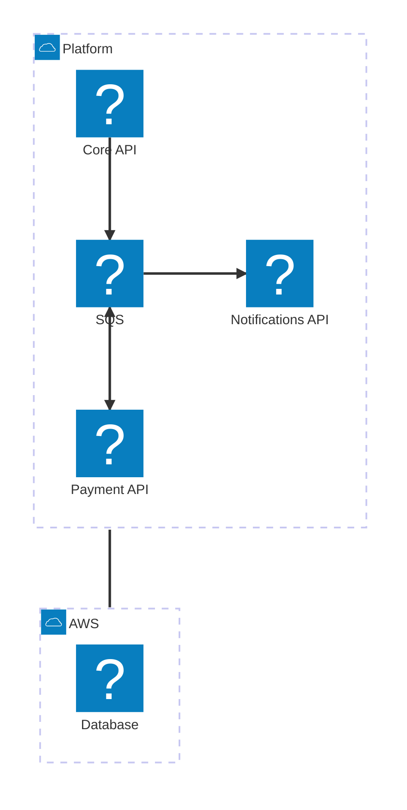

### High Level Architecture

```mermaid
---
config:
  padding: 50
  fontSize: 18
  useMaxWidth: true
---
architecture-beta
  group api(cloud)[Platform]
  service core(logos:aws-ec2)[Core API] in api
  service notifications(logos:aws-ec2)[Notifications API] in api
  service payment(logos:aws-ec2)[Payment API] in api
  service q(logos:aws-sqs)[SQS] in api
  
  core:B --> T:q
  payment:T <--> B:q
  notifications:L <-- R:q

  group shared(cloud)[AWS]
  service db(logos:aws-aurora)[Database] in shared

  payment{group}:B -- T:db{group}
```