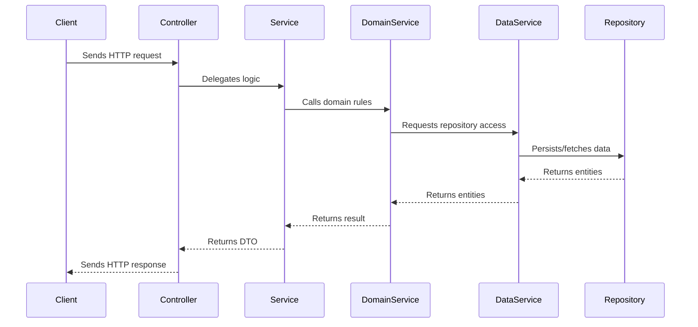

# Layered Architecture: Module → Controller → Service → Domain Service → DataService → Repository

This document describes the architectural layering used in the ZNG codebase, focusing on the flow and responsibilities from Module to Repository.

## Overview Diagram

> **Note:** The **Model** (domain entity) is the data structure returned by the Repository and passed through the DataService, Domain Service, Service, and sometimes Controller layers. The Model is not a layer itself, but the core business object that flows through these layers.

> **DataService:** The DataService is a thin abstraction that aggregates all repositories for a module. It is injected into Domain Services, which use it to access the necessary repositories (e.g., `this.data.users`, `this.data.loans`). The DataService itself does not contain business logic, but provides a convenient and type-safe way to access persistence operations.

---

## Layer Responsibilities

### 1. Module
- **Role:** Organizes related controllers, services, and domain services into a cohesive unit.
- **Responsibilities:**
  - Wires up dependencies and providers.
  - Defines feature boundaries and imports/exports.
  - Does not contain business or domain logic.

### 2. Controller
- **Role:** Handles HTTP requests and responses.
- **Responsibilities:**
  - Defines API endpoints and HTTP methods.
  - Validates and parses request data.
  - Delegates business logic to the Service layer.
  - Returns DTOs (Data Transfer Objects) as responses.

### 3. Service
- **Role:** Orchestrates application-specific business logic.
- **Responsibilities:**
  - Implements business logic for a feature.
  - Calls Domain Services for domain-specific rules or operations.
  - Calls Data Services to access repositories for persistence.
  - Remains thin—delegates domain logic to Domain Services.

### 4. Domain Service
- **Role:** Encapsulates complex domain logic and rules.
- **Responsibilities:**
  - Implements domain-specific rules, invariants, and operations.
  - Coordinates multiple entities or aggregates.
  - Remains independent of infrastructure (should not know about HTTP, database, etc.).
  - Returns domain interfaces, not DTOs.

### 5. DataService
- **Role:** Aggregates all repositories for a module and provides access to them.
- **Responsibilities:**
  - Exposes repositories as properties for use by Domain Services.
  - Does not contain business logic.
  - Provides a type-safe and convenient way to access persistence operations.

### 6. Repository
- **Role:** Abstracts the data access layer.
- **Responsibilities:**
  - Encapsulates all persistence logic for an entity or aggregate.
  - Provides CRUD operations and custom queries.
  - Returns domain entities or interfaces.
  - Hides ORM-specific details from upper layers.

---

## Flow Summary
1. **Client** sends an HTTP request to the **Controller**.
2. **Controller** receives the request, validates input, and calls the **Service**.
3. **Service** orchestrates the business logic, possibly calling one or more **Domain Services** for domain rules.
4. **Domain Service** performs domain logic, and when persistence is needed, calls the **DataService** (which exposes repositories).
5. **DataService** provides access to the appropriate **Repository**.
6. **Repository** performs the actual database operations and returns results up the stack.
7. **Controller** sends the HTTP response back to the **Client**.

---
