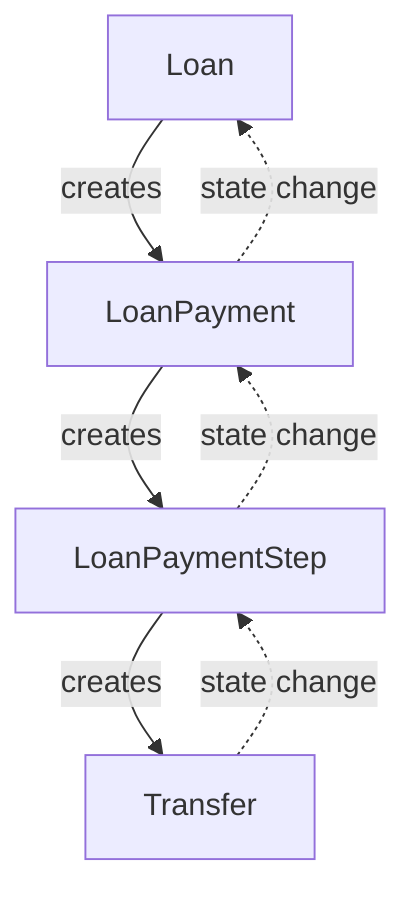
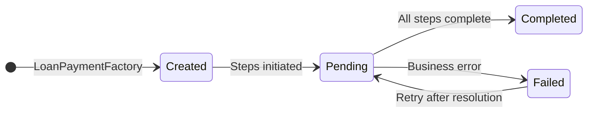
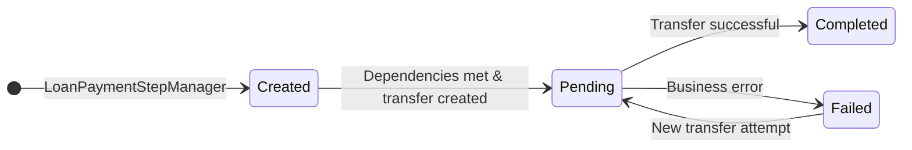
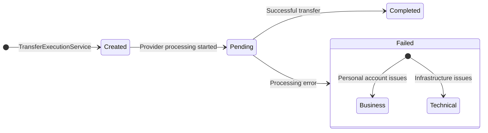

# Lending System Overview

This document provides a comprehensive overview of the ZNG lending and payments system, focusing on the core entities and their state management from loan acceptance through completion.

## System Architecture

The ZNG lending system follows a hierarchical payment processing architecture with four main entities:

- **Loan** - Manages the overall loan lifecycle and state transitions
- **LoanPayment** - Represents a specific payment within the loan lifecycle (funding, disbursement, repayment, etc.)
- **LoanPaymentStep** - Individual steps within a payment route, enabling complex multi-provider transfers
- **Transfer** - The actual fund transfer execution between payment accounts



## Loan States (From Accepted)

Once a loan is accepted by the target user, it progresses through the following operational states:

### Primary States
- **Accepted** → **Funding** → **Funded** → **Disbursing** → **Disbursed** → **Repaying** → **Repaid** → **Closed**

### Pause States
- **FundingPaused** - Funding process temporarily halted
- **DisbursingPaused** - Disbursement process temporarily halted  
- **RepaymentPaused** - Repayment process temporarily halted

### State Transition Rules
- **Accepted**: Validates payment accounts and moves to **Funding** when all prerequisites are met
- **Funding**: Lender transfers funds to Zirtue; moves to **Funded** when complete
- **Funded**: Funds ready for disbursement; moves to **Disbursing** when conditions are met
- **Disbursing**: Zirtue transfers funds to borrower/biller; moves to **Disbursed** when complete
- **Disbursed**: Funds successfully transferred; moves to **Repaying** to begin repayment schedule
- **Repaying**: Active repayment phase; uses "stepped" progression for multiple payments
- **Repaid**: All obligations satisfied; moves to **Closed** for finalization

### Loan State Stepping
The **Repaying** state supports "stepping" - progressing within the same state for multiple repayment payments without changing the overall loan state. This triggers creation of new repayment payments while maintaining the loan in **Repaying** status.

## Payment Types and Lifecycle

### Payment Types
- **Funding** - Lender → Zirtue
- **Disbursement** - Zirtue → Borrower/Biller  
- **Fee** - Lender → Zirtue (processing fees)
- **Repayment** - Borrower → Lender (via Zirtue)
- **Refund** - Reversal of previous payments

### Payment Flow Examples

#### Basic Flow
```
Loan Accepted → Funding → Disbursement → Repayment
                ↓
               Fee (parallel)
```

## LoanPayment States

### State Definitions
- **Created** - Payment entity created but not yet initiated
- **Pending** - Payment process in progress, awaiting step completion
- **Completed** - All payment steps successfully completed
- **Failed** - Payment failed due to business error requiring intervention

### Completion Reasons
When a payment reaches **Completed** state, it includes a completion reason:
- **Paid** - Normal successful payment
- **Forgiven** - Payment was forgiven/waived



## LoanPaymentStep States

Payment steps represent individual operations within a payment route. Complex payments may require multiple steps across different payment providers.

### State Definitions
- **Created** - Step created, waiting for dependencies
- **Pending** - Transfer execution in progress
- **Completed** - Step successfully completed
- **Failed** - Step failed due to business error

### Step Dependencies
Steps can specify dependencies using:
- **awaitStepId** - Reference to prerequisite step
- **awaitStepState** - Required state of prerequisite step before proceeding



## Transfer States

Transfers represent the actual fund movement between payment accounts and are the lowest level in the hierarchy.

### State Definitions
- **Created** - Transfer record created but not yet executed
- **Pending** - Transfer submitted to payment provider, processing
- **Completed** - Funds successfully transferred
- **Failed** - Transfer failed (both business and technical errors)

### Error Handling
- **Business Errors** - Issues with personal accounts; propagate up the hierarchy causing payment/loan pauses
- **Technical Errors** - Infrastructure/provider issues; only affect the transfer, retry automatically



## Payment Route System

Complex payments may require multiple steps across different payment providers. The Payment Route System determines the necessary steps:

### Route Determination Factors
- Source payment account (type, ownership, provider)
- Destination payment account (type, ownership, provider)  
- Loan configuration (type, stage)

### Example Multi-Step Payment
**Lender (Checkbook ACH) → Borrower (Fiserv Debit)**
1. **Step 1**: Lender Account → Zirtue Internal ACH
2. **Step 2**: Zirtue Internal Debit → Borrower Account

Each step creates its own Transfer, allowing for proper tracking and state management across providers.

## State Machine Interactions

### Step-Transfer State Matrix
The system uses a state machine approach where LoanPaymentStep managers react to Transfer state changes:

| Step State | Transfer Created | Transfer Completed | Transfer Failed | Transfer Pending | Transfer Not Found |
|------------|------------------|--------------------|-----------------|-----------------|--------------------|
| **Created** | → Pending | Exception | Exception | → Pending | Create transfer → Pending |
| **Pending** | Validate retry | → Completed | → Failed | No action | Exception |
| **Completed** | Exception | Exception | Exception | Exception | Exception |
| **Failed** | Validate retry | Exception | Exception | No action | Exception |

### Event-Driven Processing
The system uses events to coordinate state changes:
- **Transfer state changes** trigger **LoanPaymentStep** advancement
- **LoanPaymentStep completion** triggers **LoanPayment** advancement  
- **LoanPayment completion** triggers **Loan** state progression
- **Loan state stepping** triggers new payment creation

## Key Components

### State Managers
- **Loan State Managers** - Handle loan state transitions (AcceptedLoanStateManager, FundingLoanStateManager, etc.)
- **Payment Managers** - Manage payment lifecycle (FundingManager, DisbursementManager, RepaymentManager)
- **Step Managers** - Handle step state transitions (CreatedStepManager, PendingStepManager, etc.)

### Domain Services
- **LoanDomainService** - Core loan operations and state management
- **PaymentDomainService** - Payment and step operations
- **ManagementDomainService** - Coordinates payment/step advancement
- **TransferExecutionService** - Executes actual fund transfers

### Routing Services
- **PaymentRouter** - Determines required payment steps based on account types and providers
- **LoanPaymentFactory** - Creates appropriate payment managers based on payment type
- **LoanPaymentStepFactory** - Creates appropriate step managers based on step state

## Error Handling Philosophy

### Business vs Technical Errors
- **Business Errors**: Issues requiring user intervention (invalid accounts, insufficient funds)
  - Cause immediate state transitions to **Failed** states
  - Propagate up the hierarchy causing loan pauses
  - Require manual resolution before retry

- **Technical Errors**: Infrastructure/provider issues  
  - Keep higher-level entities in **Pending** state
  - Only affect the Transfer entity
  - Automatically retried without user intervention
