### Loan Domain (WIP)


## Entities Relationship

**Relationship Explanation:**

- **Loan** connects to **ApplicationUser** twice: once as a **lender**, once as a **borrower**.
- **Loan** references a **Biller**.
- **Loan** references **PaymentAccount** (for both lender and borrower accounts).
- **Loan** has a collection of **LoanPayments**.
- **LoanInvitee** references **Loan**.
- **LoanPayment** references **Loan** and has a collection of **Transfers**.
- **Transfer** references **PaymentAccount** for its source/destination, and an (optional) **LoanPayment**.
- **PaymentAccount** belongs to **ApplicationUser** (the account owner).
- **Biller** references **ApplicationUser** as the creator (createdBy).

---

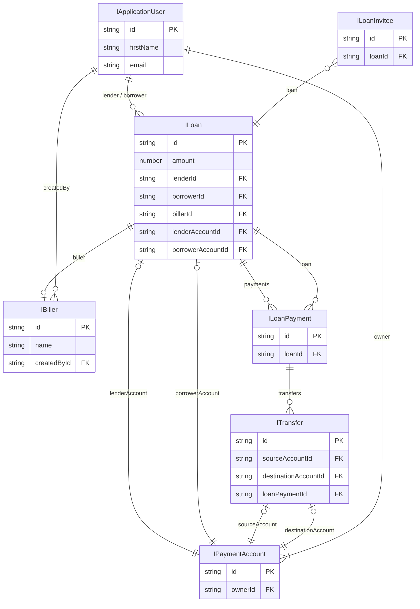

---


## Loan States
### General information
  - **Created**: Loan initial information provided (amount, plan, type), optional - Biller info
  - **Requested**: (Borrower side) Borrower provided payment method information, waiting to set target User
  - **Offered**: (Lender side) Lender provided payment method information, waiting to set target User
  - **BorrowerAssigned**: Loan Offer has Borrower User assigned
  - **LenderAssigned**: Loan Request has Lender User assigned
  - **Accepted**: Target User Accepted the Loan
  - **Funding**: Funds transfer from Lender to Zirtue started
  - **FundingPaused**: Funds transfer from Lender to Zirtue paused
  - **Funded**: Funds transfer from Lender to Zirtue completed
  - **Disbursing**: Funds transfer from Zirtue to Borrower \ Biller started
  - **DisbursingPaused**: Funds transfer from Zirtue to Borrower \ Biller paused
  - **Disbursed**: Funds transfer from Zirtue to Borrower \ Biller completed
  - **Repaying**: Borrower started to repay the loan
  - **RepaymentPaused**: Borrower paused the repayment
  - **Repaid**: Borrower repaid Loan
  - **Closed**: Loan is closed

  ```mermaid
  flowchart TD
    Created
    Requested
    Offered
    BorrowerAssigned
    LenderAssigned
    Accepted
    Funding
    FundingPaused
    Funded
    Disbursing
    DisbursingPaused
    Disbursed
    Repaying
    RepaymentPaused
    Repaid
    Closed

    Created -- "Borrower submits request" --> Requested
    Created -- "Lender submits offer" --> Offered

    Requested -- "Set Lender User" --> LenderAssigned
    Offered -- "Set Borrower User" --> BorrowerAssigned

    LenderAssigned -- "Target User accepts" --> Accepted
    BorrowerAssigned -- "Target User accepts" --> Accepted

    Accepted --> Funding
    Funding -- "Complete" --> Funded
    Funding <-- "Pause / Resume" --> FundingPaused

    

    Funded --> Disbursing
    Disbursing <-- "Pause / Resume" --> DisbursingPaused
    Disbursing -- "Complete" --> Disbursed

    Disbursed --> Repaying
    Repaying <-- "Pause / Resume" --> RepaymentPaused
    Repaying -- "Repayment complete" --> Repaid

    Repaid --> Closed
  ```


  ## LoanPayments, LoanPaymentSteps and Transfers

  ### Payment Hierarchy Overview
  
The loan payment system follows a hierarchical structure where each layer is responsible for a specific aspect of the payment process:

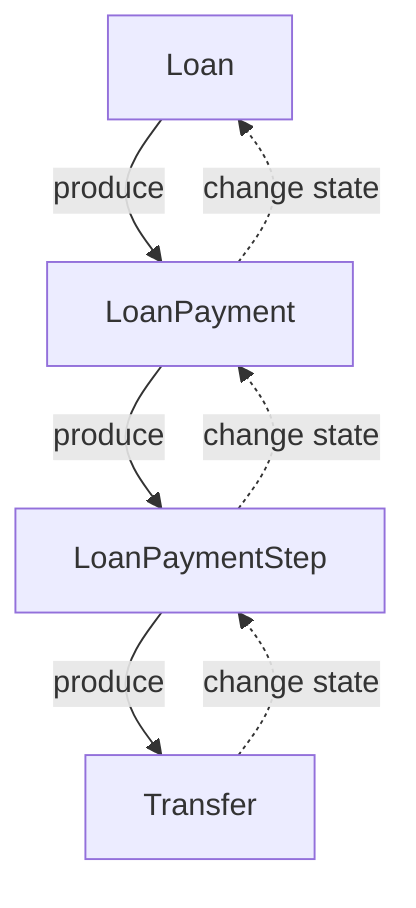

For each layer there are the following rules:
- Layer entry creation is controlled by the previous layer if it exists
- Layer entry state might be a result of next layer state change if it exists or the layer itself might change the state
- No creation or state change is possible by skipping the layer

### LoanPayment
**LoanPayment** - Entity that reflects a certain payment from the Loan lifecycle. During `Funding`, `Disbursing`, and `Repaying` states of the **Loan**, Zirtue executes funds transfers between **Lender**, **Borrower**, **Biller** and **internal accounts**. LoanPayments track such funds transfers which are started, failed or completed successfully. LoanPayments won't be created for scheduled in advance payments to keep data transparent.

Here is the updated structure of LoanPayment:

```typescript
interface ILoanPayment {
  /** UUID */
  id: string;

  /** The amount of payment */
  amount: number;

  /** Id of the Loan that keeps this payment */
  loanId: string; 

  /** Loan Entity */
  loan: ILoan; 

  /** Reflects the Payment Index for Loan Repayments.
   * `null` while Loan is not in Repayment state.
   */
  paymentIndex: number | null;

  /** Shows for what Loan lifecycle Payment is assigned
   * `funding` - Lender transfers funds to Zirtue
   * `disbursement` - Zirtue transfers funds to Biller
   * `fee` - Lender pays Zirtue fee
   * `repayment` - Borrower repays Lender
   * `refund` - Performing refund for the payment
   */
  type: LoanPaymentType;

  /** Indicates current state of the Loan Payment.
   * `created` - Payment is created but not yet initiated
   * `pending` - Payment is executed but not completed yet
   * `completed` - Payment was executed successfully
   * `failed` - Payment was not executed successfully due to some error
   */
  state: LoanPaymentState;

/**
 * Indicates what was the reason of marking LoanPayment as 'completed':
 * `paid` - Payment was executed successfully
 * `forgiven` - Payment was forgiven
 * `skipped` - Payment was skipped
 * `not_completed` - Payment was not completed yet (Default)
*/
  completionReason: LoanPaymentCompletionReason;

  createdAt: Date;
  updatedAt: Date | null;

  /** What date Loan Payment was executed last time. 
   * Should be the same with `originalExecutionDate` if it is first execution attempt, 
   * otherwise - should contain the date of latest re-attempt */
  executionDate: Date;

  /** Date for which Loan Payment was originally scheduled */
  originalExecutionDate: Date;

  /**
   * Collection of LoanPaymentSteps that are part of this Loan Payment.
   * Each Step represents a specific transfer segment in the payment route.
   */
  steps: ILoanPaymentStep[];
}
```

Notable changes:
- Removed the `stage` property as it's now handled by the LoanPaymentStep layer
- Removed direct reference to `transfers` as they are now accessed through LoanPaymentSteps
- Added `steps` property which contains LoanPaymentSteps

### LoanPaymentStep
**LoanPaymentStep** - Entity that represents a single step in the payment route chain. Multiple steps may be required to complete a single LoanPayment, especially when transfers involve different payment providers or account types.

```typescript
interface ILoanPaymentStep {
  /** UUID */
  id: string;
  
  /** Reference to the parent LoanPayment */
  loanPaymentId: string;

  /**
   * Integer order number of the step.
   * Starts with 0.
   */
  order: number;

  /** Payment Step transfer amount. Typically the same as Loan Payment amount */
  amount: number;
  
  /** FK to Payment Account from which transfer will be performed */
  sourcePaymentAccountId: string;
  
  /** FK to Payment Account to which transfer will be performed */
  targetPaymentAccountId: string;

  /**
   * Collection of Transfers that are part of this Loan Payment Step.
   * Ideally contains only one Transfer.
   * If Transfer failed and re-attempt happened - new Transfer will be referenced to the same Step.
   */
  transfers: ITransfer[] | null;

  /**
   * Current state of the Payment Step:
   * 'created' - Step is created but transfers not yet initiated
   * 'pending' - Step's transfer is in progress
   * 'completed' - Step was completed successfully
   * 'failed' - Step failed due to transfer error
   */
  state: PaymentStepState;

  /**
   * Indicates what state of the preceding step to wait for before proceeding:
   * 'none' - Do not wait for previous steps (default for first step)
   * 'confirmation' - Wait for previous step to be confirmed
   * 'completion' - Wait for previous step to be completed
   */
  awaitStepState: PaymentStepState;
  
  /**
   * Reference to the previous step that must reach awaitStepState before this step can proceed.
   * If null, will use the step with (order-1)
   */
  awaitStepId: string | null;
}
```

LoanPaymentSteps are an important addition that enable complex payment routes involving multiple transfers, potentially across different payment providers. They provide better tracking and management of the payment process.

### Transfers
**Transfer** Entity defines an explicit transfer of funds `amount` from `source` to `target` with as few extra references as possible. This maintains flexibility for funds transfer flows and allows the **Payments** microservice to execute transfers independently.

```typescript
interface ITransfer {
  /** UUID */
  id: string;

  /** FK to LoanPaymentStep */
  loanPaymentStepId: string | null;

  /** Transfer amount */
  amount: number;

  /**
   * Current Transfer state:
   * `created` - Transfer is created but not yet initiated
   * `pending` - Transfer is executed but not completed yet
   * `completed` - Transfer was executed successfully
   * `failed` - Transfer was not executed successfully due to some error
   */
  state: TransferState;

  /** Error data if Transfer failed */
  errorData: string | null;

  createdAt: Date;
  updatedAt: Date | null;

  /** Source payment account ID */
  sourceAccountId: string;
  
  /** Source payment account (relation) */
  sourceAccount: IPaymentAccount;

  /** Destination payment account ID */
  destinationAccountId: string;
  
  /** Destination payment account (relation) */
  destinationAccount: IPaymentAccount;
}
```

Key changes:
- Removed direct reference to `loanPayment` as transfers are now linked to LoanPaymentSteps
- Added optional `loanPaymentStepId` to link transfers to their respective steps. This field is optional due to support payements re-routing
- Removed Payment Account Types as they are presented in referenced PaymentAccounts
- Reference to `sourceAccount` and `destinationAccount` are not nullable now as all internal and external Payment Accounts are required to be linked to the Transfer
- The transfer is now a more generic entity that can be used for any funds transfer

### Example Payment Flow

> TODO: Review one more time for accuracy
Let's examine a Direct Bill Pay Loan with multiple payment steps:

```typescript
// Loan Payment: Funding (Lender to Zirtue using Checkbook ACH)
{
  id: 'loan-payment-1',
  amount: 1000,
  loanId: 'loan-uuid',
  paymentIndex: null,
  type: 'funding',
  state: 'completed',
  completionReason: 'paid',
  steps: [
    {
      id: 'payment-step-1',
      loanPaymentId: 'loan-payment-1',
      order: 0,
      amount: 1000,
      sourcePaymentAccountId: 'lender-account',
      targetPaymentAccountId: 'zirtue-internal-ach',
      state: 'completed',
      transfers: [{ id: 'transfer-1', amount: 1000, state: 'completed', /*...*/ }]
    }
  ]
},

// Loan Payment: Fee
{
  id: 'loan-payment-2',
  amount: 30,
  loanId: 'loan-uuid',
  paymentIndex: null,
  type: 'fee',
  state: 'completed',
  completionReason: 'paid',
  steps: [
    {
      id: 'payment-step-2',
      loanPaymentId: 'loan-payment-2',
      order: 0,
      amount: 30,
      sourcePaymentAccountId: 'lender-account',
      targetPaymentAccountId: 'zirtue-fee-account',
      state: 'completed',
      transfers: [{ id: 'transfer-2', amount: 30, state: 'completed', /*...*/ }]
    }
  ]
},

// Loan Payment: Disbursement (Zirtue to Biller using Checkbook ACH)
{
  id: 'loan-payment-3',
  amount: 1000,
  loanId: 'loan-uuid',
  paymentIndex: null,
  type: 'disbursement',
  state: 'completed',
  completionReason: 'paid',
  steps: [
    {
      id: 'payment-step-3',
      loanPaymentId: 'loan-payment-3',
      order: 0,
      amount: 1000,
      sourcePaymentAccountId: 'zirtue-internal-ach',
      targetPaymentAccountId: 'biller-account',
      state: 'completed',
      transfers: [{ id: 'transfer-3', amount: 1000, state: 'completed', /*...*/ }]
    }
  ]
},

// Loan Payment: Repayment #1 (Complex multi-step flow: Borrower with Fiserv Debit -> Lender with Checkbook ACH)
{
  id: 'loan-payment-4',
  amount: 333.33,
  loanId: 'loan-uuid',
  paymentIndex: 0,
  type: 'repayment',
  state: 'completed',
  completionReason: 'paid',
  steps: [
    // Step 1: Borrower Debit -> Zirtue Debit
    {
      id: 'payment-step-4-1',
      loanPaymentId: 'loan-payment-4',
      order: 0,
      amount: 333.33,
      sourcePaymentAccountId: 'borrower-debit',
      targetPaymentAccountId: 'zirtue-debit',
      state: 'completed',
      awaitStepState: 'none',
      awaitStepId: null,
      transfers: [{ id: 'transfer-4-1', amount: 333.33, state: 'completed', /*...*/ }]
    },
    // Step 2: Zirtue ACH -> Lender ACH (waits for step 1 to complete)
    {
      id: 'payment-step-4-2',
      loanPaymentId: 'loan-payment-4',
      order: 1,
      amount: 333.33,
      sourcePaymentAccountId: 'zirtue-ach',
      targetPaymentAccountId: 'lender-ach',
      state: 'completed',
      awaitStepState: 'completion',
      awaitStepId: 'payment-step-4-1',
      transfers: [{ id: 'transfer-4-2', amount: 333.33, state: 'completed', /*...*/ }]
    }
  ]
}
```

The example demonstrates how the new structure supports:
1. Simple single-step payments (funding, fee, disbursement)
2. Complex multi-step payments (repayment) that require intermediate accounts
3. Dependencies between steps with the await mechanism

### Payment Route Determination

The **Loan Payments Router** is responsible for determining the payment steps required to complete a payment. It takes into account:

1. Source payment account properties (type, ownership, provider)
2. Destination payment account properties (type, ownership, provider)
3. Loan configuration (type, stage)

The router returns a route consisting of one or more steps, which are then used to create the LoanPaymentSteps.

Routes and RouteSteps are pre-defined in the database to support various payment flow combinations without requiring thousands of individual route definitions.

### Payment Processing Services

The payment processing is managed by several specialized services:

1. **LoanPaymentFactory** - Creates LoanPayment entities based on loan lifecycle stage
2. **LoanPaymentStepManager** - Creates and manages LoanPaymentSteps
3. **TransferExecutionService** - Executes actual transfers and monitors their state

These services ensure proper coordination between the different layers of the payment process, maintaining the state transitions from Transfer through LoanPaymentStep to LoanPayment, and finally to Loan.

  ---

  # Loan Payments Processing

## Loan lifecycle parts
**Loan lifecycle part** - a group of Loan lifecycle states gathered together by the same purpose. For example `Funding` in the Loan lifecycle is a group of states that are required to be completed in order to have the Loan funded.

Main payments-related Loan lifecycle parts:
- `Funding`
  - Funding
  - FundingPaused
  - Funded
  - ? FundingError
- `Disbursement`
  - Disbursing
  - DisbursingPaused
  - Disbursed
  - ? DisbursementError
- `Repayment`
  - Repaying
  - RepaymentPaused
  - Repaid
  - ? RepaymentError

Side payments-related Loan lifecycle parts (not decided yet are they required to be separated):
- `Fee`
  - Fee
  - FeePaused
  - FeeCompleted
  - ? FeeError
- `Refund`
  - Refund
  - RefundPaused
  - RefundCompleted
  - ? RefundError
 

## Hierarchy and Logic of Payment-related Entities

For each layer there are following rules:
- `Layer entry creation is controlled by the previous layer if exists`
- `Layer entry state might be result of next layer state change if exists or layer itslef might change the state`
- `No creation or state change is possible by skipping the layer`

TBD: Description of how state changes are handled in the system. The design and explanation of how BE decides that:
- Loan should move further in state
- LoanPayment should move further in state
- LoanPaymentStep should move further in state
- Transfer should move further in state

### Loan
> Controls general loan information and configuration

Created and controlled by:
- **LoanService**
- **LoanDomainService**

Actions:
- **Calls [PaymentRouter](./loan-payment-flows.md#loan-payments-router)** before switching to further lifecycle state part
  - Calls Router each time when new `Repayment` Payment is scheduling
  - Calls Router once other lifecycle state part is comming
  - Validates that Route found
- **Calls `LoanPaymentFactory` to create and initiate relevant `LoanPayment`** on own major state change
  - Also provide **PaymentRoute** `PK` 

### LoanPayment
> Controls payment information on lifecycle level (`One LoanPayment per Loan lifecycle part, multiple for Repayment`).

*Not all Loan lifecycle parts involves LoanPayment though* - it is designed that one **LoanPayment** will be created for each of the payments-related Loan lifecycle parts. But it is not required to have a separate **LoanPayment** for each of the states inside the part. For example - `Funding` part can be represented by single **LoanPayment** with internal state which represents the completeness of the part.

> TODO: Write down Factory methods (including how it should react to signals)

Created and controlled by **LoanPaymentFactory**. Factory, depending on the `Loan lifecycle part` (**Funding**, **Disbursement**, **Repayment**, **Fee**, **Refund**) will return the specific **LoanPaymentManager** instance:
  - **FundingManager**
  - **DisbursementManager**
  - **RepaymentManager**
  - **FeeManager**
  - **RefundManager**

While each **LoanPaymentManager** will provide certain, lifecycle-specific functionality, all of them will implement the following methods:
- `initiate()`
  - Checks the existance of **LoanPayment** for the current **Loan** and **Loan lifecycle part** to prevent duplicates
  - Creates **LoanPayment** if it does not exist
  - Gets **PaymentRoute** by provided `PK` to generate the list of **LoanPaymentSteps** for the current **LoanPayment**
    - If the list is empty - throws an error that **LoanPayment** could not be routed
    - (`Funding specific`) If list contains one **LoanPaymentStep** - completes **Funding** part without execution (*if `Funding + Disbursement` could be managed through single transfer - we make **null**-ish **Funding** and one-transfer **Disbursement***)
    - (`Funding + Disbursement specific`) if **LoanPayment** routes with multiple steps - we take `N-1` steps for `Funding` and only last step for `Disbursement`
- `advance()`
  - Reacts to **LoanPaymentStep** 'signals' (ex. events) and updates **LoanPayment** state and other informational fields accordingly
  - If recieves a signal that **LoanPaymentStep** is completed - checks if all requirements are met:
    - If all **LoanPaymentSteps** are completed - completes **LoanPayment**
    - If not all **LoanPaymentSteps** are completed - updates **LoanPayment** state and information accordingly
- `complete()`
  - Completes **LoanPayment** if all **LoanPaymentSteps** are completed and send a signal to **Loan** to move forward in the lifecycle


### LoanPaymentStep
> Controls payment information on **Transfer Execution** level (`One LoanPaymentStep per Transfer Execution` in positive-case scenario when no re-attempts are required).

Single **LoanPayment** can be represented by multiple **LoanPaymentSteps** - it is required to have a separate **LoanPaymentStep** for each of the transfers that are executed. For example - `Funding` part can be represented by single **LoanPayment** with multiple **LoanPaymentSteps**.

The number of **LoanPaymentSteps** is dictated by the [Payment Route](./loan-payment-flows.md#loan-payments-router) that is used to generate chain of transfers definitions. For example - if `Lender` has `Checkbook ACH` account while `Borrower` has `Fiserv Debit Card` account - to process `Lender -> Borrower` **Payment** it should be done in two `Payment Steps`.

Created and controlled by **LoanPaymentStepManager**:
- `createRoute()`
  - In bulk creates **LoanPaymentSteps** for the current **LoanPayment**
- `createStep()`
  - (potential special-casing) Creates a single **LoanPaymentStep** for the current **LoanPayment**
- `execute()`
  - Creates(`!`) and executes(`?`) **Transfer** for the current **LoanPaymentStep**
  - Updates **LoanPaymentStep** state and other informational fields accordingly
- `update()`
  - Updates **LoanPaymentStep** state and other informational fields accordingly
- `complete()`
  - Completes **LoanPaymentStep** if all requirements are met and sends a signal to **LoanPayment**

Currently **LoanPaymentStep** do not require being uniquely processed depending on the **LoanPayment** type. As it goes from the definition - **LoanPaymentStep** is more like a wrapper ontop of **Transfer** where certain extended logic applied. That helps to keep real **Transfer** processing being separated from the **LoanPaymentStep** logic and namespace.

### Transfer
> Controls transfer information on execution level (`One Transfer per LoanPaymentStep` in positive-case scenario when no re-attempts are required)

Created by **LoanPaymentStepManager** (at least for **LoanPaymentStep** related transfers)

Controlled by **TransferExecutionService** which stays outside of the `Core` namespace and placed in `Payments` project:
- `execute()`
  - Executes transfer for the current **Transfer**
  - Updates **Transfer** state and other informational fields accordingly
  - Sends a signal that **Transfer** is executing
- `update()`
  - Updates **Transfer** state and other informational fields accordingly
  - Sends a signals that **Transfer** is updated to certain state
- `complete()`
  - Completes **Transfer** if all requirements are met and sends a signal to **LoanPaymentStep**

**TransferExecutionService** based on the **Transfer** configuration calls **PaymentExecutionFactory** to select the proper **PaymentProvider** interation, like:
- **CheckbookPaymentProvider**
- **FiservPaymentProvider**
- **TabapayPaymentProvider**
- etc.

**PaymentProvider** executes the transfer and returns the result back to **TransferExecutionService** which updates the **Transfer** state and sends a signal to **LoanPaymentStep**.

## Layers Communication
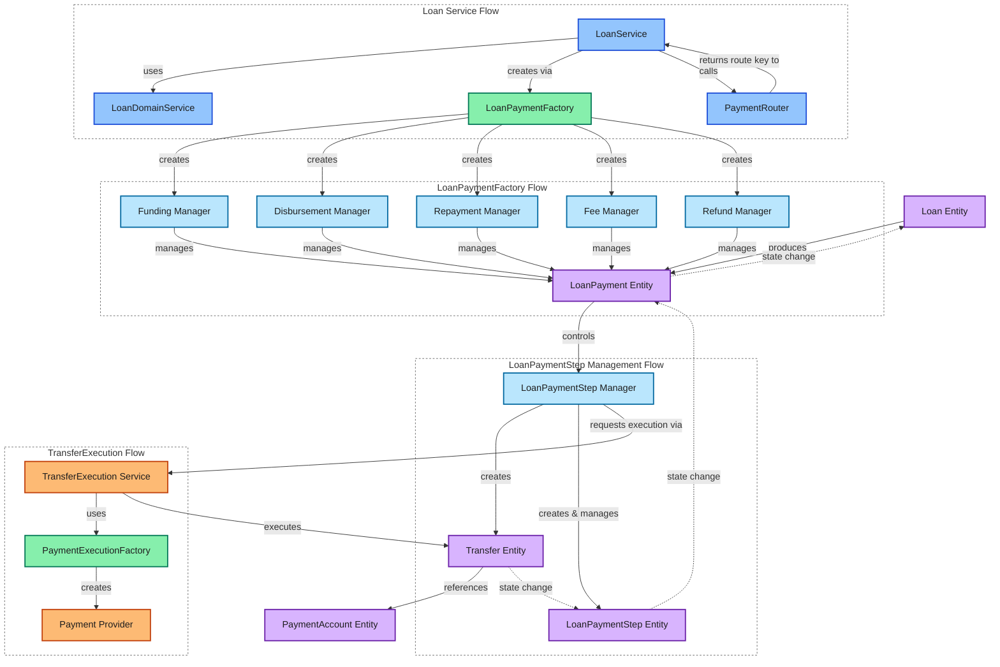

## Loan Payments States

### States Definitions

- **LoanPayment**:
  - `created` - LoanPayment is created but not yet initiated
  - `pending` - LoanPayment is initiated but not completed yet
  - `completed` - LoanPayment was executed successfully
  - `failed` - LoanPayment was not executed successfully due to some error
- **LoanPaymentStep**:
  - `created` - LoanPaymentStep is created but not yet initiated
  - `pending` - LoanPaymentStep is initiated but not completed yet
  - `completed` - LoanPaymentStep was executed successfully
  - `failed` - LoanPaymentStep was not executed successfully due to some error
- **Transfer**:
  - `created` - Transfer is created but not yet initiated
  - `pending` - Transfer is executed but not completed yet
  - `completed` - Transfer was executed successfully
  - `failed` - Transfer was not executed successfully due to some error

As you can see - the states are similar for all three entities. The difference is in the level of abstraction and the context in which they are used. By this the process of state change is similar for all three entities and do not bring any additional complexity to the system.

For **LoanPayment** and **LoanPaymentStep** only `completed` is terminating state. For **Transfer** it is `completed` and `failed` states that are terminating. The reason for this is that **Transfer** can be re-attempted while **LoanPayment** and **LoanPaymentStep** are supposed to be completed as a final result of the process - *Loan can not move forward in the lifecycle if **LoanPayment** is not completed. The same applies to **LoanPaymentStep** - it can not be completed if **Transfer** is not completed*.

To include cases when certain Payments might be Forgiven (in `Repayment`) or Loan might have zero-payments stage (e.g. `Funding` with no payments when same provider is used for both Lender and Borrower and `Funding + Disbursement` might be completed within one Transfer) we have field `completionReason` in **LoanPayment**. This field allows to have **LoanPayment** being completed by special cases like forgiveness or skipping the payment.

### Changing States

The state transitions for payment-related entities follow a consistent pattern, but with specific behaviors at each level of the payment hierarchy. The diagrams below illustrate how each entity transitions between states and the conditions that trigger these transitions.

#### LoanPayment State Transitions

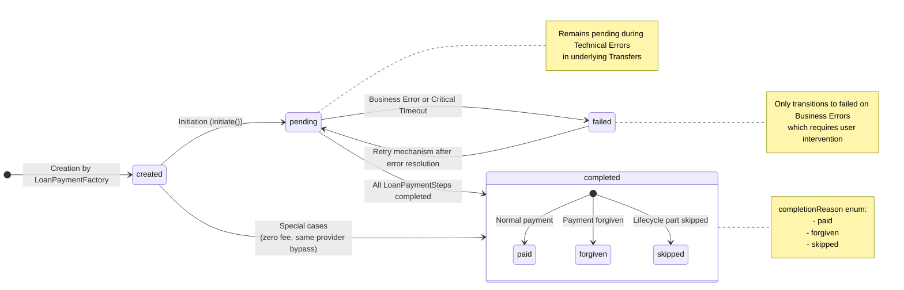

#### LoanPaymentStep State Transitions

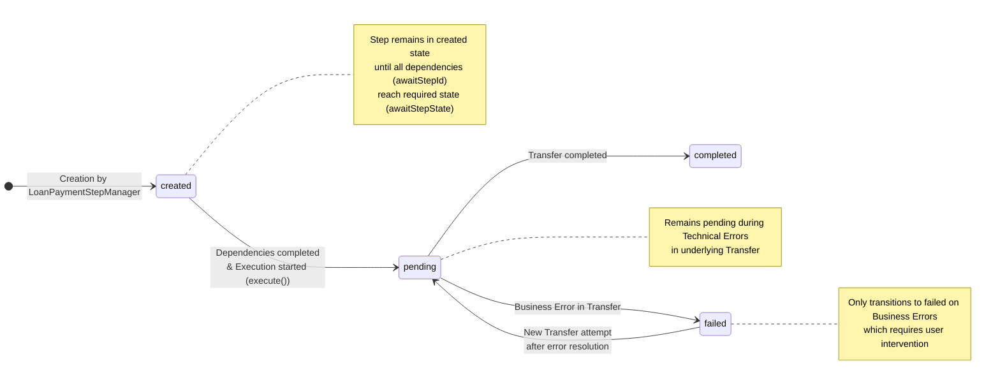

#### Transfer State Transitions

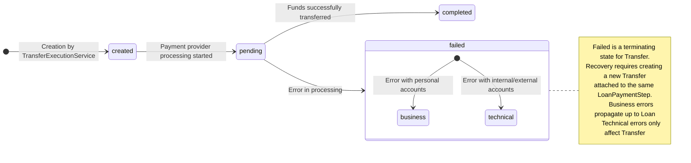

### State Transition Dependencies

The state transitions across these entities follow a hierarchical pattern:

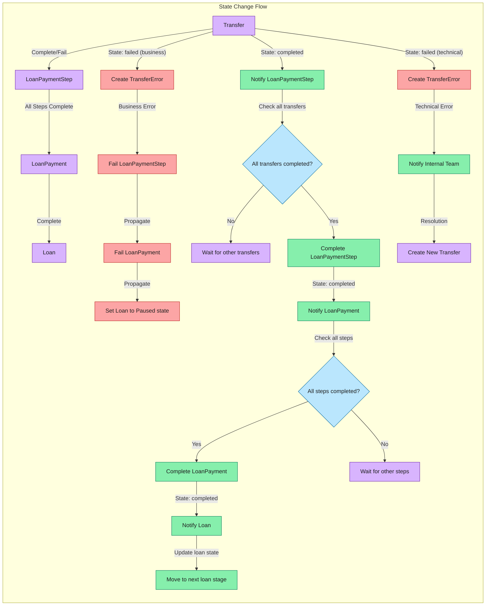

### On Error States

#### Error states philosophy
Within payments processing we have two types of errors:
1. **Business errors** - errors that are expected and handled by the system. For example - `Transfer` failed due to insufficient funds on the personal source account. In this case we can retry the transfer or notify the user about the error.
2. **Technical errors** - errors that are unexpected and should be handled by the system. For example - `Transfer` failed due to network error or timeout. In this case we should retry the transfer and notify internal team about the error to be tracked.

When **Business Error** happen - User should be aware what happened and what should be done. In this case we should notify the User about the error and provide a way to resolve it. For example - `Transfer` failed due to insufficient funds on the personal source account. In this case we can retry the transfer or notify the user about the error.

When **Technical Error** happen - User should not be aware what happened and what should be done. In this case we should retry the transfer and notify internal team about the error to be tracked. When error is addressed there should be a way to retry the transfer and continue the process.

That being said - **Business Error** changes states (to `failed`) upfront to the **Loan** and set its state to one of the `pause` accordingly to current lifecycle part. **Technical Error** should not change the state of the entities except **Transfer** itself - all higher-level entities remains `pending`.

#### Cases for Business and Technical Errors
##### Business Error
- `source in ['personal' -> anywhere]`
  - `insufficient_funds` - Insufficient funds on the source account
  - `invalid_account` - Invalid source account
  - `account_closed` - Source account is closed
  - `account_blocked` - Source account is blocked
  - `account_not_found` - Source account not found
  - `account_not_supported` - Source account not supported
  - etc
- `target in [anywhere -> 'personal']`
  - `invalid_account` - Invalid target account
  - `account_closed` - Target account is closed
  - `account_blocked` - Target account is blocked
  - `account_not_found` - Target account not found
  - `account_not_supported` - Target account not supported
  - etc

As you might see the Business Error might occur only on the `personal` accounts. The reason for this is that we do not have control over the personal accounts and we can not guarantee that they are valid. 

##### Technical Error
**Technical Error** - is an **Transfer** Error which happened during the execution of the transfer between `internal` or `external` accounts. The error might be caused by the following reasons:
- `network_error` - Network error
- `timeout` - Timeout error
- `provider_error` - Payment provider error
- `internal_error` - Internal error
- `unknown_error` - Unknown error
- etc

##### Technical Error Special Cases
Also there are two cases of Error where the reason of the Error is `internal` or `external` account (means it is **Technical Error**) but other side of the **Transfer** is `personal` account. These cases are:
- `source 'personal' -> target 'internal'/'external'`
  - First step of `Funding` in multi-step **LoanPayment**
  - `Fee` payment 
  - First step of `Repayment` in multi-step **LoanPayment**
- `source 'internal'/'external' -> target 'personal'`
  - `Disbursement` payment in Loan where Borrower/Biller has `personal` account
  - Last step of `Repayment` in multi-step **LoanPayment**

#### TransferError Entity
To handle the errors we have `TransferError` entity which is created when the **Transfer** fails. The `TransferError` entity contains the following fields:
```typescript
interface ITransferError {
  id: string; // UUID

  transferId: string; // FK to Transfer
  loanId: string; // FK to Loan

  // TODO: Block below is TBD
  // Main purposes are:
  // 1. Highlight is it business or technical error
  // 2. Give enhough description about what happened in short manner
  type: TransferErrorType; // Type of the error: 'business' or 'technical'
  issuerAccountType: PaymentAccountType; // Type of the account which caused the error
  code: TransferErrorCode; // Enum of the error code

  displayMessage: string; // Message to be displayed to the user / team

  createdAt: Date; // Date of the error

  raw: string; // Raw error data from the provider. TODO: Maybe more typped than just string
}
```

To have the explicit way of identifying that is currently Loan has an error or not we extend `ILoan` with new fields:
```typescript
interface ILoan {
  currentError: ITransferError | null; // Current error of the Loan
  retryCount: number; // Number of retries for the Loan. Includes only errors reasoned by personal accounts
}
```
while Loan has `currentError` - it is not possible to move forward in the lifecycle. The `currentError` should be cleared when the error is resolved and the process is continued.

#### TransferError Effects on Entities

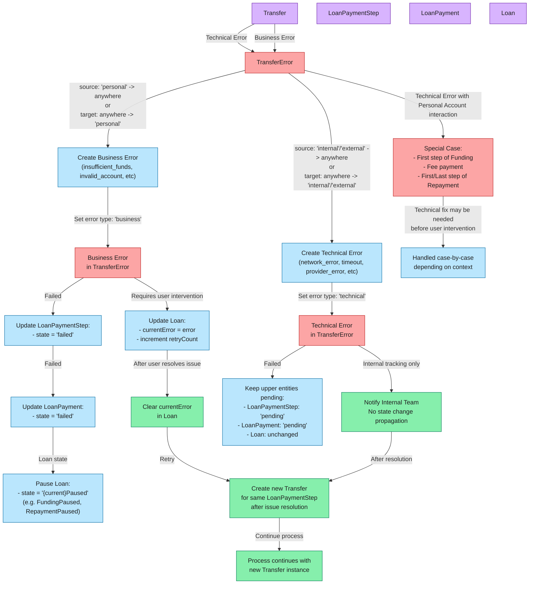

## Loan Payment Events

### Why Payment Events?
Due to the variety of way how different Payment Providers work and how they response about transfer state we need to have a way to handle all of the possible cases. Some Payment Providers resposnes immediatly with the transfer state, some of them have a webhook which notifies us about the transfer state and some of them even do this via files. To handle all of these cases we need to have a way to process the updates and align the state of the transfer accordingly.

As LoanPaymentStep state relies on the Transfer state, LoanPayment state relies on the LoanPaymentStep state and Loan state relies on the LoanPayment state - all layers should support the events and be able to process them to not wait for the response from the Payment Provider.

### Payment Events
#### Transfer Events
- `TransferCreated` - Transfer was just created. No processing started yet. On this **Transfer** has `created` state.
- `TransferInitiated` - Transfer has been taken for processing. On this **Transfer** has `pending` state.
- `TransferCompleted` - Transfer was completed successfully. On this **Transfer** has `completed` state.
- `TransferFailed` - Transfer failed with error. On this **Transfer** has `failed` state.

#### LoanPaymentStep Events
- `LoanPaymentStepCreated` - LoanPaymentStep was just created. No processing started yet. On this **LoanPaymentStep** has `created` state.
- `LoanPaymentStepInitiated` - LoanPaymentStep has been taken for processing. On this **LoanPaymentStep** has `pending` state.
- `LoanPaymentStepCompleted` - LoanPaymentStep was completed successfully. On this **LoanPaymentStep** has `completed` state.
- `LoanPaymentStepFailed` - LoanPaymentStep failed with error. On this **LoanPaymentStep** has `failed` state.

#### LoanPayment Events
- `LoanPaymentCreated` - LoanPayment was just created. No processing started yet. On this **LoanPayment** has `created` state.
- `LoanPaymentInitiated` - LoanPayment has been taken for processing. On this **LoanPayment** has `pending` state.
- `LoanPaymentCompleted` - LoanPayment was completed successfully. On this **LoanPayment** has `completed` state.
- `LoanPaymentFailed` - LoanPayment failed with error. On this **LoanPayment** has `failed` state.

### Events Payload
Most of the events already have their descriptional name and do not require many additional fields. For such Events it would be enough just to inherit from the base event:
```typescript
interface IBasePaymentEventPayload {
  id: string; // uuid of the Event for tracking / idempotency
  entityId: string; // uuid of the Entity
  timestamp: Date; // timestamp of the Event
}
```
some events might require additional fields to be passed in the payload. For example:
```typescript
interface ITransferFailedEventPayload extends IBasePaymentEventPayload {
  errorId: string; // TransferError entity
  transferId: string; // uuid of the Transfer
  type: TransferErrorType; // Type of the error: 'business' or 'technical'
}
```


### Events Dispatching, Handling and Processing (WIP)

Let's examine how events flow through each layer of the payment system:

#### 1. Transfer Events Layer

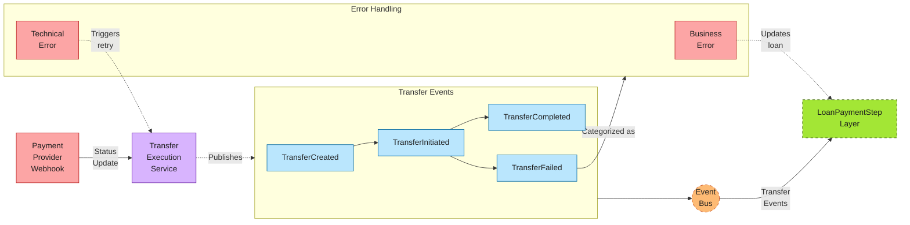

#### 2. LoanPaymentStep Events Layer

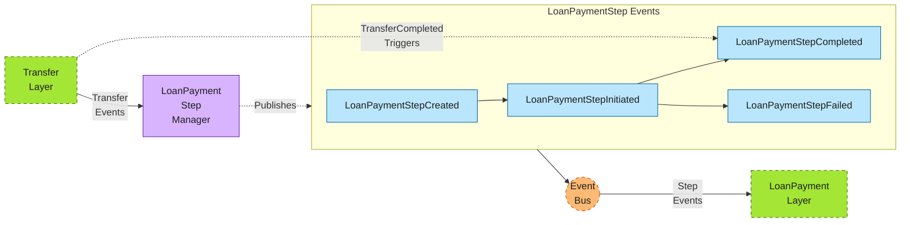

#### 3. LoanPayment Events Layer

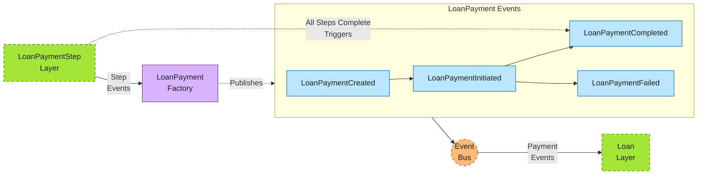

#### 4. Loan Events Layer

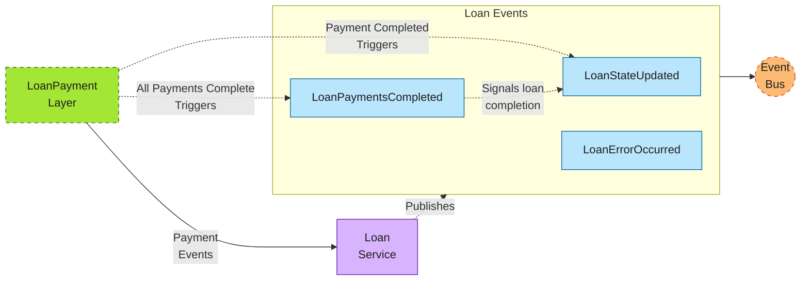


TBD: Implementation depends on the selected technologies.
Most suitable options are:
- SNS+SQS Pattern for Reliable Event Delivery
- NestJS Microservice Transport with Redis