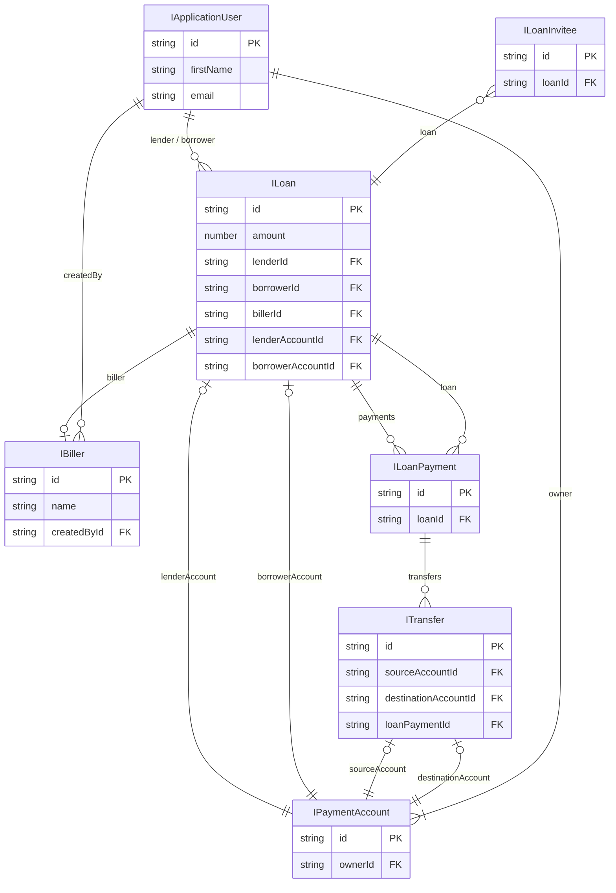

<style>
  /* use this to force non-dark mode even when IDE is using Dark Mode*/
  .mermaid {
    display: flex;                    /* turn on flex layout */
    justify-content: center;          /* center children horizontally */
    background-color: white !important;
    
  }
  .mermaid svg {
    width: auto !important;           /* don’t force it to fill the parent */
  }

</style>
### Loan Domain (WIP)


## Entities Relationship

**Relationship Explanation:**

- **Loan** connects to **ApplicationUser** twice: once as a **lender**, once as a **borrower**.
- **Loan** references a **Biller**.
- **Loan** references **PaymentAccount** (for both lender and borrower accounts).
- **Loan** has a collection of **LoanPayments**.
- **LoanInvitee** references **Loan**.
- **LoanPayment** references **Loan** and has a collection of **Transfers**.
- **Transfer** references **PaymentAccount** for its source/destination, and an (optional) **LoanPayment**.
- **PaymentAccount** belongs to **ApplicationUser** (the account owner).
- **Biller** references **ApplicationUser** as the creator (createdBy).

---



---


## Loan States
### General information
  - **Created**: Loan initial information provided (amount, plan, type), optional - Biller info
  - **Requested**: (Borrower side) Borrower provided payment method information, waiting to set target User
  - **Offered**: (Lender side) Lender provided payment method information, waiting to set target User
  - **BorrowerAssigned**: Loan Offer has Borrower User assigned
  - **LenderAssigned**: Loan Request has Lender User assigned
  - **Accepted**: Target User Accepted the Loan
  - **Funding**: Funds transfer from Lender to Zirtue started
  - **FundingPaused**: Funds transfer from Lender to Zirtue paused
  - **Funded**: Funds transfer from Lender to Zirtue completed
  - **Disbursing**: Funds transfer from Zirtue to Borrower \ Biller started
  - **DisbursingPaused**: Funds transfer from Zirtue to Borrower \ Biller paused
  - **Disbursed**: Funds transfer from Zirtue to Borrower \ Biller completed
  - **Repaying**: Borrower started to repay the loan
  - **RepaymentPaused**: Borrower paused the repayment
  - **Repaid**: Borrower repaid Loan
  - **Closed**: Loan is closed

  ```mermaid
  flowchart TD
    Created
    Requested
    Offered
    BorrowerAssigned
    LenderAssigned
    Accepted
    Funding
    FundingPaused
    Funded
    Disbursing
    DisbursingPaused
    Disbursed
    Repaying
    RepaymentPaused
    Repaid
    Closed

    Created -- "Borrower submits request" --> Requested
    Created -- "Lender submits offer" --> Offered

    Requested -- "Set Lender User" --> LenderAssigned
    Offered -- "Set Borrower User" --> BorrowerAssigned

    LenderAssigned -- "Target User accepts" --> Accepted
    BorrowerAssigned -- "Target User accepts" --> Accepted

    Accepted --> Funding
    Funding -- "Complete" --> Funded
    Funding <-- "Pause / Resume" --> FundingPaused

    

    Funded --> Disbursing
    Disbursing <-- "Pause / Resume" --> DisbursingPaused
    Disbursing -- "Complete" --> Disbursed

    Disbursed --> Repaying
    Repaying <-- "Pause / Resume" --> RepaymentPaused
    Repaying -- "Repayment complete" --> Repaid

    Repaid --> Closed
  ```

---

  ### State change conditions
  TBD

  ---

  ### Loan State change on Error
  TBD

  ---