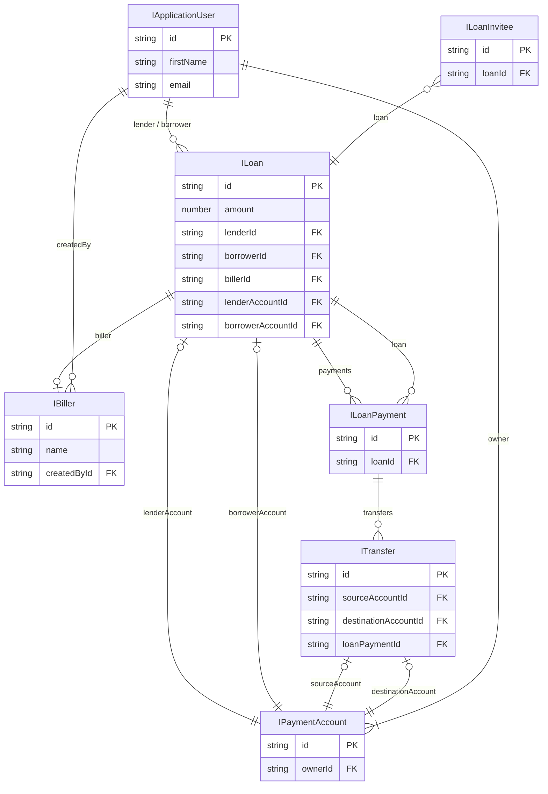
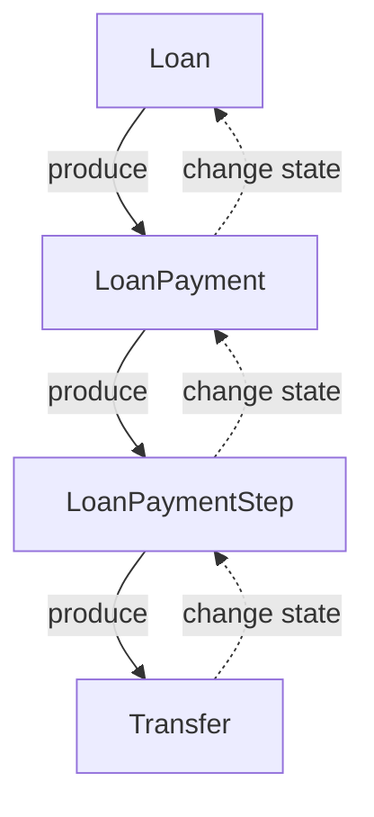
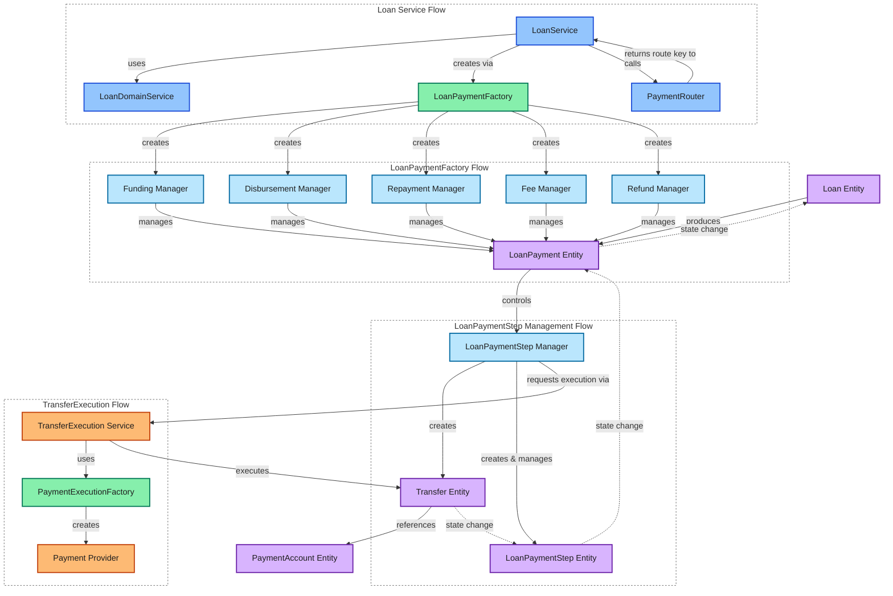

### Loan Domain (WIP)


## Entities Relationship

**Relationship Explanation:**

- **Loan** connects to **ApplicationUser** twice: once as a **lender**, once as a **borrower**.
- **Loan** references a **Biller**.
- **Loan** references **PaymentAccount** (for both lender and borrower accounts).
- **Loan** has a collection of **LoanPayments**.
- **LoanInvitee** references **Loan**.
- **LoanPayment** references **Loan** and has a collection of **Transfers**.
- **Transfer** references **PaymentAccount** for its source/destination, and an (optional) **LoanPayment**.
- **PaymentAccount** belongs to **ApplicationUser** (the account owner).
- **Biller** references **ApplicationUser** as the creator (createdBy).

---



---


## Loan States
### General information
  - **Created**: Loan initial information provided (amount, plan, type), optional - Biller info
  - **Requested**: (Borrower side) Borrower provided payment method information, waiting to set target User
  - **Offered**: (Lender side) Lender provided payment method information, waiting to set target User
  - **BorrowerAssigned**: Loan Offer has Borrower User assigned
  - **LenderAssigned**: Loan Request has Lender User assigned
  - **Accepted**: Target User Accepted the Loan
  - **Funding**: Funds transfer from Lender to Zirtue started
  - **FundingPaused**: Funds transfer from Lender to Zirtue paused
  - **Funded**: Funds transfer from Lender to Zirtue completed
  - **Disbursing**: Funds transfer from Zirtue to Borrower \ Biller started
  - **DisbursingPaused**: Funds transfer from Zirtue to Borrower \ Biller paused
  - **Disbursed**: Funds transfer from Zirtue to Borrower \ Biller completed
  - **Repaying**: Borrower started to repay the loan
  - **RepaymentPaused**: Borrower paused the repayment
  - **Repaid**: Borrower repaid Loan
  - **Closed**: Loan is closed

  ```mermaid
  flowchart TD
    Created
    Requested
    Offered
    BorrowerAssigned
    LenderAssigned
    Accepted
    Funding
    FundingPaused
    Funded
    Disbursing
    DisbursingPaused
    Disbursed
    Repaying
    RepaymentPaused
    Repaid
    Closed

    Created -- "Borrower submits request" --> Requested
    Created -- "Lender submits offer" --> Offered

    Requested -- "Set Lender User" --> LenderAssigned
    Offered -- "Set Borrower User" --> BorrowerAssigned

    LenderAssigned -- "Target User accepts" --> Accepted
    BorrowerAssigned -- "Target User accepts" --> Accepted

    Accepted --> Funding
    Funding -- "Complete" --> Funded
    Funding <-- "Pause / Resume" --> FundingPaused

    

    Funded --> Disbursing
    Disbursing <-- "Pause / Resume" --> DisbursingPaused
    Disbursing -- "Complete" --> Disbursed

    Disbursed --> Repaying
    Repaying <-- "Pause / Resume" --> RepaymentPaused
    Repaying -- "Repayment complete" --> Repaid

    Repaid --> Closed
  ```

---

  ### State change conditions
  TBD

  ---

  ### Loan State change on Error
  TBD

  ---

  ## LoanPayments and Transfers // TODO: Update to latest design

  ### LoanPayments
**LoanPayment** - Entity that reflects a certain payment from Loan lifecycle. During `Funding`, `Disbursing` and `Repaying` states of the **Loan** Zirtue should execute funds transfers between **Lender**, **Borrower**, **Biller** and **internal accounts**. LoanPayments allows to keep track of such funds transfers which are started, failed or completed successfully. LoanPayments won't be created for scheduled in advance payments to keep data transparent.

Here is a current structure of LoanPayment:
```typescript
  /** UUID */
  id: string;

  /** The amount of payment */
  amount: number;


  /** Id of the Loan that keeps this payment */
  loanId: string; 

  /** Loan Entity */
  loan: Loan; 


  /** Reflects the Payment Index for Loan Repayments.
   * `null` while Loan is not in Repayment state.
   */
  paymentIndex: number | null;

    /** Shows for what Loan lifecycle Payment is assigned
   * `funding` - Lender transfers funds to Zirtue
   * `disbursement` - Zirtue transfers funds to Biller
   * `fee` - Lender pays Zirtue fee
   * `repayment` - Borrower repays Lender
   * `refund` - Performing refund for the payment
   */
  type: LoanPaymentType;

    /** Indicates order number for Loan Payment if multiple stages are involved.
   * Ex: In Loan 'Repayment' stage `0` is for `Borrower->Zirtue` payment and `1` for `Zirtue->Lender`.
   * For one-stage payments and by default `0` is used.
   */
  stage: number;

    /** Indicates current state of the Loan Payment.
   * `pending` - Payment is executed but not completed yet
   * `completed` - Payment was executed successfully
   * `failed` - Payment was not executed successfully due to some error
   */
  state: LoanPaymentState;

  createdAt: Date;
  updatedAt: Date | null;

    /** What date Loan Payment was executed last time. 
     * Should be the same with `originalExecutionDate` if it is first execution attempt, 
     * otherwise - should contain the date of latest re-attempt */
  executionDate: Date;

    /** Date for which Loan Payment was originally scheduled */
  originalExecutionDate: Date;

    /**
   * Collection of Transfers that are part of this Loan Payment.
   * Ideally should contain only one Transfer. 
   * But if Transfer failed and re-attempt happened - new Transfer will be also referenced to the same Loan Payment.
   */
  transfers: Transfer[] | null;
```

Let's take a look on example:
Imagine that we have a Direct Bill Pay Loan that in `Repaying` state, last payment just failed after re-attempt. Loan was configured to three repayments. Here is an array of LoanPayments that were created during the whole Loan lifecycle (some fields are removed to improve readability):
```typescript
// 1. Funding: Lender transfers funds to Zirtue
{ amount: 1000, loanId: 'loan-uuid', paymentIndex: null, type: 'funding', stage: 0, state: 'completed', transfers: [lender-zirtue-transfer] },
// 2. Funding: Lender pays fee to Zirtue
{ amount: 30, loanId: 'loan-uuid', paymentIndex: null, type: 'fee', stage: 0, state: 'completed', transfers: [lender-zirtue-fee-transfer] },
// 3. Disbursement: Zirtue transfers funds to Biller
{ amount: 1000, loanId: 'loan-uuid', paymentIndex: null, type: 'disbursement', stage: 0, state: 'completed', transfers: [zirtue-biller-transfer] },
// 4.1 Repayment #1: Borrower -> Zirtue
{ amount: 333.33, loanId: 'loan-uuid', paymentIndex: 0, type: 'repayment', stage: 0, state: 'completed', transfers: [borrower-zirtue-transfer1] },
//     Repayment #1: Zirtue -> Lender
{ amount: 333.33, loanId: 'loan-uuid', paymentIndex: 0, type: 'repayment', stage: 1, state: 'completed', transfers: [zirtue-lender-transfer1] },
// 4.2 Repayment #2: Borrower -> Zirtue
{ amount: 333.33, loanId: 'loan-uuid', paymentIndex: 1, type: 'repayment', stage: 0, state: 'completed', transfers: [borrower-zirtue-transfer2] },
//     Repayment #2: Zirtue -> Lender
{ amount: 333.33, loanId: 'loan-uuid', paymentIndex: 1, type: 'repayment', stage: 1, state: 'completed', transfers: [zirtue-lender-transfer2] },
// 4.3 Repayment #3: Borrower -> Zirtue
{ amount: 333.34, loanId: 'loan-uuid', paymentIndex: 2, type: 'repayment', stage: 0, state: 'completed', transfers: [borrower-zirtue-transfer3] },
//     Repayment #3: Zirtue -> Lender
{ amount: 333.34, loanId: 'loan-uuid', paymentIndex: 2, type: 'repayment', stage: 1, state: 'failed', transfers: [zirtue-lender-transfer3-1, zirtue-lender-transfer3-2] },
```

Note: In most positive case scenario (all transfers were succeeded during whole Loan lifecycle) the number of Transfers made is equal to number of LoanPayments stored.

  ---

  ### Transfers
**Transfer** Entity defines an explicit transfer of funds `amount` from `source` to `target` with as few extra references (*none is ideal*) as possible.
The purpose of that is to keep the flexibility in flows where funds transfers are possible. Also it is expected that `transfers` won't be only **`Core`** namespace specific but also will be used by separate **`Payments`** microservice which will execute the transfers.

At the moment the structure of Transfer Entity is following:
```typescript
  /** UUID */
  id: string;

  /** Transfer amount */
  amount: number;

    /** Current Transfer state:
   * `pending` - Transfer is executed but not completed yet
   * `completed` - Transfer was executed successfully
   * `failed` - Transfer was not executed successfully due to some error
   */
  state: TransferState;

  /** Error data if Transfer failed */
  errorData: string | null;

  createdAt: Date;
  updatedAt: Date | null;


  sourceAccountId: string | null;
  sourceAccount: PaymentAccount | null;

  destinationAccountId: string | null;
  destinationAccount: PaymentAccount | null;

  sourceAccountType: string;
  destinationAccountType: string;

  loanPaymentId: string | null;
  loanPayment: LoanPayment | null;
```

As it was mentioned before - Transfer Entity should stay as clean as possible from any references. But in the structure above we see that there are already three references presented:
- `loanPayment` reference allows **LoanPayment** Entity to aggregate all **Transfers** made for this payemnt. This reference is nullable for the purpose of supporting non-Loan Transfers being stored in the same place (ex *batch payments*). 
To keep Transfer Entity less linked to other Entities there is an **Alternative approach**(likely to be implemented): solve LoanPayments <> Transfers relationships by having intermediate Table `LoanPaymentTransfers` which as like for many-to-many relationships (in fact Transfers are `many to (one OR none)` with LoanPayments). This table will keep references for **LoanPayments** and **Transfers** aligned while **Transfer** itself won't have a reference to **LoanPayment**
- `sourceAccount` and `destinationAccount` references seems to be required - this is the exact **from - to** information. But there is also **Alternative approach**(also likely to be implemented) - to have a reference not directly to **PaymentAccount** but another aggregation Table which will keep references between different types of Payment Methods Accounts. *The naming should be fixed here*. Fields `sourceAccountType` and `destinationAccountType` are exactly highlightning that requirement for Transfer execution - the service (which will execute the transfer) should know at some point what types of APIs / flows should be used to perform the transfer. But ideally **Transfer** Entity should not keep this information also.

  ---

### LoanPayments relationship with Transfers

TBD

  ---

  # Loan Payments Processing

## Loan lifecycle parts
**Loan lifecycle part** - a group of Loan lifecycle states gathered together by the same purpose. For example `Funding` in the Loan lifecycle is a group of states that are required to be completed in order to have the Loan funded.

Main payments-related Loan lifecycle parts:
- `Funding`
  - Funding
  - FundingPaused
  - Funded
  - ? FundingError
- `Disbursement`
  - Disbursing
  - DisbursingPaused
  - Disbursed
  - ? DisbursementError
- `Repayment`
  - Repaying
  - RepaymentPaused
  - Repaid
  - ? RepaymentError

Side payments-related Loan lifecycle parts (not decided yet are they required to be separated):
- `Fee`
  - Fee
  - FeePaused
  - FeeCompleted
  - ? FeeError
- `Refund`
  - Refund
  - RefundPaused
  - RefundCompleted
  - ? RefundError
 

## Hierarchy and Logic of Payment-related Entities

For each layer there are following rules:
- `Layer entry creation is controlled by the previous layer if exists`
- `Layer entry state might be result of next layer state change if exists or layer itslef might change the state`
- `No creation or state change is possible by skipping the layer`

TBD: Description of how state changes are handled in the system. The design and explanation of how BE decides that:
- Loan should move further in state
- LoanPayment should move further in state
- LoanPaymentStep should move further in state
- Transfer should move further in state

### Loan
> Controls general loan information and configuration

Created and controlled by:
- **LoanService**
- **LoanDomainService**

Actions:
- **Calls [PaymentRouter](./loan-payment-flows.md#loan-payments-router)** before switching to further lifecycle state part
  - Calls Router each time when new `Repayment` Payment is scheduling
  - Calls Router once other lifecycle state part is comming
  - Validates that Route found
- **Calls `LoanPaymentFactory` to create and initiate relevant `LoanPayment`** on own major state change
  - Also provide **PaymentRoute** `PK` 

### LoanPayment
> Controls payment information on lifecycle level (`One LoanPayment per Loan lifecycle part, multiple for Repayment`).

*Not all Loan lifecycle parts involves LoanPayment though* - it is designed that one **LoanPayment** will be created for each of the payments-related Loan lifecycle parts. But it is not required to have a separate **LoanPayment** for each of the states inside the part. For example - `Funding` part can be represented by single **LoanPayment** with internal state which represents the completeness of the part.

> TODO: Write down Factory methods (including how it should react to signals)

Created and controlled by **LoanPaymentFactory**. Factory, depending on the `Loan lifecycle part` (**Funding**, **Disbursement**, **Repayment**, **Fee**, **Refund**) will return the specific **LoanPaymentManager** instance:
  - **FundingManager**
  - **DisbursementManager**
  - **RepaymentManager**
  - **FeeManager**
  - **RefundManager**

While each **LoanPaymentManager** will provide certain, lifecycle-specific functionality, all of them will implement the following methods:
- `initiate()`
  - Checks the existance of **LoanPayment** for the current **Loan** and **Loan lifecycle part** to prevent duplicates
  - Creates **LoanPayment** if it does not exist
  - Gets **PaymentRoute** by provided `PK` to generate the list of **LoanPaymentSteps** for the current **LoanPayment**
    - If the list is empty - throws an error that **LoanPayment** could not be routed
    - (`Funding specific`) If list contains one **LoanPaymentStep** - completes **Funding** part without execution (*if `Funding + Disbursement` could be managed through single transfer - we make **null**-ish **Funding** and one-transfer **Disbursement***)
    - (`Funding + Disbursement specific`) if **LoanPayment** routes with multiple steps - we take `N-1` steps for `Funding` and only last step for `Disbursement`
- `advance()`
  - Reacts to **LoanPaymentStep** 'signals' (ex. events) and updates **LoanPayment** state and other informational fields accordingly
  - If recieves a signal that **LoanPaymentStep** is completed - checks if all requirements are met:
    - If all **LoanPaymentSteps** are completed - completes **LoanPayment**
    - If not all **LoanPaymentSteps** are completed - updates **LoanPayment** state and information accordingly
- `complete()`
  - Completes **LoanPayment** if all **LoanPaymentSteps** are completed and send a signal to **Loan** to move forward in the lifecycle


### LoanPaymentStep
> Controls payment information on **Transfer Execution** level (`One LoanPaymentStep per Transfer Execution` in positive-case scenario when no re-attempts are required).

Single **LoanPayment** can be represented by multiple **LoanPaymentSteps** - it is required to have a separate **LoanPaymentStep** for each of the transfers that are executed. For example - `Funding` part can be represented by single **LoanPayment** with multiple **LoanPaymentSteps**.

The number of **LoanPaymentSteps** is dictated by the [Payment Route](./loan-payment-flows.md#loan-payments-router) that is used to generate chain of transfers definitions. For example - if `Lender` has `Checkbook ACH` account while `Borrower` has `Fiserv Debit Card` account - to process `Lender -> Borrower` **Payment** it should be done in two `Payment Steps`.

Created and controlled by **LoanPaymentStepManager**:
- `createRoute()`
  - In bulk creates **LoanPaymentSteps** for the current **LoanPayment**
- `createStep()`
  - (potential special-casing) Creates a single **LoanPaymentStep** for the current **LoanPayment**
- `execute()`
  - Creates(`!`) and executes(`?`) **Transfer** for the current **LoanPaymentStep**
  - Updates **LoanPaymentStep** state and other informational fields accordingly
- `update()`
  - Updates **LoanPaymentStep** state and other informational fields accordingly
- `complete()`
  - Completes **LoanPaymentStep** if all requirements are met and sends a signal to **LoanPayment**

Currently **LoanPaymentStep** do not require being uniquely processed depending on the **LoanPayment** type. As it goes from the definition - **LoanPaymentStep** is more like a wrapper ontop of **Transfer** where certain extended logic applied. That helps to keep real **Transfer** processing being separated from the **LoanPaymentStep** logic and namespace.

### Transfer
> Controls transfer information on execution level (`One Transfer per LoanPaymentStep` in positive-case scenario when no re-attempts are required)

Created by **LoanPaymentStepManager** (at least for **LoanPaymentStep** related transfers)

Controlled by **TransferExecutionService** which stays outside of the `Core` namespace and placed in `Payments` project:
- `execute()`
  - Executes transfer for the current **Transfer**
  - Updates **Transfer** state and other informational fields accordingly
  - Sends a signal that **Transfer** is executing
- `update()`
  - Updates **Transfer** state and other informational fields accordingly
  - Sends a signals that **Transfer** is updated to certain state
- `complete()`
  - Completes **Transfer** if all requirements are met and sends a signal to **LoanPaymentStep**

**TransferExecutionService** based on the **Transfer** configuration calls **PaymentExecutionFactory** to select the proper **PaymentProvider** interation, like:
- **CheckbookPaymentProvider**
- **FiservPaymentProvider**
- **TabapayPaymentProvider**
- etc.

**PaymentProvider** executes the transfer and returns the result back to **TransferExecutionService** which updates the **Transfer** state and sends a signal to **LoanPaymentStep**.

## Layers Communication

