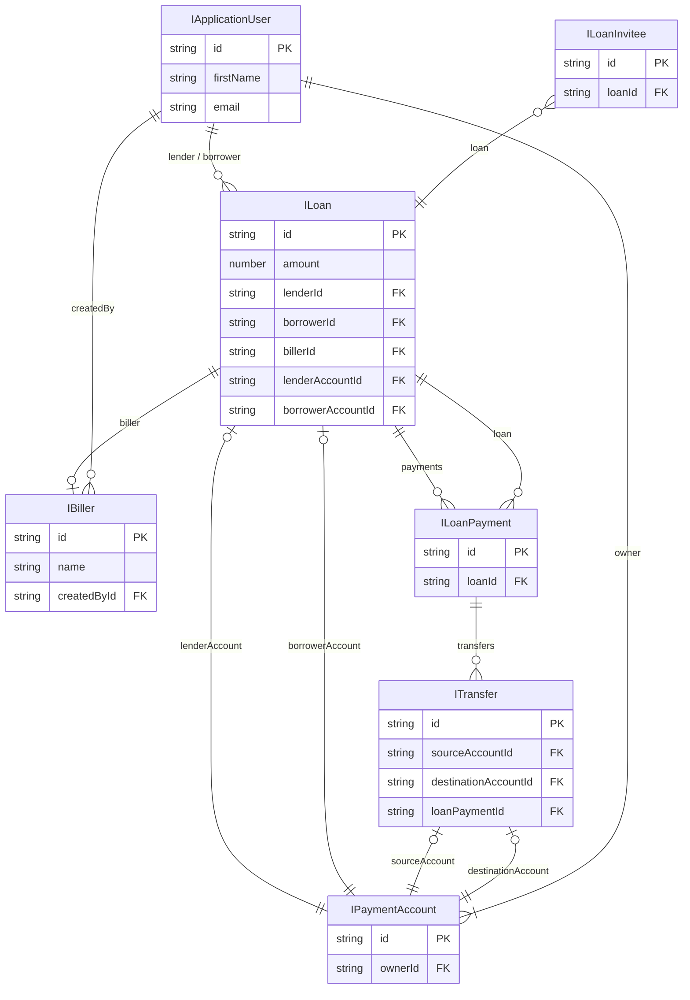
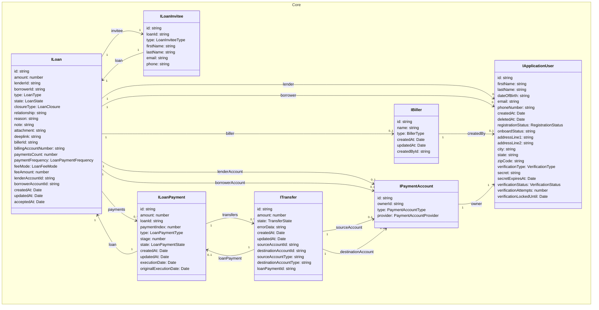

<style>
  /* use this to force non-dark mode even when IDE is using Dark Mode*/
  .mermaid {
    display: flex;                    /* turn on flex layout */
    justify-content: center;          /* center children horizontally */
    background-color: white !important;
    
  }
  .mermaid svg {
    width: auto !important;           /* don’t force it to fill the parent */
  }

</style>
### Loan Domain (WIP)


## Entities Relationship

**Relationship Explanation:**

- **Loan** connects to **ApplicationUser** twice: once as a **lender**, once as a **borrower**.
- **Loan** references a **Biller**.
- **Loan** references **PaymentAccount** (for both lender and borrower accounts).
- **Loan** has a collection of **LoanPayments**.
- **LoanInvitee** references **Loan**.
- **LoanPayment** references **Loan** and has a collection of **Transfers**.
- **Transfer** references **PaymentAccount** for its source/destination, and an (optional) **LoanPayment**.
- **PaymentAccount** belongs to **ApplicationUser** (the account owner).
- **Biller** references **ApplicationUser** as the creator (createdBy).

---



---




## Loan States
### General information
  - **Created**: Loan initial information provided (amount, plan, type), optional - Biller info
  - **Requested**: (Borrower side) Borrower provided payment method information, waiting to set target User
  - **Offered**: (Lender side) Lender provided payment method information, waiting to set target User
  - **BorrowerAssigned**: Loan Offer has Borrower User assigned
  - **LenderAssigned**: Loan Request has Lender User assigned
  - **Accepted**: Target User Accepted the Loan
  - **Funding**: Funds transfer from Lender to Zirtue started
  - **FundingPaused**: Funds transfer from Lender to Zirtue paused
  - **Funded**: Funds transfer from Lender to Zirtue completed
  - **Disbursing**: Funds transfer from Zirtue to Borrower \ Biller started
  - **DisbursingPaused**: Funds transfer from Zirtue to Borrower \ Biller paused
  - **Disbursed**: Funds transfer from Zirtue to Borrower \ Biller completed
  - **Repaying**: Borrower started to repay the loan
  - **RepaymentPaused**: Borrower paused the repayment
  - **Repaid**: Borrower repaid Loan
  - **Closed**: Loan is closed

  ```mermaid
  flowchart TD
    Created
    Requested
    Offered
    BorrowerAssigned
    LenderAssigned
    Accepted
    Funding
    FundingPaused
    Funded
    Disbursing
    DisbursingPaused
    Disbursed
    Repaying
    RepaymentPaused
    Repaid
    Closed

    Created -- "Borrower submits request" --> Requested
    Created -- "Lender submits offer" --> Offered

    Requested -- "Set Lender User" --> LenderAssigned
    Offered -- "Set Borrower User" --> BorrowerAssigned

    LenderAssigned -- "Target User accepts" --> Accepted
    BorrowerAssigned -- "Target User accepts" --> Accepted

    Accepted --> Funding
    Funding -- "Complete" --> Funded
    Funding <-- "Pause / Resume" --> FundingPaused

    

    Funded --> Disbursing
    Disbursing <-- "Pause / Resume" --> DisbursingPaused
    Disbursing -- "Complete" --> Disbursed

    Disbursed --> Repaying
    Repaying <-- "Pause / Resume" --> RepaymentPaused
    Repaying -- "Repayment complete" --> Repaid

    Repaid --> Closed
  ```

---

  ### State change conditions
  TBD

  ---

  ### Loan State change on Error
  TBD

  ---

  ## LoanPayments and Transfers

  ### LoanPayments
**LoanPayment** - Entity that reflects a certain payment from Loan lifecycle. During `Funding`, `Disbursing` and `Repaying` states of the **Loan** Zirtue should execute funds transfers between **Lender**, **Borrower**, **Biller** and **internal accounts**. LoanPayments allows to keep track of such funds transfers which are started, failed or completed successfully. LoanPayments won't be created for scheduled in advance payments to keep data transparent.

Here is a current structure of LoanPayment:
```typescript
  /** UUID */
  id: string;

  /** The amount of payment */
  amount: number;


  /** Id of the Loan that keeps this payment */
  loanId: string; 

  /** Loan Entity */
  loan: Loan; 


  /** Reflects the Payment Index for Loan Repayments.
   * `null` while Loan is not in Repayment state.
   */
  paymentIndex: number | null;

    /** Shows for what Loan lifecycle Payment is assigned
   * `funding` - Lender transfers funds to Zirtue
   * `disbursement` - Zirtue transfers funds to Biller
   * `fee` - Lender pays Zirtue fee
   * `repayment` - Borrower repays Lender
   * `refund` - Performing refund for the payment
   */
  type: LoanPaymentType;

    /** Indicates order number for Loan Payment if multiple stages are involved.
   * Ex: In Loan 'Repayment' stage `0` is for `Borrower->Zirtue` payment and `1` for `Zirtue->Lender`.
   * For one-stage payments and by default `0` is used.
   */
  stage: number;

    /** Indicates current state of the Loan Payment.
   * `pending` - Payment is executed but not completed yet
   * `completed` - Payment was executed successfully
   * `failed` - Payment was not executed successfully due to some error
   */
  state: LoanPaymentState;

  createdAt: Date;
  updatedAt: Date | null;

    /** What date Loan Payment was executed last time. 
     * Should be the same with `originalExecutionDate` if it is first execution attempt, 
     * otherwise - should contain the date of latest re-attempt */
  executionDate: Date;

    /** Date for which Loan Payment was originally scheduled */
  originalExecutionDate: Date;

    /**
   * Collection of Transfers that are part of this Loan Payment.
   * Ideally should contain only one Transfer. 
   * But if Transfer failed and re-attempt happened - new Transfer will be also referenced to the same Loan Payment.
   */
  transfers: Transfer[] | null;
```

Let's take a look on example:
Imagine that we have a Direct Bill Pay Loan that in `Repaying` state, last payment just failed after re-attempt. Loan was configured to three repayments. Here is an array of LoanPayments that were created during the whole Loan lifecycle (some fields are removed to improve readability):
```typescript
// 1. Funding: Lender transfers funds to Zirtue
{ amount: 1000, loanId: 'loan-uuid', paymentIndex: null, type: 'funding', stage: 0, state: 'completed', transfers: [lender-zirtue-transfer] },
// 2. Funding: Lender pays fee to Zirtue
{ amount: 30, loanId: 'loan-uuid', paymentIndex: null, type: 'fee', stage: 0, state: 'completed', transfers: [lender-zirtue-fee-transfer] },
// 3. Disbursement: Zirtue transfers funds to Biller
{ amount: 1000, loanId: 'loan-uuid', paymentIndex: null, type: 'disbursement', stage: 0, state: 'completed', transfers: [zirtue-biller-transfer] },
// 4.1 Repayment #1: Borrower -> Zirtue
{ amount: 333.33, loanId: 'loan-uuid', paymentIndex: 0, type: 'repayment', stage: 0, state: 'completed', transfers: [borrower-zirtue-transfer1] },
//     Repayment #1: Zirtue -> Lender
{ amount: 333.33, loanId: 'loan-uuid', paymentIndex: 0, type: 'repayment', stage: 1, state: 'completed', transfers: [zirtue-lender-transfer1] },
// 4.2 Repayment #2: Borrower -> Zirtue
{ amount: 333.33, loanId: 'loan-uuid', paymentIndex: 1, type: 'repayment', stage: 0, state: 'completed', transfers: [borrower-zirtue-transfer2] },
//     Repayment #2: Zirtue -> Lender
{ amount: 333.33, loanId: 'loan-uuid', paymentIndex: 1, type: 'repayment', stage: 1, state: 'completed', transfers: [zirtue-lender-transfer2] },
// 4.3 Repayment #3: Borrower -> Zirtue
{ amount: 333.34, loanId: 'loan-uuid', paymentIndex: 2, type: 'repayment', stage: 0, state: 'completed', transfers: [borrower-zirtue-transfer3] },
//     Repayment #3: Zirtue -> Lender
{ amount: 333.34, loanId: 'loan-uuid', paymentIndex: 2, type: 'repayment', stage: 1, state: 'failed', transfers: [zirtue-lender-transfer3-1, zirtue-lender-transfer3-2] },
```

Note: In most positive case scenario (all transfers were succeeded during whole Loan lifecycle) the number of Transfers made is equal to number of LoanPayments stored.

  ---

  ### Transfers

  ---

  ### LoanPayments relationship with Transfers

  ---