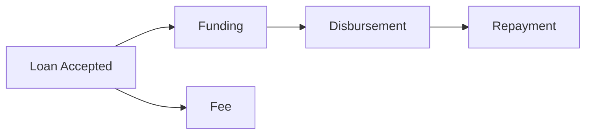
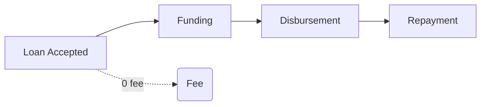
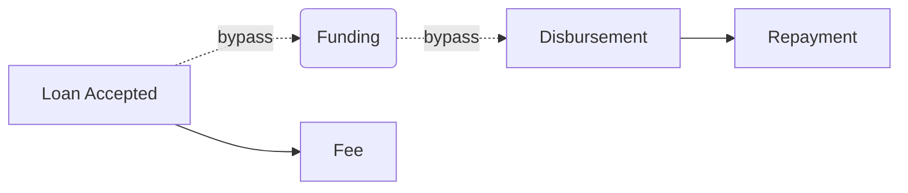
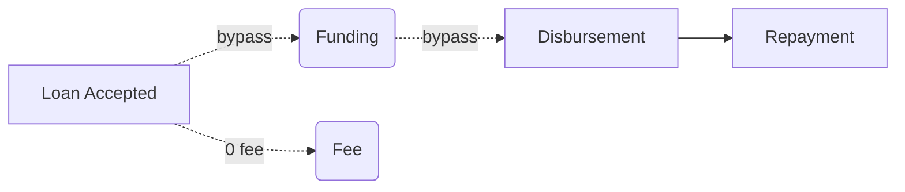
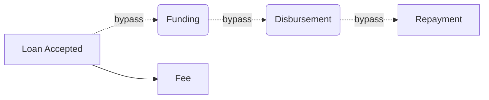
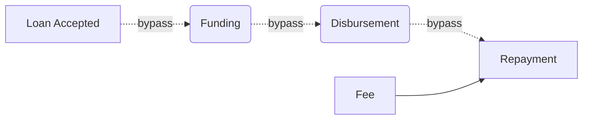

## P2P (Personal Loan) and DBP (Direct Bill Pay)

### Basic Flow


---

### Zero Fee Flow


---

### Same Payment Provider Flow


---

### Same Payment Provider and Zero Fee Flow


## RR (Repayment Requset)
Not a priority right now, but allows to check general functionality by supporting flow preiosuly requested (in Zirtue Legacy).
The general difference - there is no `Funding` and `Disbursement` stages at all - Users want to setup only `Repayment` phase.

### Fee Paid by Lender Flow

---

### Fee Paid by Borrower Flow


---
---

# Loan Payments Router

## Overview
Idea of `Loan Payments Router` - is to have a logic that allows to build all transfers chain required to process `A -> B` payment. 

In some cases it is possible that single transfer will not be enough to complete the **Payment**. 
For example: **Lender** has **Checkbook ACH** account while **Borrower** has **Fiserv Debit Card** account. To process `Lender -> Borrower` **Payment** it should be done in two `Payment Steps`:
1. `Lender -> Zirtue ACH`
2. *(Zirtue ACH reports that funds recieved)*
3. `Zirtue Debit -> Borrower`

Thus **Loan Payments Router** should take as INPUT:
- source Payment Account
- target Payment Account
- Loan properties

and returns as OUTPUT:
- list of **Payment Steps** 

## Route Key
To allow **Loan Payment Router** support certain level of flexibility (cross-provider transfers, multiple internal accounts for the same **Payment Provider**) following variables participation in **Payment Routing**:
- Loan Configuration:
  - `loanType`: 'dbp' | 'p2p' | 'rr'
  - `stage`: 'funding' | 'disbursement' | 'fee' | 'repayment' | 'refund'
- Payment Account Configuration (twice as there is *source* and *target* of the payment):
  - `paymentAccountType`: 'debit_card' | 'bank_account' | 'rpps'
  - `ownership`: 'personal' | 'internal' | 'external'
  - `provider`: 'checkbook' | 'fiserv' | 'tabapay'

**Route Key** - is unique combination of Loan Configuration and two Payment Account Configurations (*from* and *to*).

### Route Key and Route Value Structure
Lets assume that for now **Payment Routes** are the same for `loanType` (if it will not be the truth - we may extend *Base Routing* by LoanType-special routes).
The structure of **Route Key** then will look like:
```typescript
interface IRouteAccountConfiguration {
    paymentAccountType: PaymentAccountType; // 'debit_card' | 'bank_account' | 'rpps'
    ownership: PaymentAccountOwnershipType; // 'personal' | 'internal' | 'external'
    provider: PaymentAccountProvider; // 'checkbook' | 'fiserv' | 'tabapay'
}

interface IRouteKey {
    stage: string; // 'funding' | 'disbursement' | 'fee' | 'repayment' | 'refund'

    from: IRouteAccountConfiguration;
    to: IRouteAccountConfiguration;

}
```
The structure of **Route Value** is even more straightforward:
```typescript
interface IPaymentRoute {
    order: number; // Order of a Route element in a chain
    fromId: string | null; // Id of the Payment Account if it is pre-defined (e.g. Zirtue Internal For Checkbook ACH Funding)    
    toId: string | null; // Id of the Payment Account if it is pre-defined (e.g. Zirtue Internal For Checkbook ACH Funding)
}

interface IRouteValue {
    route: IPaymentRoute[];
}
```
So, basically saying **Route** is an ordered array of two **Payment Account** referencies. For the same **Payment Provider** route it might contain only one entry.

If `fromId` or `toId` is not `null` - it means that for this route part **Payment Account** if pre-defined and fixed. Empty (`null`) values are expected to be only for **personal** accounts.

## Building a Loan Payment Route
If we attempt to have all variations of **Route Keys** then we will have *thousands* of them, which is complete overkill.
To solve this we could have pre-defined static collection of **Routes** with **Route Keys** that are supported per **Loan Type** and **Loan Stage**. **Payment Routes** not being mentioned in collection appears to be unsupported.


### Loan Payment Step

As **Payment Route** might require to be performed it in few steps - we add **Loan Payment Step** collection into **Loan Payment**
```typescript
interface ILoanPaymentStep {
    id: string; // uuid
    loanPaymentId: string; // FK to ILoanPayment

    /**
     * Integer order number of the step.
     * Starts with 0.
    */
    order: number;

    amount: number; // Payment Step transfer amount. Basically the same as Loan Payment amount, but keep mentioned again
    sourcePaymentAccountId: string; // FK to Payment Account from which transfer will be performed
    targetPaymentAccountId: string; // FK to Payment Account to which transfer will be performed

    /**
   * Collection of Transfers that are part of this Loan Payment Step.
   * Ideally should contain only one Transfer. 
   * But if Transfer failed and re-attempt happened - new Transfer will be also referenced to the same Loan Payment Step.
   */
    transfers: ITransfer[] | null;

    state: PaymentStepState; // 'created', 'confirmed', 'pending', 'completed', 'failed'

    awaitStepState: PaymentStepState; // 'none' | 'confirmation' | 'completion'. Default: 'completion'
    awaitStepId: string | null; // reference to previous Payment Step. If `null` order-1 will be taken

}

interface ILoanPayment {
    ...
    steps: ILoanPaymentStep[];
    step: number; // <-- Removed
    paymentNumber: number | null; // <-- Removed
    transfers: ITransfer[] | null; // <-- Removed

    /** Shows for what Loan lifecycle Payment is assigned
   * `funding` - Lender transfers funds to Zirtue
   * `disbursement` - Zirtue transfers funds to Biller
   * `fee` - Lender pays Zirtue fee
   * `repayment` - Borrower repays Lender
   * `refund` - Performing refund for the payment
   */
    type: LoanPaymentType;
}
```

### Pre-Generating Loan Payment Step
**Loan** moves further in it's payments stages (`Funding`, `Disbursement`, `Fee`, `Repayment`) ONLY if:
- Previous stage successfully completed
OR
- Previous stage was skipped

This means that next stage won't be reached until previous **Loan Payment** will have all **Loan Payment Steps** completed. 
To not have everything pre-generated we agreed that we will not schedule all payments in advance. But in terms of **Loan Payment Steps** - we might have them pre-generated for incoming **Loan Payment**. It means that if **Loan** goes to **Funding** stage - we will create **Loan Payment** with `type: 'funding'` and also generate required **Loan Payments Steps** for this to fixate the **Payment Route** and do not implement thousands of possible routes.

### Supported Loan Payment Routes example
TBD 