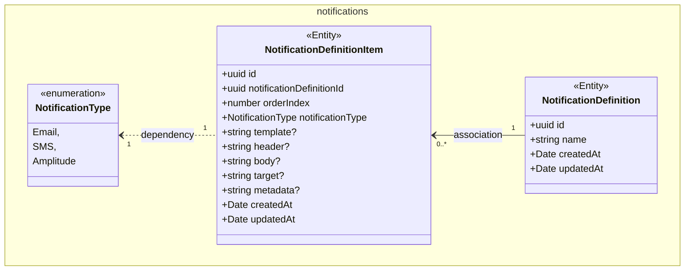

### Notification Schema

```mermaid
---
config:
  title: Notifications Domain
  theme: default
  class:
    hideEmptyMembersBox: true
    padding: 8
---
classDiagram
  namespace notifications {
    class NotificationType {
      <<enumeration>>
      Email,
      SMS,
      Amplitude
    }

    class NotificationDefinition {
      <<Entity>>
      +uuid id
      +string name
      +Date createdAt
      +Date updatedAt
    }
    
    class NotificationDefinitionItem {
      <<Entity>>
      +uuid id
      +uuid notificationDefinitionId
      +number orderIndex
      +NotificationType notificationType
      +string template?
      +string header?
      +string body?
      +string target?
      +string metadata?
      +Date createdAt
      +Date updatedAt
    }

    
}

NotificationType "1" <.. "1" NotificationDefinitionItem: dependency
NotificationDefinitionItem "0..*" <-- "1" NotificationDefinition : association
```
