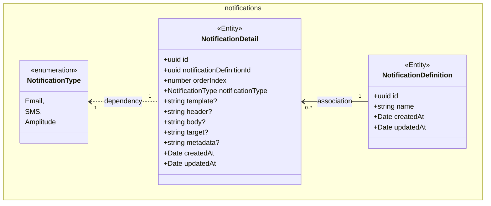

### Notification Schema

```mermaid
---
config:
  title: Notifications Domain
  class:
    hideEmptyMembersBox: true
    theme: base
---
classDiagram
namespace notifications {
  class NotificationType {
    <<enumeration>>
    Email,
    SMS,
    Amplitude
  }

  class NotificationDefinition {
    <<Entity>>
    +uuid id
    +string name
    +Date createdAt
    +Date updatedAt
  }

  class NotificationDetail {
    <<Entity>>
    +uuid id
    +uuid notificationDefinitionId
    +number orderIndex
    +NotificationType notificationType
    +string template?
    +string header?
    +string body?
    +string target?
    +string metadata?
    +Date createdAt
    +Date updatedAt
  }

}

NotificationDetail "0..*" <-- "1" NotificationDefinition : association
NotificationType "1" <.. "1" NotificationDetail: dependency
```
