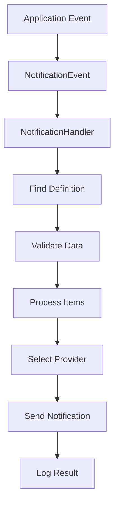

# Notification System Documentation

## Overview

The ZNG notification system is built on an event-driven architecture that provides a flexible, scalable, and maintainable way to send notifications across multiple channels (Email, SMS, Amplitude). The system uses template-based notifications with dynamic data substitution and supports multiple delivery providers.

## Architecture

### Base Components

#### 1. Notification Data View (`NotificationDataView`)
A database view that aggregates user and loan data for notifications:
- **User Information**: ID, email, phone number, first name, last name
- **Loan Information**: ID, amount, loan type, lender/borrower IDs, creation date
- **Relationships**: Links users to their lending/borrowing roles

#### 2. Notification Definition (`NotificationDefinition`)
Defines notification templates and their required data:
- **Name**: Unique identifier (e.g., `login_verification_sms`)
- **Data Items**: Required data fields (`user`, `code`, `lenderLoan`, `borrowerLoan`)
- **Items**: Associated notification definition items

#### 3. Notification Definition Item (`NotificationDefinitionItem`)
Specific notification delivery configurations:
- **Type**: Email, SMS, or Amplitude
- **Templates**: Header, body, target, and metadata templates
- **Order**: Execution order within a definition
- **Provider Configuration**: Additional settings for specific providers

#### 4. Notification Log (`NotificationLog`)
Audit trail for all sent notifications:
- **Status**: Success, failure, or error details
- **Target**: Recipient information
- **Transport**: Delivery method used
- **Content**: Full message content and metadata

### Data Flow



## Supported Notification Types

### 1. Email Notifications
- **Provider**: Mandrill
- **Use Cases**: Verification codes, loan updates, system notifications
- **Template Variables**: `<%= user.email %>`, `<%= code %>`, etc.

### 2. SMS Notifications
- **Provider**: Twilio
- **Use Cases**: Verification codes, urgent notifications
- **Template Variables**: `<%= user.phoneNumber %>`, `<%= code %>`, etc.

### 3. Amplitude Notifications
- **Provider**: Amplitude Analytics
- **Use Cases**: User behavior tracking, analytics events
- **Template Variables**: Custom event data

## Available Data Items

The system supports the following data items for notifications:

- **`user`**: User information (ID, email, phone, name)
- **`code`**: Verification codes or tokens
- **`lenderLoan`**: Loan information when user is a lender
- **`borrowerLoan`**: Loan information when user is a borrower

## How to Add a New Notification

### Step 1: Define the Notification Data Requirements

First, determine what data your notification needs. You can use any combination of the available data items:

```typescript
// Example: Loan approval notification
const dataItems = ['user', 'lenderLoan', 'borrowerLoan'];
```

### Step 2: Create the Notification Definition

Use the setup script or API to create a new notification definition:

```javascript
// Using the setup script
await createNotificationDefinition('loan_approval_notification', [
  'user',
  'lenderLoan',
  'borrowerLoan'
]);
```

### Step 3: Add Notification Items

For each delivery channel, create a notification definition item:

#### Email Notification Item
```javascript
await createNotificationItem(
  notificationId,
  1, // orderIndex
  'email',
  '', // template (optional)
  'Loan Approval Notification', // header
  'Your loan of $<%= lenderLoan.amount %> has been approved!', // body
  '<%= user.email %>', // target
  '{"subject": "Loan Approved"}' // metadata
);
```

#### SMS Notification Item
```javascript
await createNotificationItem(
  notificationId,
  2, // orderIndex
  'sms',
  '', // template
  'SMS Loan Approval', // header
  'Your loan of $<%= lenderLoan.amount %> has been approved!', // body
  '<%= user.phoneNumber %>', // target
  '{}' // metadata
);
```

### Step 4: Update the Notification Data View (if needed)

If your notification requires new data that's not available in the current view, you'll need to update the `NotificationDataView`:

```sql
-- Example: Adding new fields to the view
CREATE OR REPLACE VIEW notifications.v_notification_data AS
SELECT
  u.id as user_id,
  l.id as lend_id,
  b.id as borrow_id,
  json_build_object(
    'id', u.id,
    'email', u.email,
    'phoneNumber', u.phone_number,
    'firstName', u.first_name,
    'lastName', u.last_name,
    'newField', u.new_field -- Add new fields here
  ) as user,
  -- ... rest of the view
```

### Step 5: Trigger the Notification

In your application code, trigger the notification by publishing an event:

```typescript
// In your service or controller
const notificationPayload = await this.sharedNotificationDomainService
  .getNotificationPayload('loan_approval_notification', userId);

if (notificationPayload) {
  this.eventBus.publish(new NotificationEvent(notificationPayload));
}
```

## Template Variables

### User Data
- `<%= user.id %>` - User ID
- `<%= user.email %>` - User email address
- `<%= user.phoneNumber %>` - User phone number
- `<%= user.firstName %>` - User first name
- `<%= user.lastName %>` - User last name

### Code Data
- `<%= code %>` - Verification code or token

### Loan Data
- `<%= lenderLoan.id %>` - Lender loan ID
- `<%= lenderLoan.amount %>` - Loan amount
- `<%= lenderLoan.loanType %>` - Type of loan
- `<%= lenderLoan.createdAt %>` - Loan creation date
- `<%= borrowerLoan.id %>` - Borrower loan ID
- `<%= borrowerLoan.amount %>` - Loan amount
- `<%= borrowerLoan.loanType %>` - Type of loan
- `<%= borrowerLoan.createdAt %>` - Loan creation date

## Monitoring and Debugging

### Notification Logs
All notification attempts are logged in the `notification_logs` table with:
- Success/failure status
- Target recipient
- Transport method
- Full message content
- Error details (if applicable)

### Common Issues and Solutions

#### 1. Missing Data
**Problem**: Notification fails due to missing required data
**Solution**: Verify that all required data items are available in the notification data view

#### 2. Template Rendering Errors
**Problem**: Template variables not properly substituted
**Solution**: Check template syntax and ensure all variables are available in the payload

#### 3. Provider Failures
**Problem**: External provider (Twilio, Mandrill) returns errors
**Solution**: Check provider credentials, rate limits, and network connectivity

## Configuration

### Environment Variables
```bash
# Twilio Configuration
TWILIO_ACCOUNT_SID=your_account_sid
TWILIO_AUTH_TOKEN=your_auth_token
TWILIO_PHONE_NUMBER=your_phone_number

# Mandrill Configuration
MANDRILL_API_KEY=your_api_key

# Amplitude Configuration
AMPLITUDE_API_KEY=your_api_key
```

### Database Schema
The notification system uses the `notifications` schema with the following tables:
- `notification_definitions`
- `notification_definition_items`
- `notification_logs`
- `v_notification_data` (view)

### Manual Testing
Use the setup script to create test notifications and verify delivery through each channel.
