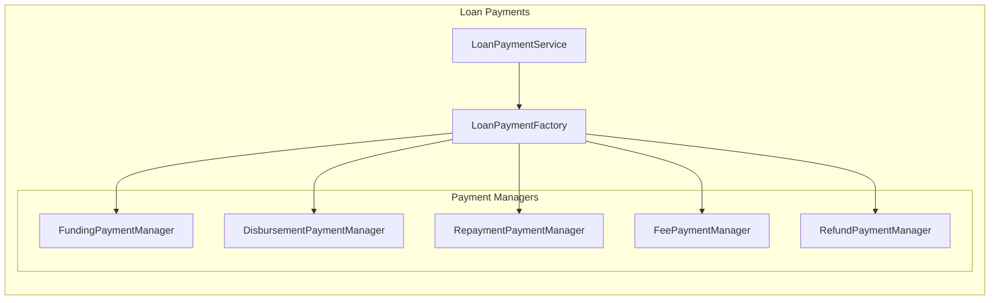
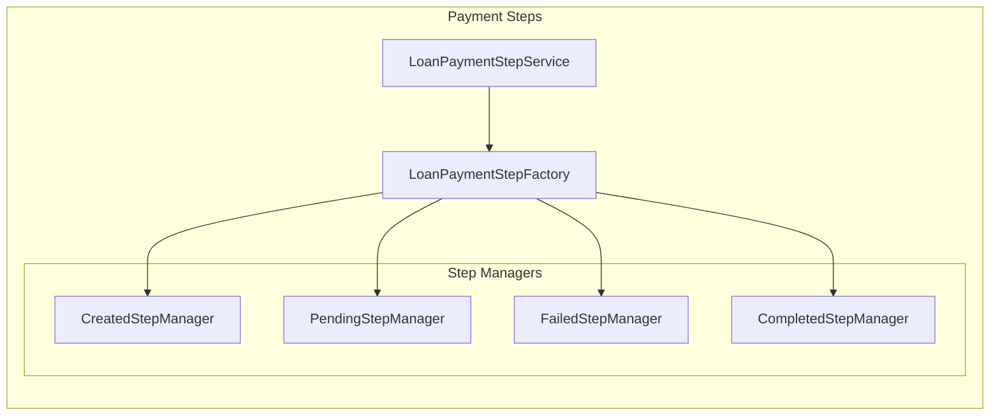
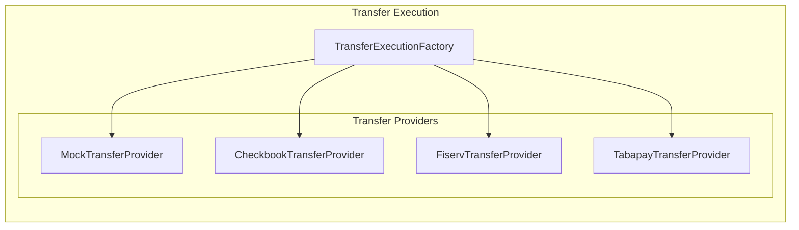
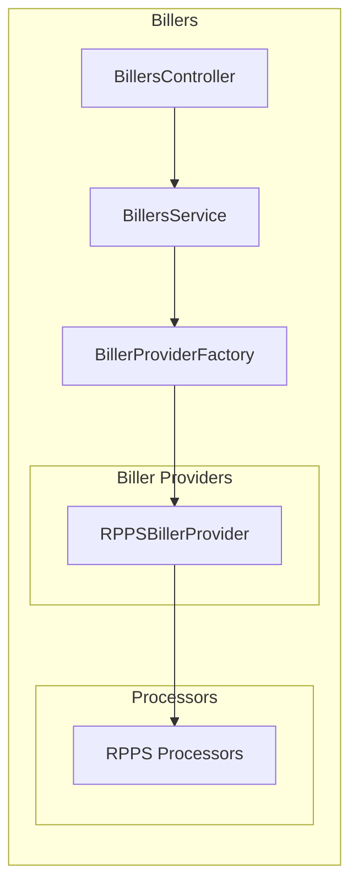

# Payment Module Architecture

## Overview

The Payment service is a NestJS microservice responsible for handling all payment-related operations in the ZNG system. It follows a layered architecture with clear separation of concerns, implementing domain-driven design pri3. **Enhanced Event Handling**: Improve event flow to avoid event stormsdriven communication patterns.

## High-Level Architecture

The Payment service follows a clean layered architecture:

**Application Layer** → **Business Layer** → **Domain Layer** → **Infrastructure Layer**

- **Application Layer**: `PaymentController`, `PaymentService`, `Event Handlers`
- **Business Layer**: `Loan Payments`, `Loan Payment Steps`, `Transfer Execution`, `Billers`
- **Domain Layer**: `Domain Services`, `Domain Module`
- **Infrastructure Layer**: `Data Module`, `Repositories`, `External Providers`

Each layer depends only on the layers below it, ensuring clean separation of concerns and maintainability.

## Module Structure

### 1. Application Layer

#### PaymentModule (Root Module)
- **Purpose**: Main application module that orchestrates all payment-related functionality
- **Dependencies**: Integrates CQRS, Event handling, Health checks, and all business modules
- **Key Components**:
  - `PaymentController`: Main REST API endpoint
  - `PaymentService`: Application service (currently minimal, planned for loan state management)
  - Event handlers for payment lifecycle events

#### Event Handlers
Event-driven components that respond to various payment and loan state changes:

| Handler | Purpose |
|---------|---------|
| `LoanStateChangedEventHandler` | Responds to loan state changes |
| `LoanStateSteppedEventHandler` | Handles loan state progression events |
| `PaymentStepCompletedEventHandler` | Manages completed payment step events |
| `PaymentStepFailedEventHandler` | Handles failed payment step events |
| `PaymentStepPendingEventHandler` | Manages pending payment step events |
| `PaymentSteppedEventHandler` | Handles payment progression events |
| `TransferCompletedEventHandler` | Manages completed transfer events |
| `TransferExecutedEventHandler` | Handles transfer execution events |
| `TransferFailedEventHandler` | Manages failed transfer events |

### 2. Business Layer

#### Loan Payments Module
**Purpose**: Manages the lifecycle of loan-related payments (funding, disbursement, repayment, fees, refunds)



**Key Components**:
- `LoanPaymentFactory`: Creates appropriate payment managers based on payment type
- `LoanPaymentService`: Orchestrates payment operations
- **Payment Managers**: Specialized handlers for different payment types
  - `FundingPaymentManager`: Handles loan funding payments
  - `DisbursementPaymentManager`: Manages loan disbursement payments
  - `RepaymentPaymentManager`: Processes loan repayments
  - `FeePaymentManager`: Handles fee-related payments
  - `RefundPaymentManager`: Manages refund operations

#### Loan Payment Steps Module
**Purpose**: Manages individual steps within payment processes, handling step state transitions



**Key Components**:
- `LoanPaymentStepFactory`: Creates step managers based on step state
- `LoanPaymentStepService`: Orchestrates step operations
- **Step Managers**: State-specific handlers for payment steps
  - `CreatedStepManager`: Handles newly created steps
  - `PendingStepManager`: Manages steps in pending state
  - `FailedStepManager`: Handles failed step recovery
  - `CompletedStepManager`: Processes completed steps

#### Transfer Execution Module
**Purpose**: Handles actual money transfer execution through various payment providers



**Key Components**:
- `TransferExecutionFactory`: Creates appropriate transfer provider based on configuration
- **Transfer Providers**: Integration with external payment systems
  - `MockTransferExecutionProvider`: Testing/development provider
  - `CheckbookTransferExecutionProvider`: Checkbook payment integration
  - `FiservTransferExecutionProvider`: Fiserv payment integration
  - `TabapayTransferExecutionProvider`: Tabapay payment integration

#### Billers Module
**Purpose**: Manages biller integrations for payment processing and data ingestion



**Key Components**:
- `BillersController`: REST API for biller operations
- `BillersService`: Business logic for biller management
- `BillerProviderFactory`: Creates appropriate biller providers
- **Biller Providers**: Integration with external biller systems
- **Processors**: Data transformation and processing logic

### 3. Domain Layer

#### Domain Module
**Purpose**: Contains core business logic and domain services

**Key Components**:
- `DomainServices`: Facade for accessing domain services
- `PaymentDomainService`: Core payment domain logic
- **Domain Exceptions**: Custom business exceptions

### 4. Infrastructure Layer

#### Data Module
**Purpose**: Provides data access layer with repositories and database configuration

**Key Components**:
- `DataModule`: Database configuration and repository registration
- `PaymentDataService`: Data access orchestration
- **Custom Payment Repositories**: Specialized data access for payment entities
- **Shared Repositories**: Common repository implementations

## Scalability and Extensibility

### 1. Factory Pattern
- `LoanPaymentFactory`: Creates payment managers
- `LoanPaymentStepFactory`: Creates step managers
- `TransferExecutionFactory`: Creates transfer providers
- `BillerProviderFactory`: Creates biller providers

### 2. Strategy Pattern
- Payment managers implement different strategies for payment types
- Step managers implement different strategies for step states
- Transfer providers implement different strategies for payment processors

### 3. Event-Driven Architecture
- All major operations emit events for loose coupling
- Event handlers manage cross-cutting concerns
- Enables audit trails and external system notifications

### 4. Repository Pattern
- Data access abstracted through repository interfaces
- Supports different data sources and testing
- Clear separation between domain and infrastructure

## Module Dependencies

The module dependency hierarchy follows a clear top-down structure:

```
PaymentModule (Root)
├── SharedModule (Infrastructure)
├── EventModule (Infrastructure)  
├── HealthModule (Infrastructure)
├── DomainModule
│   └── DataModule
├── LoanPaymentModule
│   ├── DomainModule
│   ├── DataModule
│   └── LoanPaymentStepModule
│       ├── DomainModule
│       └── DataModule
├── TransferExecutionModule
│   ├── DomainModule
│   └── DataModule
└── BillersModule
    └── DataModule
```

**Key Dependency Rules**:
- Business modules depend on Domain and Data modules
- Domain module depends on Data module
- No circular dependencies between business modules
- Shared infrastructure modules are consumed at the root level

## Scalability and Extensibility

### Adding New Payment Types
1. Create new payment manager extending `BaseLoanPaymentManager`
2. Register in `LoanPaymentFactory`
3. Add corresponding event handlers if needed

### Adding New Transfer Providers
1. Create new provider extending `BaseTransferExecutionProvider`
2. Register in `TransferExecutionFactory`
3. Configure provider selection logic

### Adding New Biller Integrations
1. Create new biller provider extending `BaseBillerProvider`
2. Add corresponding processors for data transformation
3. Register in `BillerProviderFactory`
