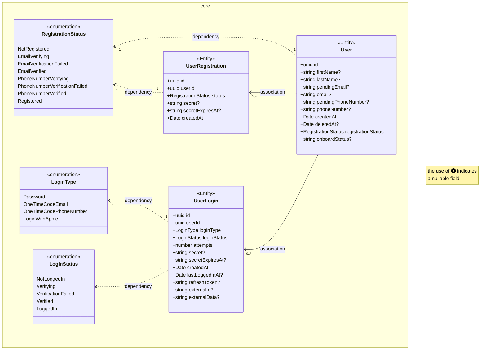

### User Domain

```mermaid
---
config:
  title: User Domain
  class:
    hideEmptyMembersBox: true
    theme: base
---
classDiagram
namespace core {
  %% enumeration types represented as classes just for Design purposes
  class RegistrationStatus {
    <<enumeration>>
    NotRegistered
    EmailVerifying
    EmailVerificationFailed
    EmailVerified
    PhoneNumberVerifying
    PhoneNumberVerificationFailed
    PhoneNumberVerified
    Registered
  }

  class LoginType {
    <<enumeration>>
    Password
    OneTimeCodeEmail
    OneTimeCodePhoneNumber
    LoginWithApple
  }

  class LoginStatus {
    <<enumeration>>
    NotLoggedIn
    Verifying
    VerificationFailed
    Verified
    LoggedIn
  }

  class User {
    <<Entity>>
    +uuid id
    +string firstName?
    +string lastName?
    %% Store Email here until the user has verified ownership of it
    %% Then copy it over to the email field and null this out
    %% Still need to validate that this Email is not already taken by someone else
    +string pendingEmail?
    +string email?
    %% Store PhoneNumber here until the user has verified ownership of it
    %% Then copy it over to the phoneNumber field and null this out
    %% Still need to validate that this PhoneNumber is not already taken by someone else
    +string pendingPhoneNumber?
    +string phoneNumber?
    +Date createdAt
    +Date deletedAt?
    %% Default to `NotRegistered`
    +RegistrationStatus registrationStatus
    %% Provided and tracked by UI
    +string onboardStatus?
  }

  class UserRegistration {
    <<Entity>>
    +uuid id
    +uuid userId
    +RegistrationStatus status
    %% Would be the Verification Code for us today
    +string secret?
    +string secretExpiresAt?
    +Date createdAt
  }

  class UserLogin {
    <<Entity>>
    +uuid id
    +uuid userId
    +LoginType loginType
    %% (verifying, verified, loggedIn, ???) -- Not sure if we need verified, since we will go straight to loggedIn in most cases
    +LoginStatus loginStatus
    %% Default to 0 instead of making this nullable
    +number attempts
    %% Contains VerificationCode or password or other external secret (depends on loginType)
    %% secret* values are nulled out after a successful Login verification
    +string secret?
    +string secretExpiresAt?
    +Date createdAt
    %% Not set until the user 'verifies' their login
    %% and is updated whenever the User has to login again
    +Date lastLoggedInAt?
    %% Not sure if we can just store this here like this. What happens if the User logins in on multiple devices?
    %% Would each separate login request generate it's own RefreshToken?
    %% What about the initial AccessToken we generate along with the RefreshToken? Do we need to keep that around as well?
    %% We may have to store some sort of sessionId per login across multiple devices, browsers, incognito mode, etc. (more research needed)
    +string refreshToken?
    +string externalId?
    +string externalData?
  }
}
  
  UserRegistration "0..*" <-- "1" User : association
  UserLogin "0..*" <-- "1" User : association
  RegistrationStatus "1" <.. "1" User : dependency
  RegistrationStatus "1" <.. "1" UserRegistration : dependency
  LoginType "1" <.. "1" UserLogin : dependency
  LoginStatus "1" <.. "1" UserLogin : dependency
  %% We can use Font Font Awesome Fonts (because of change to settings.json)
  note "the use of fa:fa-question-circle indicates 
  a nullable field"

  %% Can cheat and use this to generate Tooltips for Classes (only shows at bottom left of screen)
  click User call x() "User Information"
  click UserRegistration call x() "User Registration Information"
  click UserLogin call x() "User Login Information"
```
