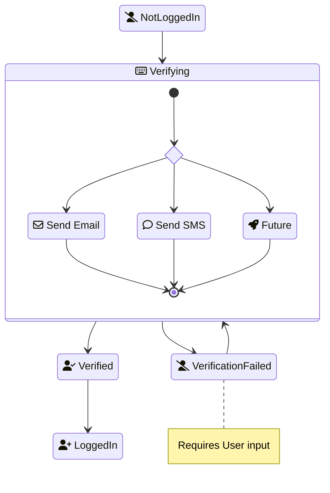

### User Login States

```mermaid
---
config:
  title: User Login States
  class:
    theme: base
---
stateDiagram-v2

  NotLoggedIn --> Verifying
  NotLoggedIn: <i class="fas fa-user-slash"></i> NotLoggedIn
  Verifying: <i class="far fa-keyboard"></i> Verifying
  state Verifying {
      state notification_type <<choice>>
      [*] --> notification_type
      notification_type --> SendEmail
      notification_type --> SendSMS
      notification_type --> Future
      SendEmail: <i class="far fa-envelope"></i> Send Email
      SendSMS: <i class="far fa-comment"></i> Send SMS
      Future: <i class="fas fa-rocket"></i> Future
      SendEmail --> [*]
      SendSMS --> [*]
      Future --> [*]
  }

  Verifying --> Verified
  Verified: <i class="fas fa-user-check"></i> Verified
  Verifying --> VerificationFailed
  VerificationFailed: <i class="fas fa-user-slash"></i> VerificationFailed
  Verified --> LoggedIn
  LoggedIn: <i class="fas fa-user-plus"></i> LoggedIn
  %% Can only move from VerificationFailed to Verifying state with external input  
  VerificationFailed --> Verifying

  note right of VerificationFailed: Requires User input 

```