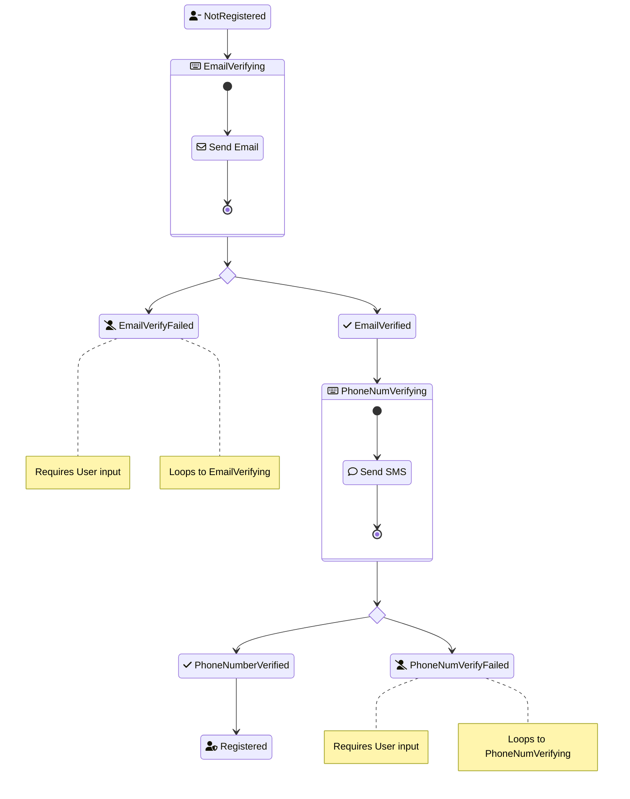

### User Registration States

```mermaid
---
config:
  title: User Registration States
  class:
    theme: base
---
%% Could not fully model the Email and PhoneNumber Verification Failure states as the layout
%% of the diagram doesn't flow properly when looping back here (hence the Notes)

stateDiagram-v2
  state email_success <<choice>>
  state phoneNumber_success <<choice>>

  NotRegistered --> EmailVerifying
  NotRegistered: <i class="fas fa-user-minus"></i> NotRegistered
  EmailVerifying: <i class="far fa-keyboard"></i> EmailVerifying
  state EmailVerifying {
      [*] --> SendEmail
      SendEmail: <i class="far fa-envelope"></i> Send Email
      SendEmail --> [*]
  }
  EmailVerifying --> email_success
  email_success --> EmailVerified
  EmailVerified: <i class="fas fa-check"></i> EmailVerified
  EmailVerified --> PhoneNumVerifying
  %% Real name of PhoneNumVerifying == PhoneNumberVerifying (abbreviating to make it fit in diagram)
  %% Real name of EmailVerifyFailed == EmailVerificationFailed (abbreviating to make it fit in diagram)
  email_success --> EmailVerifyFailed
  EmailVerifyFailed: <i class="fas fa-user-slash"></i> EmailVerifyFailed
  note right of EmailVerifyFailed: Requires User input
  note right of EmailVerifyFailed: Loops to EmailVerifying
  %% EmailVerifyFailed --> EmailVerifying 

  PhoneNumVerifying: <i class="far fa-keyboard"></i> PhoneNumVerifying
  state PhoneNumVerifying {
      [*] --> SendSMS
      SendSMS: <i class="far fa-comment"></i> Send SMS
      SendSMS --> [*]
  }
  PhoneNumVerifying --> phoneNumber_success
  phoneNumber_success --> PhoneNumberVerified
  PhoneNumberVerified: <i class="fas fa-check"></i> PhoneNumberVerified
  PhoneNumberVerified --> Registered
  Registered: <i class="fas fa-user-shield"></i> Registered
  phoneNumber_success --> PhoneNumVerifyFailed %% (PhoneNumberVerificationFailed: real name had to abbreviate to fit)
  PhoneNumVerifyFailed: <i class="fas fa-user-slash"></i> PhoneNumVerifyFailed
  note right of PhoneNumVerifyFailed: Requires User input
  note right of PhoneNumVerifyFailed: Loops to PhoneNumVerifying
  %% PhoneNumVerifyFailed --> PhoneNumVerifying

```