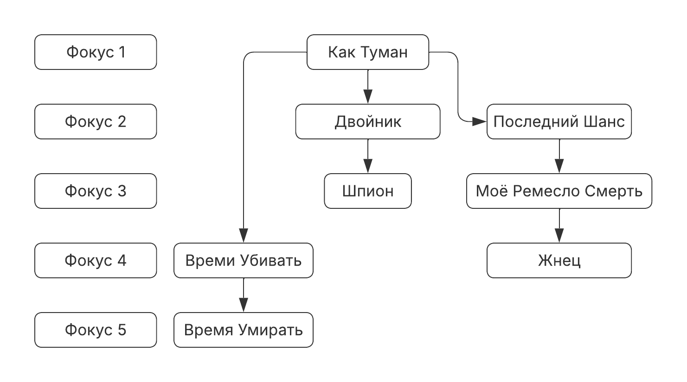
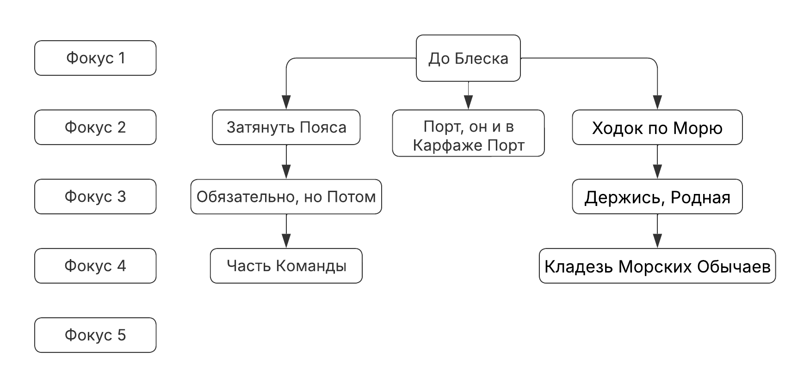
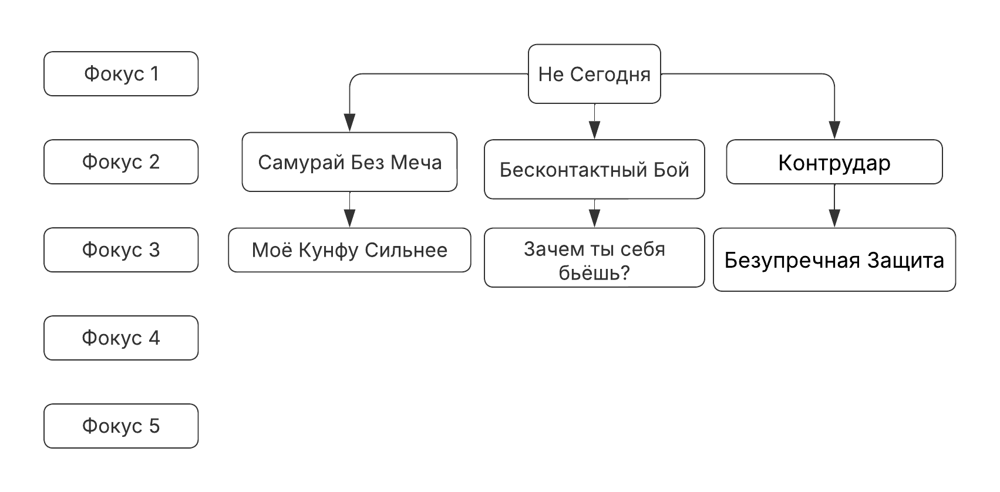
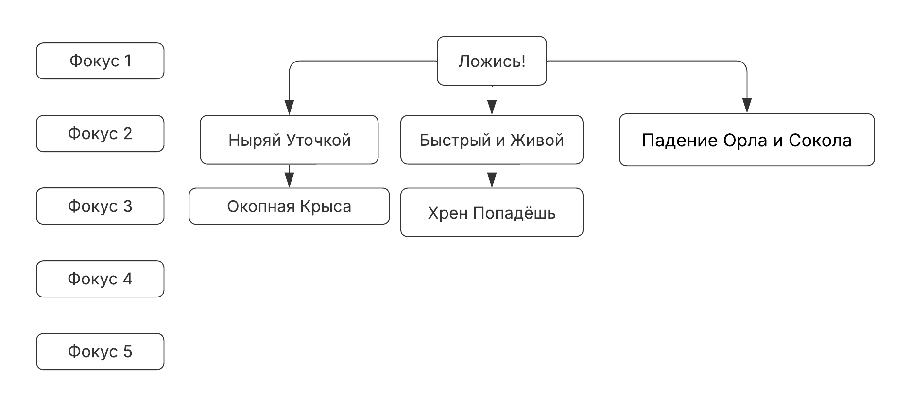
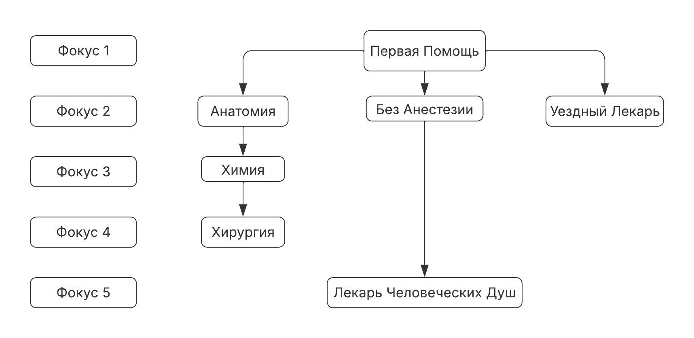
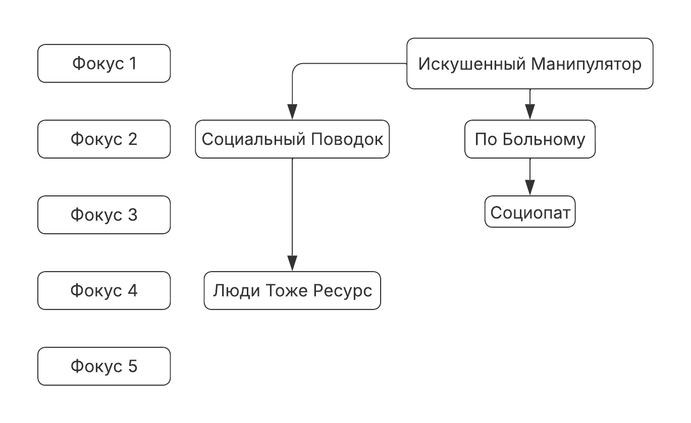
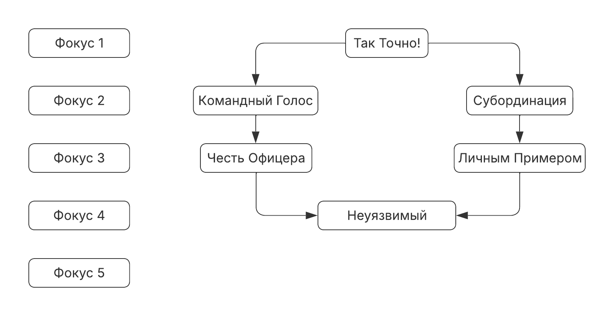
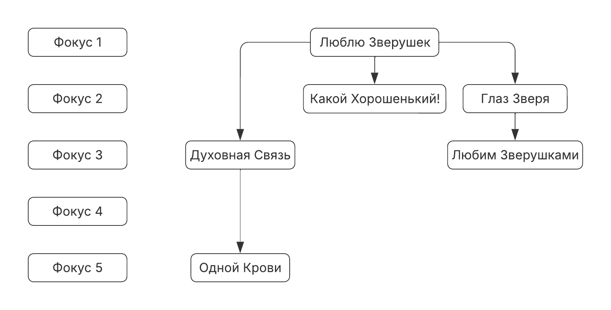
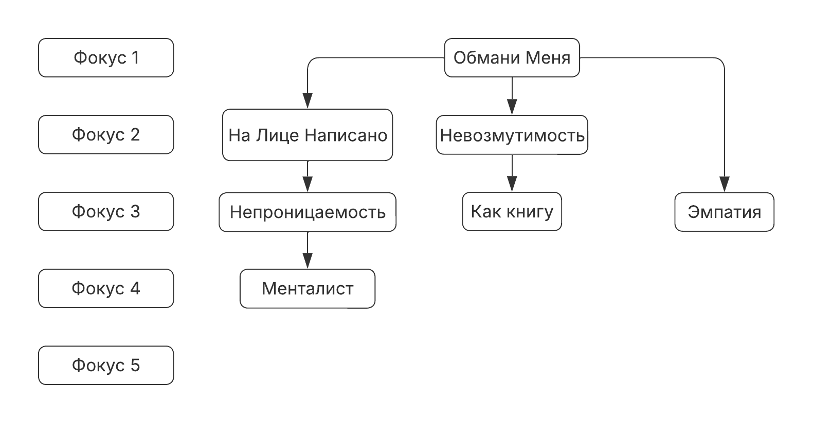

Предисловие: Архипелаг \- это сеттинг для НРИ, который я создал, когда был в поисках того, что мне хотелось бы поводить. Архипелаг не претендует на какую-то особенную уникальность, являясь, по сути, компиляцией идей, механик, и подходов из разных сеттингов, систем, культур и произведений. Если вам кажется, что “это было в симпсонах”, то это, скорее всего, так. В то же время, этот сеттинг оригинальный хотя бы тем, что лёг на мои собственные литературные наработки. В любом случае, Архипелаг, или “тёмное место”, как он ещё назывался в рабочем варианте, вышел увлекательным. Это сеттинг, в котором найдётся место самым разным сюжетам, героям и приключениям. Большой частью архипелага являются его тайны и секреты. Не ждите, что всё будет понятно, последовательно, или хотя бы логично. Информация может быть противоречива, источники ненадёжны, а детали искажены. Так и задумано. Пытливый ум игрока может согреть мысль о том, что “вся правда” известна, и заранее написана. Она существует, до неё можно добраться, и это, на мой взгляд, не менее увлекательно, чем кидаться кубиками в ворогов. Добро пожаловать, Игрок, в мир, окруженный густым туманом. Мир, где солнце встаёт из чёрных вод бездонного океана. Где не светят звёзды в ночном небе. Где каждое путешествие сквозь безучастную водную гладь, по которой раскидано множество больших и малых островов, может стать последним. Добро пожаловать в Архипелаг. * * * Для начала: “Архипелаг” это НРИ \(настольная ролевая игра\). В ней есть мастер, он же рассказчик, который играет “за мир” и, собственно, игроки, которые играют за своих персонажей. Эта книга предназначена, в первую очередь, для игроков, а значит и сосредоточится на том, что им необходимо знать. Система, на которой стоит “Архипелаг” называется 2д20\. В ней используется всего два вида кубов К20 \(куб с 20 гранями\) и К6 \(куб с шестью гранями\). Стандартный бросок \- это два дадцатигранных куба. Отсюда и название. Шестигранными кубами лучше запастись в большом количестве. Так же могут потребоваться фишки\токены для того, чтобы следить за разными ресурсами, и бумага с карандашём для записей. 2д20 - очень гибкая система, позволяющая отразить многие аспекты персонажей игроков. Персонажи в мире архипелага \- выдающиеся индивиды, незаурядные личности, способные к незаурядным же поступкам. Они не должны быть добропорядочными, или хотя бы просто здравомыслящими \- вы можете создавать и отыгрывать, что вашей душе угодно. Но стоит отметить, что мир Архипелага не слишком дружелюбен, и чаще следует принципу “играй в дурацкие игры \- получай дурацкие призы” чем нет. Персонажи игроков, безусловно, являются центром собственной истории, но ни в коем случае не являются центром всего мира. Мир архипелага полон событий, больших и малых, и каждая кампания или игра в мире архипелага происходит в живом и меняющемся мире, который реагирует на действия или бездействия персонажей. Архипелаг задумывался как песочница для историй, а значит не стоит ожидать, что мир вокруг вас сложится дорогой из жёлтого кирпича от начала приключений к великому и славному будущему. Смерть персонажей игроков, их неудачи \- неотъемлемая часть приключений в мире “Архипелага”. Ожидается, что игроки в “Архипелаг” уже знакомы хотя бы в общих чертах с настольными ролевыми играми, и для абсолютных новичков “Архипелаг” может показаться откровенно недружелюбным. Для таких игроков я могу лишь посоветовать отказаться от любых ожиданий, которые у них могли быть, и быть открытыми к новому. * * * Создание Персонажа: У каждого персонажа есть Атрибуты, Навыки, Таланты, и какое-то стартовое снаряжение. Персонажи создаются в пять этапов: Шаг Первый: Природа персонажа Природа персонажа \- это суть его бытия в мире Архипелага. Персонажи могут быть: Смертные: Подавляющее большинство персонажей в мире Архипелага смертны. Простые люди, которые рождаются, живут, и умирают на островах. Особенность смертных персонажей состоит в том, что они обладают “Решимостью” \- особой механикой, которая позволяет им действовать в “моменты истины” с особой стойкостью, достигая своих целей. Для этого у них есть “Ценности” \- фундаментальные этические ориентиры, и набор представлений о мире и своём месте в нём. Это, с одной стороны, накладывает определённые ограничения на отыгрыш, заставляя следовать заданным рамкам, и даже, временами, сталкиваться с экзистенциальными дилеммами. С другой \- такие персонажи куда яснее представляют себе свой путь в этом мире, и отыгрывать их может быть действительно удовлетворяющим занятием. Бессмертные: ака “Потерянные”/”Вернувшиеся”/”Отвергнутые”/”Отмеченные четвёртым порядком”, и прочие имена, возникшие для таких в разных культурах Архипелага. Люди, по какой-то причине избежавшие смерти. Какой бы не была их смерть, их тела неизбежно прибивает к ближайшему берегу примерно через сутки после смерти. Потерянные неизбежно меняются после своего возвращения. Изменения могут быть как и мелкими: цвет волос, глаз или кожи, так и крупные: пол, возраст, характер. Некоторые потерянные возвращаются множество раз. Они меняются до неузнаваемости. Некоторые полностью забывают себя прежних. Надёжным знаком того, что потерянный больше не вернётся, является потеря голоса. Каждый потерянный “отмечен четвёртым порядком” имеет на теле три одинаковые отметины. Это может быть что угодно, но чаще всего треугольник. Потерянные, таким образом, не имеют чёткого характера, ориентира в жизни, стойкости и решимости смертных. Вместо этого они имеют очки удачи \- восстанавливающийся ресурс, дающий им относительно небольшой контроль над своей судьбой. Как видно из описания, бессмертные, в конечном счёте, всё же смертны. Количество раз, которые можно вернуться, случайно, но неизбежно конечно. Преимущество Бессмертных персонажей в их особой механике, позволяющий им достичь нечеловеческих высот \(максимальное значение атрибута может быть поднято до 14, против 12 у смертных\). Обратной стороной является опасность частых смертей. Персонаж может стать откровенно недееспособным из-за неудачных бросков, и навсегда отстать по опыту и развитию. В плане отыгрыша \- абсолютная свобода с ноткой нигилизма. Потерянные \- достаточно редкое явление в мире Архипелага, и хотя группа персонажей игроков может состоять из них хоть целиком, неигровые персонажи вернувшиеся \- почти музейная редкость. Кошки: Да-да, вы правильно прочитали. Большие. Антропоморфные. Кошки. Кошки происходят с загадочных “Островов Тысячи Кошек”. Легенда гласит, что однажды племена, населяющие дальние острова, увидели сон, что они кошки, и многие проснулись “как кошки”. Те, кто похож на людей слишком сильно \(прямохождение, противопоставленные пальцы\) в обязательном порядке отправляются в путешествие по архипелагу, чтобы больше контактировать с людьми и проверить силу своей веры. Если они возвращаются, и они всё ещё коты, то уже навсегда принимаются в общество. Если же нет \- они просто превращаются в людей, и никогда не возвращаются. Соответственно игра за такого персонажа \- это нарративно нечто совершенно особенное. У них есть несколько уникальных механик. В первую очередь, у кошек “девять жизней” \- они могут девять раз избежать смерти. Второе \- они нарративно ограничены своей “кошкостью”. За отклонение от этого они могут навсегда потерять свои “кошачьи” черты, постепенно превращаясь в обычного человека. Ну и самое приятное \- кошки в обязательном порядке имеют особую ветку талантов “Веры”. В себя, любимых. Эта их особенность позволяет им успешно сохранять баланс между своей кошачьей природой и миром людей, а также достигать невероятных, невозможных результатов практически в любой деятельности. Что тут скажешь? Кошки. Если вы хотите доверить этот выбор случаю, то киньте 1К20\. На 1-14 возьмите смертного. На 15-18 возьмите “вернувшегося”. На 19-20 возьмите кошку. У смертных персонажей есть Решимость. Смертные персонажи умирают один раз. Если игрок так того пожелает, то смертный персонаж может стать вернувшимся. В противном случае, если новый персонаж присоединяется к той же компании, то он может взять 80% всего распределенного опыта от предыдущего, если новый персонаж тоже смертный. Если игрок хочет, чтобы персонаж стал вернувшимся, то он должен снять 40%\(не менее, чем 800 опыта\) из аттрибутов\навыков\талантов персонажа. После чего у него пропадает решимость, появляется удача, и он играется как вернувшийся. Эта смерть не идёт в счётчик смертей. Смерть вернувшегося персонажа: Весь нераспределенный опыт теряется. После смерти вернувшиеся меняются. Игрок волен изменить что-то во внешности, или характере, но обязан в навыках\атрибутах\талантах. Нужно “освободить опыт” \- понизить характеристики\навыки\таланты на сумму не менее 200 опыта. Теперь необходимо кинуть 2к20 проверку Дисциплины \(без фокуса и без возможности пользоваться моментумом\). При двух успехах \- весь “освобождённый опыт” переходит в “Засоленный опыт” При одном успехе \- половина теряется. При двух неуспехах \- весь теряется. Сверх этого \- при двух усложнениях следующая жизнь последняя, персонаж теряет голос. Усложнения выпадают на 20 - номер смерти после создания персонажа, и ограничиваются 16\( то есть, 17, 18, 19, 20 - это усложнения\). Только используя “засоленный” опыт можно повысить атрибуты до 14\. “Засоленный” опыт можно тратить только между смертью и возвращением. Решимость Игроки, играющие за смертных персонажей, имеют доступ к ресурсу “Решимость”. Решимость отражает тот факт, что персонажи являются протагонистами своих историй, с амбициями, стимулом, и стойкостью, превышающими таковые у многих людей. Такие индивиды творят свою судьбу волей и делом. Неважно, считаются ли они героями в традиционном смысле слова, Персонажи игроков естественным образом являются выдающимися людьми. Решимость может быть использована, чтобы выполнять захватывающие трюки, получать преимущество в напряженных ситуациях, или иным образом помочь продвинуть историю. Персонажи получают и тратят Решимость, действуя в соответствии с их воззрениями, выраженными их Ценностями. Когда их ценности помогают им в том, чего они хотят достичь, у них появляется возможность потратить Решимость, в то время как получить Решимость можно когда сиюминутные цели персонажа и его ценности в конфликте друг с другом. Каждый Смертный Персонаж начинает с одним очком Решимости, и не может иметь больше трёх в любой момент. Излишки немедленно сбрасываются. Трата Решимости Когда вы проходите проверку навыка, или иным образов в сложной ситуации, и одна, или более, из ваших ценностей, могли бы помочь ситуации, Вы можете потратить единицу Решимости. Когда вы её тратите, вы можете выбрать один из следующих эффектов: ● Идеальная возможность: Решимость может быть потрачена во время проверки навыка, чтобы к20 показал единицу. Необходимо заявить до любых бросков на этом тесте. ● Момент Вдохновения: Перебросить все кости в пуле костей. Можно заявить после броска. ● Вспышка Деятельности: Немедленно совершить ещё одно действие в свой ход, как только закончилось первое. Применять только в бою. ● Сделай Это: Немедленно создать характеристику\(см., “Правила и Механика”\), которая подходит для этой сцены. Можно до проверки навыка, может влиять на тест. ● Полезная Уловка: Персонаж немедленно получает возможность пользоваться талантом, которым не владеет\(необходимо иметь хотя бы одно очко фокуса в этой ветке\) Талант остаётся до конца сцены. Получение Решимости Когда вы проходите проверку навыка, или иным образов в сложной ситуации, и одна, или более, из ваших ценностей, делают ситуацию ещё сложнее, тогда ГМ может попросить вас сделать одну из следующих вещей: ● Подчиниться: вы остаётесь верны своей ценности, получая усложнение как результат. Это усложнение может сделать выбранный курс действий сложнее, или даже предотвратить попытку это сделать, вместо этого требуя попробовать что-то другое. Обсуждайте с ГМом, как именно это должно происходить. Как только это случилось, вы получаете очко Решимости. ● Вызов: вы идёте против своей ценности. Вы вычёркиваете эту ценность, поскольку она уже не так жизненно важна для персонажа, как раньше казалось, а затем продолжаете разрешение проверки или ситуации. Как только это закончено, вы получаете очко Решимости. Во время игры, не обязательно рассчитывать только на ГМа для получения подсказок о восстановлении Решимости; вы можете сообщить ГМу, что считаете ситуацию подходящей для восстановления решимости. Вычеркнутые Ценности Если какая-либо из ваших ценностей вычеркнута, вы менее уверены в своих убеждениях и в своем месте во Вселенной. Чтобы устранить эту неопределенность, нужны время, саморефлексия, и хороший совет. Перечеркнутая ценность не может быть использована, пока не будет переписана. Когда заканчивается сцена, во время которой вы размышляли о личных делах или обсуждали их с другим персонажем, и вы не потратили, и не получили решимости во время этой сцены, вы можете спросить ГМа, можете ли вы восстановить ценность. Если вы не сделаете этого во время игрового процесса, это произойдет автоматически, между приключениями, если не было подходящей возможности во время игры. При восстановлении значения выберите одну вычеркнутую ценность и запишите новую ценность. Это может быть небольшое изменение, если убеждения персонажа смещаются медленно, или приобретают нюансы и сложности, или это могли быть крупные изменения, если бы базовое самоощущение персонажа претерпело потрясения. Как только это будет сделано, ценность будет восстановлена, и ее можно будет использовать свободно, хотя вы не сможете оспорить \(совершить Вызов\) ценности, которая уже была оспорена и восстановлена во время этого приключения \(базовые убеждения людей не меняются так часто\). Ценности Когда персонаж создается, Игрок персонажа создает утверждения, описывающие отношения, верования, и убеждения этого персонажа. Это не простые мнения, а фундаментальная структура морали и поведение персонажа. Это то, что определяет, кем является персонаж как личность, почему он ведёт себя таким образом и что движет им во времена борьбы и трудностей. В Архипелаге пять ценностей, три из которых описывают отношения, в частности, то, как персонаж относится к остальной группе. Эта связь не обязательно должна быть положительной — старые обиды и ресентимент могут оказать решающее влияние на Ценность персонажа, но это должно быть что-то значимое и что-то, что формирует характер персонажа и то, как он действует. Однако ценности персонажа не статичны. Они являются мощной движущей силой персонажа; людям свойственно развиваться и расти вместе со своим опытом, и во многих случаях вещи, которые когда-то казались непоколебимыми убеждениями, с течением времени могут восприниматься по-другому. Во время игры будет возможность изменить Ценности персонажа, а ценности являются важной частью того, как персонажи растут и развиваются с течением времени. Ценности отличаются от Черт \(см. выше\) тем, что они описывают то, во что верит персонаж. Это заявления о том, как персонаж относится к вселенной вокруг себя, и они одновременно субъективны и потенциально изменчивы. Авторитет: К тем, кто превосходит меня, сильнее меня, выше по званию, или может решить мои проблемы мой персонаж относится… \(закончи фразу\) Гордыня: К тем, кто слабее меня, ниже по званию, или не может быть мне полезен, мой персонаж относится… Соперничество: К тем, кто равен мне, кто рядом со мной, и кто стремится к тому же, что и я, мой персонаж относится … Идеализм: Мой персонаж убеждён, что с течением времени он, и мир вокруг него… Личность: Глубоко внутри, мой персонаж убеждён, что … Пожалуйста, избегайте слишком общих формулировок. Пример хорошего заполнения ценности: Мой персонаж убеждён, что с течением времени он, и мир вокруг него изменятся в лучшую сторону, воссияет торжество разума, конфликты и предубеждения останутся в прошлом, а ему в таком мире найдётся достойное место, которое он заработает своим трудом. Пример плохого заполнения ценности: Мой персонаж убеждён, что с течением времени он, и мир вокруг него, умрёт. Шаг Второй: Родина Географическое происхождение персонажа. Даёт Талант и знание языка. В Архипелаге не так много крупных централизованных государств, но множество мелких полу-независимых островных образований. Выбранная родина \- это место где вырос персонаж, но необязательно родился. Эффекты таких талантов чаще всего связаны с культурными особенностями, но некоторые касаются именно урожденных представителей. Кошки всегда родом с Островов Кошек, и даже если они по нарративным причинам выбирают другую родину, они остаются со своим талантом, не получая новый. Суо\(или любые “внешние” острова\): Язык: Соответственный. Талант: Стойкость и Гармония. Царство Триединое: Язык: Триединая Речь Талант: За Песнь, Царя и Отечество Империя Инис: Язык: Гаэльге Талант: Ружья, барабаны и сталь Маори: Язык: Маори Талант: Урождённые Навигаторы Карфаж: Язык: Глоса Талант: Избранники Солнца Шляхта\(или любые “срединные” острова\): Язык: Соответственный Талант: Торговля и Ремесло Случайный выбор: Киньте 1к20\. 1-5 Инис. 6-10 Царство Триединое. 10-15 Шляхта. 16-18 Суо. 19 Маори. 20 Карфаж. Описание Талантов Родины: Стойкость и Гармония: Выберите одну из предложенных веток талантов, и получите скидку на повышение фокуса и приобретение талантов в 50 очков опыта: Лук, Сопротивление, Обращение с Животными. Выберите одну из предложенных веток талантов, и получите скидку на повышение фокуса и приобретение талантов в 25 очков опыта: Ремесло\(лодочник\),Знание\(Дикость\), Манипуляция Порядком \(Гармония\). За Песнь, Царя, и Отечество Выберите одну из предложенных веток талантов, и получите скидку на повышение фокуса и приобретение талантов в 50 очков опыта: Ближний Бой, Командование, Вера. Выберите одну из предложенных веток талантов, и получите скидку на повышение фокуса и приобретение талантов в 25 очков опыта: Манипуляция Порядком \(Небо\),Знание\(Стратегия\), Манипуляция Порядком \(Время\). Ружья, Барабаны и Сталь Выберите одну из предложенных веток талантов, и получите скидку на повышение фокуса и приобретение талантов в 50 очков опыта: Огнестрельное\(Любое\), Манипуляция Порядком\(Земля\) Выберите одну из предложенных веток талантов, и получите скидку на повышение фокуса и приобретение талантов в 25 очков опыта: Ремесло\(Инженерные дисциплины\), Знания\(цивилизация\) Урождённый Навигатор Если персонаж не имеет фокуса в Навигации, и они проходят проверку Навигации вместе с другим персонажем, имеющим этот талант, и не имеющим фокуса в навигации, то они могут кидать полный пул \(2к20\) кубов. Если персонаж решает развивать Навигацию, то вложение фокуса и покупка талантов дешевле на 100 очков опыта. Избранники Солнца: Выберите одну из предложенных веток талантов, и получите скидку на повышение фокуса и приобретение талантов в 50 очков опыта: Боевые Искусства, Ближний Бой, Парирование. получите скидку на повышение фокуса и приобретение талантов в 100 очков опыта в Манипуляция Порядком\(Небо\), но сложность проверки сопротивления при употреблении солнечной воды повышается на один шаг. Торговля и Ремесло: Выберите одну из предложенных веток талантов, и получите скидку на повышение фокуса и приобретение талантов в 50 очков опыта: Боцман, Убеждение/Манипуляция, Понимание Выберите одну из предложенных веток талантов, и получите скидку на повышение фокуса и приобретение талантов в 25 очков опыта: Атлетика, Ремесло\(Любое\), Навигация Шаг Третий: Атрибуты У персонажей шесть аттрибутов: Ловкость: отвечает за подвижность и атлетичность. Сила: отвечает за физическую силу, выносливость, здоровье. Так же даёт бонус к урону от традиционных видов боя. Координация: Отвечает за сложные действия, требующие сосредоточения, и, сюрприз, координации. Проницательность: Сочетание социальных способностей, и общей внимательности, и осознанности персонажа. Интеллект: Образование, и умственные способности. Воля: Возможно, самый важный показатель в мире архипелага. Внутренняя сила персонажа, умение направить свои чаяния, устремления, и мысли в нужном направлении. Физические атрибуты: Ловкость, Сила, Координация. Ментальные: Проницательность, Интеллект, Воля Максимальный показатель аттрибута для смертных людей двенадцать. Средний \- семь. Ниже шести подразумевает какой-то заметный изъян. Самый просто способ распределить характеристики \- это взять “стандартный набор”: 8, 8, 9, 9, 10, 11. Можно заметить, что таким образом все значения выше среднего. Это отражает природу персонажей, как выдающихся личностей. Альтернативные варианты распределения характеристик: Покупка за очки: Установите все атрибуты на 6\. Игрок может распределить 19 очков в Атрибуты. Один атрибут может быть равен 6, один может быть равен 12\. Случайные характеристики: Установите все характеристики на 8\. Киньте К6 по одному разу на каждую характеристику. 1 = 1, 2 = 2, 3,4 = 0, 5 = 2, 6 = 3. Прибавьте значение к характеристике. Шаг Четвёртый: Навыки Здесь, опять же, можно прибегнуть к готовы Архетипам \- их пять, или распределить самостоятельно. Архетип \- это такой усреднённый вариант персонажа, который может встретиться в Архипелаге. Игрок может затем настроить его под себя. Сущность Архетипа: Экспертиза в которой вы получаете +3, и выбираете одну ветку талантов, фокус в которой +3, и +1 очко таланта в этой ветке. можно навсегда потратить два очка удачи, или навсегда снизить максимальный запас решимости на два, и выбрать вторую ветку талантов с фокусом 3, без очка талантов. Предрасположенность: Вы получаете +3 экспертизы. Вы можете выбрать ветку талантов и поднять фокус в ней +2 , а также получить в ней очко таланта. Интересы: Эти экспертизы получают +2, +2. Выберите в одной из них ветку талантов, и поднимите в ней фокус на 1\. Вы также получаете ещё одно очко таланта для свободного распределения. Можно снизить максимальный запах очков удачи или решимости на один, и получить ещё одно свободное очко талантов, если ещё не была взята опция из “Сущности”. Штрихи: Выберите две экспертизы из предложенных. Они получают +1 ИЛИ Выберите одну из предложенных экспертиз, она получает +1 и любая из уже выбранных экспертиз, кроме тех, что были в Сущности, получает +1 ИЛИ получите ещё одно очко талантов, но его можно вложить только в ветку из Интересов. Снаряжение: Стартовое снаряжение. Второй вариант: +3, +3, +2, +2, +1, +1 - экспертизы. +3, +2, +1 - фокусы. +3 очка талантов. Распределите как желаете нужным. Выбирать две ветки талантов в одной экспертизе нельзя. Можете снизить максимальный запас Удачи или Решимости на 2, чтобы получить ещё +3 фокуса ИЛИ снизить на 1, чтобы получить ещё одно очко талантов. Третий Вариант: получите 10 очков экспертизы и 5 очков фокуса. Распределите их как посчитаете нужным. Можно навсегда снизить максимальный запас Удачи или Решимости, чтобы поднять эти значения до 12 и 6 соответственно. Вы также получаете 3 очка талантов. Можете снизить запас удачи или решимости ещё на один, чтобы получить +1 очко таланта. Архетипы: Традиционный Боец: Неважно, по какой причине, будь то ваше происхождение из отдалённых и диких уголков Архипелага, или принципиальная верность традиции, или просто придурь \- вы сражаетесь классическим оружием ближнего боя, мастер стрельбы из лука, или даже готовы вступить в бой с голыми руками, полагаясь на своё знание боевых искусств. Сущность: Традиционные Виды Боя +3, фокус в Традиционных Видах Боя на выбор +3. +1 очко Талантов в этой ветке. Предрасположенность: Выносливость +3, фокус +2, +1 талант ИЛИ Дисциплина \+ 3 \(Вера\) фокус +2, +1 талант ИЛИ Подвижность +3, фокус +2 +1 талант Интересы: Выносливость/Дисциплина\(Вера\)/Подвижность \(нельзя выбрать то же самое, что и в Предрасположенности\) + 2, Защита \+ 2. +1 Фокус в одной из них, +1 свободное очко талантов. Штрихи: Чувства, Присутствие, Знание. Снаряжение: Традиционное оружие ближнего или дальнего боя на выбор, Плотная Одежда \(1\) и Щит ИЛИ Тяжёлый Доспех\(3\) Накопления в Размере 5 денях. Безделицы связанные с историей персонажа на выбор игрока на общую сумму не выше 2 золотых. Солдат: Вы отслужили в одной из современных армий Архипелага. Вас учили получать и отдавать приказы, сражаться в море и на суше, и претерпевать лишения. Вы знакомы с современными образцами оружия и кораблей. После армии у вас остались сбережения, но большую их часть вы промотали в пьянках и азартных играх. Сущность: Огнестрельное +3, фокус в Огнестрельном на выбор +3. +1 очко Талантов в этой ветке. Предрасположенность: Защита +3\(Укрытие\), фокус +2, +1 очко таланта в фокусе. Интересы: Атлетика \+ 2, Традиционные Виды Боя \+ 2 ИЛИ Присутствие +2, Мореплавание +2. +1 Фокус в одной из них, +1 свободное очко талантов. Штрихи: Знания, ремесло, подвижность, выносливость. Снаряжение: Наградное оружие \(Сабля, Кортик, Пистолет на выбор\). Форма. Воспоминания. От них вам уже не отделаться. Накопления в Размере 10 денях. Безделицы связанные с историей персонажа на выбор игрока на общую сумму не выше 4 золотых. Моряк: Торговый флот, или пиратское судно. Разгружать корабли, или драить палубу. Запах моря, качка палубы \- всё это вам более чем знакомо. Вы можете назвать дюжину видов такелажа, и определить загрузку корабля по тому, как он заходит в порт. Сущность: Мореплавание +3, фокус в Мореплавании на выбор +3. +1 очко Талантов в этой ветке. Предрасположенность: Присутствие +3 ИЛИ Социальные Интеракции +3, фокус в ней +2, +1 очко таланта в фокусе. Интересы: Огнестрельное \+ 2, Защита \+ 2 ИЛИ Ремесло +2, Знания +2 ИЛИ Традиционный Бой +2, Подвижность +2. +1 Фокус в одной из них, +1 свободное очко талантов. Любую из выбранных экспертиз в интересах можно заменить на Дисциплину, если взять Веру. Моряки люди суеверные. Штрихи: Подвижность, Атлетика, Дисциплина, Традиционные Виды Боя. Снаряжение: Кортик, или Пистолет, или Инструменты для Ремесла на выбор. Морские татушки, куда без них. Ваше жалование за последнюю неделю в размере 5 денях. Сокровище, обретенное вами в плавании. Что-то дорогое сердцу, но не стоящее реальных денег. Пройдоха: В этом мире множество возможностей, и упускать их из-за каких-то там принципов \- не для вас. Вы предпочитаете не прибегать к насилию, и знаете десяток и один способ законного отъёма денег у населения. И в два раза больше незаконных. Сущность: Чувства +3 ИЛИ Подвижность +3, фокус +3. +1 очко Талантов в этой ветке. Предрасположенность: Социальные Интеракции +3 ИЛИ Подвижность +3 ИЛИ Чувства +3\(нельзя выюрать то же, что и в сущности\), фокус в ней +2, +1 очко таланта в фокусе. Интересы: Присутствие \+ 2, Знания \+ 2 ИЛИ Ремесло +2, Знания +2 ИЛИ Традиционный Бой +2, Подвижность +2. +1 Фокус в одной из них, +1 свободное очко талантов. Штрихи: Атлетика, Дисциплина, Традиционные Виды Боя. Снаряжение: Кинжал, неприметная одежда, ворох мелких правонарушений в прошлом. Кристальная жизнь ведёт к кристально чистым карманам. Повеса: Вы родились в богатой семье, или может быть удачно вложились в экспедицию за туман, или вы потомственный аристократ, в любом случае вы завсегдатай кабаков и трактиров, светских приемов и балов. В пределах своего социального статуса, конечно. Большая часть денег уже пропита, но главное \- это алкоголизм и знакомства, заработанные в процессе. Сущность: Социальные Интеракции +3, фокус +3. +1 очко Талантов в этой ветке. Предрасположенность: Выносливость +3 ИЛИ Чувства +3, фокус в ней +2, +1 очко таланта в фокусе. Интересы: Подвижность \+ 2, Знания \+ 2 +1 Фокус в одной из них, +1 свободное очко талантов. Штрихи: Традиционные Виды Боя, Огнестрельное. Снаряжение: Костюм по последней моде, дорогой парфюм, 15 денях. Навигатор: Вы обладаете редким и невероятно важным талантом в Архипелаге \- умением водить суда по океану. Вы никогда не останетесь без работы, но вряд ли проживете долгую счастливую жизнь. Сущность: Дисциплина+3\(Навигация\) фокус +3. +1 очко Талантов в этой ветке. Предрасположенность: Знания +3 ИЛИ Мореплавание +3 ИЛИ Ремесло +3, фокус в ней +2, +1 очко таланта в фокусе. Интересы: Социальные \+ 2, Огнестрельное \+ 2 ИЛИ Чувства +2, Традиционные Виды Боя +2 ИЛИ Защита +2, Выносливость +2. +1 Фокус в одной из них, +1 свободное очко талантов. Штрихи: Выносливость, Дисциплина, Знания, Ремесло, Социальные. Снаряжение: Журнал с известными на вашей родине картами Архипелага, Любая Одежда, 7 денях. Музыкант: Конечно же, вы не просто играете на музыкальном инструменте, но и можете видеть и чувствовать Порядок. Вы получили это знание от своего наставника, или может быть упорной и долгой практикой сами смогли понять, как это работает \- важно лишь то, что вы владеете Манипуляцией Порядком. Сущность: Дисциплина +3\(Манипуляция Порядком \(зависит от вашего происхождения\)\), фокус +3. +1 очко Талантов в этой ветке. Предрасположенность: Социальные Интеракции +3 ИЛИ Присутствие +3 ИЛИ Чувства +3, фокус в ней +2, +1 очко таланта в фокусе. Интересы: Выбери 2 из : Ремесло +2, Мореплавание +2, Знания +2. +1 Фокус в одной из них, +1 свободное очко талантов. Штрихи: Защита, Подвижность, Ремесло, Знания, Выносливость Снаряжение: Ваш Музыкальный Инструмент, Журнал Музыкальных Произведений, Книги с историями и поэмами, одежда, 5 денях. Божий Человек: Вы веруете в одного из Богов Архипелага, и активно несёте свою веру в массы. А уж пиздюлем или добрым словом \- решать вам. Сущность: Дисциплина +3\(Вера\), фокус +3. +1 очко Талантов в этой ветке. Предрасположенность: Социальные Интеракции +3 ИЛИ Знания +3 ИЛИ Традиционный Бой +3 ИЛИ Огнестрельное \+ 3, фокус в ней +2, +1 очко таланта в фокусе. Интересы: Присутствие \+ 2, Чувства \+ 2 ИЛИ Защита +2, Выносливость +2 ИЛИ Подвижность +2, Чувства +2. +1 Фокус в одной из них, +1 свободное очко талантов. Штрихи: Защита, Выносливость, Знания, Чувства. Снаряжение: Символ вашего Бога, Оружие, Если было выбрано Огнестрельное или Традиционные Виды Боя в Предрасположенности, в противном случае 15 денях. Простая одежда. Исследователь: Архипелаг полон загадок и тайн, а вы полны научного любопытства. Может быть вы состоите в Академии, а может быть собираете частную коллекцию \- но вы знаете о мире больше, чем многие. Сущность: Знания +3, фокус +3. +1 очко Талантов в этой ветке. Предрасположенность: Социальные Интеракции +3 ИЛИ Подвижность +3 ИЛИ Чувства +3, фокус в ней +2, +1 очко таланта в фокусе. Интересы: Огнестрельное +2, Защита +2 ИЛИ Мореплавание +2, Дисциплина +2. +1 Фокус в одной из них, +1 свободное очко талантов. Штрихи: Ремесло, Социальные, Подвижность, Дисциплина, Огнестрельное, Защита. Снаряжение: Журнал для записей, Пистолет, Хлыст, Шляпа, Рубашка с запахом пота и знаний. Денег нет, стипендию задерживают. Изобретатель: Научно-технический прогресс шагает по просторам Архипелага, и вы хотите быть во главе. Ваши устройства хитроумны, не всегда работают, и обещают сделать жизнь лучше. Наверное. Сущность: Ремесло +3, Фокус \+ 3, талант +1 Предрасположенность: Знания +3 ИЛИ Мореплавание \+ 3 ИЛИ Огнестрельное +3 фокус в ней +2, +1 очко таланта в фокусе. Интересы: Присутствие \+ 2, Знания \+ 2 ИЛИ Огнестрельное +2, Защита +2 ИЛИ Дисциплина +2, Мореплавание +2.\(Нельзя выбирать то, что уже выбрали в Предрасположенности\) +1 Фокус в одной из них, +1 свободное очко талантов. Штрихи: Выносливость, Дисциплина, Традиционные Виды Боя, Присутствие, Социальные. Снаряжение: Моё Собственное Изобретение \- небольшое устройство, делающее что-то тривиальное, но собранное вами лично. Чертежи, записи. Одежда, которую стоило бы давно сменить. 10 денях за вашу последнюю работу. Архетипы ролятся броском одного К20\. Если вы кот, и в вашем Архетипе нет Веры \- добавьте Вера +2. Также исключите из таблицы Музыканта, и замените его на любой другой на ваш выбор. 1-2: Трад. Воин 3-4: Солдат 5-6: Моряк 7-8: Пройдоха 9-10: Повеса 11-12:Навигатор 13-14:Божий Человек 15-16:Исследователь 17-18:Изобретатель 19-20:Музыкант Если вы на всех этапах вместо выбора бросали кубики \- можете записать себе дополнительно 200 опыта и очко таланта. Если вы ролили всё, кроме одного, то только 200 опыта. Навыки: Компетентность, Фокус, и Ветки Талантов Навыки распределены между атрибутами. В навыках может быть компетентность \- широкое поле похожих умений и\или знаний и фокус \- узконаправленное поле умений и\или знаний, в которых персонаж особенно хорош. Фокусу соответствует ветка талантов. Каждому атрибуту соответствует хотя бы одна компетентность, а каждой компетентности хотя бы один фокус. Некоторые фокусы могут быть выбраны в разных компетентностях, что отражает разные подходы к достижению одного результата. Ветки талантов обычно строго соотносятся с фокусом, но бывают и исключения, где, наоборот, ветка талатнтов одна, а соответствующий ей фокус может меняться \- например ремесло может быть разным, например кузнечное дело, механика, парфюмерия и так далее, но таланты у них одинаковые. Таланты и фокус, соответственно, применимы только к той области, в которой они были приобретены. Предполагается, что фокус \- это очень трудозатратно для персонажа, поэтому иметь больше одного направления фокуса в поле компетентности \- изнурительно для него. Если игрок желает приобрести второй фокус \(ака ветку талантов\) в определенной компетентности, после того, как он создал персонажа, то он должен кинуть К6\. Если выпадает эффект \- он должен навсегда понизить физическое или ментальное \(зависит от аттрибута, в котором поле экспертизы\) здоровье на уровень фокуса, который он приобретает. Некоторые ветки талантов взаимоисключающие \(Пока что это Вера и М.П.\) Далее идёт общий свод Атрибутов, компетентностей и фокусов. * * * Атрибут| Компетентности| Фокус/Ветки Талантов ---|---|--- Ловкость| Традиционные Формы Ведения Боя| Ближний бойЛукБоевые Искусства | Подвижность| АкробатикаСкрытностьВоровство\* Сила| Выносливость| АтлетикаСопротивления Координация| Огнестрельное| ПистолетыАркебузыАртиллерия | Мореплавание| РулевойБоцман\* | Защита| ПарированиеУкрытие Проницательность| Социальные Взаимодействия| УбеждениеВлияние | Сила Присутствия| КомандованиеОбращение с Животными\*Боцман\* | Чувства| НаблюдательностьПониманиеВоровство\*Природа\* Интеллект| Ремесло| Ремесло на выбор | Знания| ЦивилизацияМедицинаСтратегияПрирода\*Обращение с Животными\* Воля| Дисциплина| Манипуляция ПорядкомНавигация в ОкеанеВера Некоторые Ветки Талантов помечены звёздочкой \- это значит, что они могут находиться в разных полях компетентности. Игрок должен выбрать, к какому полю компетентности относится его ветка талантов, когда её выбирает. Компетентность: Традиционные Виды Боя Это поле компетентности отвечает за все “традиционные” и в основном устаревшие \(но все ещё широко применяющиеся\) виды ведения боя. Требует хорошей физической подготовки и контроля над своим телом. Развитие поля экспертизы идёт в счёт всех фокусов, кроме Боевых Искусств \(то есть броски Ближнего Боя и Лука будут считаться с бонусом, даже если в них нет фокуса\). Если Персонаж владеет боевым искусством, то бонус также распространяется на него. Фокус: Ближний Бой Старое доброе махание чем-то заточенным в направлении противника с целью нанести тяжкие телесные, влекущие за собой смерть. Применяется чаще всего в бою, но может быть использовано в ситуациях, когда нужно оценить навык бойца, или вид оружия и прочие непосредственно связанные с этим фокусом вещи. Сложность: Смотри “Сцены Действия” Моментумы: Смотри “Сцены Действия”  Коли Острым Концом: При совершении атаки Ближнего боя вы можете перебросить количество кубиков урона, равное общему количеству талантов Ближнего боя \(и рангов в этих талантах\), которое у вас есть, если хотите. Вы неизменно должны принять результаты повторных бросков. Жестокость: Делая проверку урона после ближней атаки, вы можете потратить один Моментум, чтобы добавить оружию свойство Ярость 1\(+1 урона на эффекте\), или повысить свойство Ярость оружия на 1, если оно уже обладает им. Выверенные Удары: Ваши удары точны и смертельны. Когда вы наносите одну или более ран в результате атаки в ближнем бою, вы можете потратить 2 Моментума, чтобы немедленно нанести дополнительную рану. В случае толпы или отряда врагов это дополнительное ранение может относиться к другому члену этой толпы или отряда. Не меч бьёт, но рука Всякий раз, когда вы совершаете ближнюю атаку, любой потраченный Моментум, или сгенерированные пункты Рока, добавляющие бонусные d20 к проверке Ближнего боя, дают два кубика вместо одного, хотя обычное ограничение в три бонусных d20 все еще действует. Следи за ногами Вы умеете приспосабливать свой боевой стиль к раз личным обстоятельствам. Атакуя или защищаясь, вы вольны увеличить или уменьшить досягаемость своего оружия на 1\. Досягаемость оружия не может быть уменьшена ниже 1 Пьянящий запах крови Если ваша атака достигла цели, то вы можете потратить моментум, чтобы дать оружию свойство “Длящаяся” \(ака кровотечение\) 1, или повысить его свойство кровотечение на 1. Добейте Выживших Если противник находится под эффектом вашего кровотечения, когда вы его атакуете, то вы наносите ему травму за каждые 3 пункта урона, а не 5\. Фокус: Лук Стрельба из лука, арбалета, пращи и прочих запуливателей снарядов во врагов, друзей и случайных зрителей. Также опознание такого оружия, уход за ним и так далее. Сложность: См., “Сцены Действия” Моментумы: См “Сцены Действия”  Точность: При атаке оружием дальнего боя вы можете перебросить количество кубиков урона, равное количеству имеющихся у вас талантов Дальнего боя. Вы должны принять результат этих повторных бросков. Охотник: Вы можете потратить малое действие перед попыткой дальней атаки, выделив тем самым немного больше времени и усилий на свою атаку. Когда вы делаете это, то получаете 1 дополнительный Моментум для атаки. Зоркость: Вы научились стрелять на любое расстояние. Вы можете уменьшить штраф за стрельбу на расстоянии, отличном от оптимального для оружия, на одну ступень, вплоть до минимума 0. Одна за Одной: Вы можете подготовить новый выстрел почти сразу после того, как сделали предыдущий. При использовании оружия дальнего боя со свойством Залп вы можете потратить малое действие, чтобы повысить скорость атаки. Это позволит вам потратить два заряда, получив при этом бонусный d20 и +1 к урону за каждый израсходованный заряд. Кучно Легли: Когда вы совершаете дальнюю атаку оружием со свойством Залп, допустимо потратить 1 заряд, чтобы применить Вторичную цель за 1 Моментум\(повторяемая\). Рой Стрел: Когда в качестве цели для дальней атаки вы выбираете толпу или отряд, дополнительные цели, выбранные путем траты Моментума на Вторичную цель, получают полный урон, а не половину. Выпендрёж: Вы очень точный стрелок. Вы получаете 1 бонусный Моментум при дальних атаках, однако его нельзя использовать для увеличения урона атаки и нельзя сохранить в общий запас. Поле Компетентности: Подвижность Эта компетентность отвечает за способность контролировать движения своего тела в пространстве, позволяя совершать акробатические трюки, двигаться бесшумно, успешно переживать прыжки и падения с высоты, замереть в неудобной позе, чтобы слиться с местностью, и подобное. Развитие компетентности даёт бонус Акробатике и Скрытности, если игрок того пожелает, можно так же развивать воровство в этом поле компетентности, что отразит именно ловкие, отточенные движения, и контроль над своим телом, позволяющие вытащить что-то из чужих карманов, или вскрыть замок. Фокус: Акробатика Контроль над телом, когда дело касается прыжков, акробатических трюков. Попытка уклониться от атаки из традиционного дальнобойного оружия, такого как лук, или праща \- тоже совершаются атлетикой. Однако, уклонение от огнестрельного оружия таким образом невозможно. Обычное Применение: Уклонение от традиционных дальних атак, простейших ловушек, прыжки, акробатические трюки, безопасное приземление или снижение урона от падения. Сложность: Броня \(чем тяжелее, тем сложнее\), местность \(прыгать на острых камнях сложнее\), отвлекающие факторы, тяжёлая ноша, погодные условия. Моментумы: Стиль акробатического манёвра\трюка, снижение урона от падения, улучшить приземление, в бою \- специфические для боя траты.  Подвижность: Можете перебросить один кубик при проверке Акробатики. Необходимо принять результат. Морская Походка: Ранг 2 Вы привыкли к морской качке, к уходящей из под ног палубе, и то, что для других видится опасной чередой препятствий вам сродни ровной дороге. За каждый ранг можно снизить на 1У сложность проверок Акробатики для преодоления сложной местности, преград, препятствий, и т.п. На четыре лапы: Ранг 2 Вы как котик \- хорошо прыгаете, и ещё лучше приземляетесь. За каждый ранг можно уменьшить сложность прыжка и приземления с высоты на 1У. Если вы кот \- талант стоит в два раза дешевле. Неуловимый: Можно заменить проверку Парирования на проверку Акробатики. Стоимость реакции неизменна. С прыжка: Если вы использовали действие\(любое\) для перемещения во время своего хода, то можете бросить проверку акробатики против сложности 1У \(увеличения сложности сообразно ситуации\) и применить к следующей атаке \(или проверке укрытия\) все сгенерированные моментумы. Если ситуация не боевая, можно сделать то же самое, и применить к релевантному следующему действию \(толкнуть, прыгнуть, схватить, бросить и тому подобные\). Скачет, что твой зайчик: Если вы использовали действие \(любое\) для перемещения в свой ход, то сложность попадания по вам оружием дальнего боя увеличивается на 1У. Не применяется, если вы заявили реакцию защиты. Выше головы не прыгнешь?: Если вы можете в прыжке коснуться ногой хоть чего-нибудь, хотя бы листика \- вы можете немедленно совершить ещё один прыжок, но проверка будет от Воли. \(Воля \+ Акробатика\). Фокус: Скрытность Умение двигаться бесшумно, безупречно контролируя движения своего тела. Обычное Применение: Передвигаться бесшумно, скрываться в засаде, устраивать засады, преследовать кого-то без их ведома, не оставлять или скрывать следы, убивать бесшумно, быстро, и эффективно. Сложность: Броня \(чем тяжелее, тем сложнее\), местность, уровень освещения, отвлекающие факторы, тяжёлая ноша, погодные условия. Проверка скрытности обычно противостоит проверке Чувства: Наблюдательность. Моментумы: Обычно сгенерированные моментумы переносятся на следующие проверки.  Как Туман: Ранг 3 1 Ранг: Вы умеете использовать эффекты местности и социальные факторы, чтобы оставаться незамеченным для наблюдателей. При попытке остаться сокрытым или незамеченным вы получаете бонусный Моментум, равный вашему Фокусу в скрытности. 2 Ранг: При проверках скрытности, по желанию игрока, противники должны кидать волю\дисциплину вместо наблюдательности, чтобы вас заметить. 3 Ранг: Вы можете проходить все проверки скрытности через волю, а не через Ловкость. Открывает доступ к Таланту “Время Убивать” Последний Шанс: У вас всегда есть ещё хотя бы один кинжал\нож с собой. Если вас разоружили, то вы можете заплатить 1 Рок, чтобы достать спрятанный кинжал малым действием. После этого “последний шанс” нельзя применить до конца сцены. Моё ремесло Смерть: Если вы вооружены оружием со свойством “Скрытое” то можете заменить навык Традиционного Боя Скрытностью. Урон оружия увеличивается на 1КУ. Жнец: Убивать для вас естественное ремесло. Можете потратить 2 моментума, чтобы при броске урона от оружия со свойством “Скрытое” каждый куб засчитался как эффект, а не то, что там реально выпало. Двойник: Вы можете копировать походку, жесты, движения практически идеально. Если вам нужно выдать себя за кого-то, и вы успешно прошли проверку скрытности, то вы генерируете в два раза больше моментумов, которые можно потратить на последующую проверку Манипуляции, в случае, если вам придётся общаться с кем-то в образе. Шпион: Вы можете скрыть практически без подготовки и в самых неподходящих местах. Вы можете игнорировать усложнения, влияющие на сложность проверки скрытности. “Время Убивать” Персонаж должен выбрать себе цель из НПЦ или Игроков, присутствующих в сцене, и уведомить об этом мастера. НПЦ или Игрок не должны быть настроены враждебно к Персонажу, и не должны знать, что их выбрали. Если Персонаж успешно лично убьёт выбранного НПЦ или Игрока, то он может забрать его голос, и использовать для: В случае, если он вернувшийся: получит возможность перебросить один К20 во время проверки воли после смерти. В случае, если он живой: возможность использовать решимость один раз против своей ценности, даже если она была переписана. В обоих случаях: говорить чужим голосом Одновременно можно иметь не больше двух голосов. Получить второй в пять раз дороже первого \(то есть надо убить ЕЩЁ пятерых таким образом\). Убийства игроков считаются 1 к 1\. Убитый таким образом игрок автоматически получает одно усложнение на проверку, если вернувшийся. Персонаж, который воспользовался талантом “Время Убивать” через некоторое время тем или иным образом \(на усмотрение мастера\) войдёт в контакт с “Хором”. “Время Умирать” Персонаж может совершить ритуальный суицид, если владеет хотя бы одним не своим голосом. Живой персонаж после этого может полностью перераспределить весь свой опыт, и стать вернувшимся. Обладать этим талантом после возвращения не обязательно. Вернувшийся может потратить чужой голос чтобы заявить число на К20 проверки после смерти. Забирать опыт из ветки скрытности после смерти нельзя. Компетентность: Выносливость Превозмогание чисто физических трудностей. Перетаскивание тяжестей, марш броски, поедание сомнительных вещей, сопротивления болезням, и тому подобные преимущества обладания недюжим здоровьем. Фокус: Атлетика Поднятие тяжестей, лазанье по горам и весям, плаванье, бег, встречные проверки силы. Высокая Атлетика не обязательно значит, что вы обладаете внешним видом бодибилдера, только что вы сильны, и умело эту силу применяете. Обычное Применение: Передвигаться бесшумно, скрываться в засаде, устраивать засады, преследовать кого-то без их ведома, не оставлять или скрывать следы, убивать бесшумно, быстро, и эффективно. Сложность: Местность, отвлекающие факторы,погодные условия. Тяжёлая ноша. Моментумы: Сгенерированные моментумы можно тратить, чтобы помочь более слабым в выполнении задачи, а также чтобы самому быстрее\дольше\мощнее применять навык.  Косая Сажень: Вы широки в плечах и сильны. Вы можете перебросить на проверке атлетики любой куб, который не сгенерировал успех. Пловец: Быть в воде для вас так же естественно, как на суше. Вы можете снизить сложность проверки плавания на уровень вашего фокуса в Атлетике \(до нуля\). Мощные Лапищи: Ранг 2 У вас реально тяжёлая рука. Плюс 1КУ к физическому урону за ранг Армрестрлер: Вы не можете выронить своё оружие даже из-за усложнения на кубах, невосприимчивы к разоружению в бою, а также в случае проверки вашего ближнего боя против защиты противника \- вам достаточно сравнять количество успехов, чтобы преуспеть. Цирковой Силач: Вы умеете исполнять невероятные трюки из репертуара циркового силача. +2к20 на проверки атлетики, касающиеся впечатляющих проявлений силы \(залезть на скалу без снаряжения, бросить что-то огромное, разогнуть подкову и так далее\). Отказной Подход: Если проверка Атлетики провалена \- пройдите простую \(1У\) проверку воли. Если проверка успешна \- вы можете немедленно повторить проверку Атлетики. Если проверка Воли сгенерировала моментумы \- их можно применить к проверке Атлетики. С каждым следующим применением таланта в одной и той же проверке сложность проверки Воли растёт на один шаг. Если проверка Воли провалена \- получите количество кубов ментального урона, равное вашему фокусу в Атлетике, со свойством оглушение. Эго качка хрупко. Фокус: Сопротивления Естественная устойчивость организма, закалённое тренировками тело, привычность к экстремальным ситуациям. Обычное Применение: Сопротивления физическим состояниям, восстановление, преодоление экстремальных нагрузок. Сложность: Обычно устанавливается сообразно ситуации или эффекту, которому надо сопротивляться. Часто проверки продолжительные \- чем дольше персонаж мёрзнет, отравляет себя алкоголем или иным образом подвержен влиянию \- тем выше проверка. Например, если персонаж решил перепить всех в таверне, то проверка начнётся с простой 1У и будет повышаться до эпической 5У. Моментумы: Трата моментума может увеличить период между проверками в случае продолжительной проверки, или увеличить количество восстановленного стресса в случае преодоления эффекта и так далее. УСТАЛОСТЬ Проваливая проверки Сопротивления, вы набираете усталость. Усталость не наносит урона, вместо этого снижая ваш максимальный запас физического здоровья. Усталость, полученная после понижения здоровья до нуля наносит раны, как обычно. Таким образом \- вполне можно умереть от усталости. Температура, жажда, голод, депривация сна или продолжительные физические нагрузки \- все могут вызвать усталость. Проваленная проверка Сопротивлений, в такому случае, нанесёт равное сложности проверки количество очков усталости. Избавление от Усталости Как только вы избавились от источника накопления усталости \- вернулись к нормальной температуре, поели, попили или выспались, или смогли отдохнуть после марша \- можете пройти проверку Сопротивлений сложность 1У и убрать 1 + Моментумы уровней усталости. Полученные раны, однако, остаются. Вам могут помочь навыком Исцеление, или другим релевантным навыком \(например, знания Дикость, если вы были в дикой природе, или Мореплавание Боцман \- если вы приходите в себя после шторма\).  Закалка: Вы закалялись по утрам. И вечерам. И в целом, жизнь вас потрепала. Можно перекинуть один куб Сопротивлений. Необходимо принять результат. Богатырское Здоровье: Ранг 2 Сложность нанести вам Рану увеличивается на 1 единицу урона за ранг таланта. Дубина Стоеросовая: Физически вы очень выносливы, а интеллектуально \- не очень развиты. Если ваш показатель интеллекта не превышает 8, вы можете проходить проверки Сопротивления для защиты от ментальных атак, эффектов устрашения и подобного. Сон Для Слабаков: Когда вы должны получить усталость \- заплатите мастеру равное пунктам усталости количество Рока, чтобы это проигнорировать. Дублёная Кожа: Ваша кожа огрубела, а чувствительность к боли \- упала. Получите 1 КУ физической брони на каждой зоне попадания. Складывается с эффектами брони. Нельзя пожертвовать. Не Упал: Вы можете потратить одно или несколько очков удачи, чтобы немедленно закрыть равное количество ран. Вы лишаетесь возможности восстанавливать удачу на такое же количество сессий \(отсчёт ведётся от сессии, где талант был применён\). Либо, вы можете потратить одно очко решимости, чтобы закрыть все открытые раны. Можно применять в момент получения раны. Компетентность: Огнестрельное Умение обращаться с огнестрельным оружием, от пистолета до пушки. Фокус: Пистолеты Умение обращаться с кремневыми пистолетами. Стрелять из одного или нескольких подряд, перезаряжать в бою, и так далее. Обычное Применение: Огонь из огнестрельного оружия, перезарядка, обслуживание, идентификация видов огнестрельного оружия. Сложность: См., “Сцены Действия” Моментумы: См., “Сцены Действия”  Стрелковая Подготовка: Персонаж обучен владению пистолетом, и может перезаряжать его в бою. Основное действие, С1 \(увеличивается в зависимости от обстоятельств\). Вне боя, сложность перезарядки С0. Твёрдая Рука: Можно перебросить один к20, который не сгенерировал успех. Персонаж обязан принять новый результат. С двух рук: Вы обучились стрелять из пистолета, держа его в не-основной руке. Если вы держите по пистолету в каждой руке, то вы можете произвести два выстрела в одну и ту же цель, без затрат моментума. Македонец: Второй выстрел может быть произведён в другую цель, необходимо потратить моментум для второй цели, полный урон. Быстрый и Меткий: Ранг 3 За каждый ранг этого таланта, можно добавить один пистолет \(пистолет должен быть размещён на теле персонажа\) к череде выстрелов. Каждый следующий выстрел требует затрат моментума \(2 за выстрел\). Если имеется талант “Македонец” для каждого выстрела можно выбирать цель без дополнительных затрат моментума. Фокус: Аркебузы \(Мушкеты\) Умение обращаться с аркебузой\мушкетом. Обычное Применение: Огонь из огнестрельного оружия, перезарядка, обслуживание, идентификация видов огнестрельного оружия. Сложность: См., “Сцены Действия” Моментумы: См., “Сцены Действия”  Стрелковая Подготовка: Персонаж обучен владению аркебузой, и может перезаряжать его в бою. Основное действие, С1 \(увеличивается в зависимости от обстоятельств\). Вне боя, сложность перезарядки С0. Целься\!: Позволяет потратить минорное действие, чтобы прицелиться. Это добавит атаке 1 моментум, и сделает её прицельной. Пристрелялся: После успешного попадания в цель, находящуюся в зоне аркебузы, следующий выстрел по той же цели имеет сложность -1У, до минимума 1. Пли\! Персонаж тренирован в стрельбе на скорость в пешем строю. Если рядом с персонажем находится хотя бы ещё один персонаж с этим талантом, и они вместе ведут огонь \- стоимость второго действия для перезарядки оружия снижается на -1 моментум. Сложность попадания в цель увеличивается на 1У. Примкнуть штыки\! К аркебузе можно присоединить штык-нож, который наносит 3КУ \+ КУ от силы, длина 2, с качествами: Беспощадный 1, Кровотоечение 1\. На попадание бросается Координация \+ Огнестрельное. Коли\! Стреляй\! Если атака штык ножом попала, а аркебуза была заряжена, то можно немедленно выстрелить. Атака автоматически достигает той же цели. Инструктор Стрелковой Подготовки: Персонаж занимает удобную позицию, и подготавливается к стрельбе \(тратит один дополнительный заряд\). Пока персонаж не двигается с места, он получает преимущества таланта Пли\!, но не штрафы. Персонаж слишком сосредоточен, чтобы успевать целиться, оружие получает качество “Не Прицельное”. Фокус: Артиллерия Пороховая Артиллерия. Стрелять, целиться, обслуживать. Обычное Применение: Огонь из огнестрельного оружия, перезарядка, обслуживание, идентификация видов огнестрельного оружия. Сложность: См., “Сцены Действия” Моментумы: См., “Сцены Действия”  Артиллерийская Подготовка: Вы знакомы с устройством и эксплуатацией корабельной и стационарной артиллерии. Вы можете перезаряжать её в бою, а также руководить артиллерийским расчётом. Рекогносцировка: Если вы заранее провели разведку местности \(наблюдательность\соответствующее знание 2У\) или имеете детальные планы местности, или пристреляли орудия заранее \(2У артиллерии\), то вы можете потратить 1 дополнительный моментум во время стрельбы, чтобы дать орудию качество “Прицельный” на момент выстрела. Умный в Артиллерии: Перед каждым выстрелом вы можете пройти проверку Артиллерии от Интеллекта 2У, чтобы снизить сложность попадания на 1У. Эффект суммируется до ранга таланта. Вы должны лично находиться за орудием. Неуспех на проверке знания автоматически проваливает проверку стрельбы. Промах сбрасывает накопленный эффект. Офицер-Артиллерист: Эффекты талантов Умный в Артиллерии, Рекогносцировка, Плотный Огонь распространяются на отдаваемые приказы о стрельбе. Плотный Огонь: Вы работаете на скорость: стоимость второго действия для перезарядки орудия снижается на 1 моментум. Артиллерийская Дуэль: Если вы заявляете ответный огонь по артиллерии \(то есть стреляете туда, откуда стреляли по вам\), то вы можете пройти проверку наблюдательности или артиллерии \(3У\) чтобы попытаться обнаружить огневую точку, если она скрыта, или зону, где находится боезапас, в случае корабельного боя. После успешной проверки, эта зона/точка может быть выбрана для прицельного огня без затрат моментума. Царица Полей: Артиллерия под вашим командованием особенно эффективна: вы игнорируете штрафы за зоны, а также можете потратить 3 Рока, чтобы сделать любой синхронный залп прицельным без дополнительных условий. Компетентность: Мореплавание Умение управлять морскими судами, от лодочки до линкора, содержать их в порядке, и заботиться о судне и его команде. Фокус: Рулевой Непосредственное управление кораблём, особенно в боевых ситуациях. Обычное Применение: Манёвры в бою, заход в сложную гавань. Сложность: Манёвр проверяется против сложности 1У, на которую влияют:погода, нахождение корабля под обстрелом, состояние корабля, состояние команды, загруженность корабля. Моментумы: Ускорить манёвр  Юнга: Персонаж знаком с устройством и особенностями управления определённого типа судов. При выборе этого таланта, необходимо указать, к какой категории он относится: Традиционные суда, Парусный флот, Паровые корабли. Персонаж может перебросить один кубик при проверке Мореплавания. Обязан принять новый результат. Бывалый моряк: Можно потратить 1 Рок, чтобы снизить сложность проверки мореплавания на 1\. Один раз за проверку. Морской Волк: Штурвал \- продолжение ваших рук.Пока вы лично управляете кораблём вы можете: Ранг 1: Потратить 1 Рок, чтобы снизить штраф к маневренности от манёвра \(заявляется до манёвра\). Ранг 2: Потратить 1 сгенерированный проверкой мореплавания моментум, чтобы увеличить бонус к маневренности от манёвра на 1 \(максимум манёвренности всё ещё равен 5\). Ранг 3: Корабль больше не может потерять управление, пока вы за штурвалом. \(Минимум манёвренности корабля равняется 1\). Невозмутимый Рулевой: Вы видали всякое, находясь в море. Вы можете игнорировать повышение сложности проверки мореплавания, связанное с погодой, или иными сложными условиями. Однако вы обязаны кидать такие проверки через Волю, а не через Координацию. Часть Корабля: Каждый раз, когда корабль, за штурвалов которого вы стоите, получает повреждение, вы можете пройти проверку мореплавания от воли, равную количеству имеющихся у корабля повреждений \(включая только что полученное\). В случае успеха повреждение наносится, но автоматически закрывается. Так же раз за сцену, вы можете попытаться пройти эту проверку, когда получаете повреждение, которое затопило бы корабль. Если проверка успешна, считается, что это повреждение не было нанесено. Фокус: Боцман Содержание корабля и команды. Обычное Применение: Взаимодействия с командой, грузом. Сложность: Зависит от погодных условий, состояния команды, загрузки и состояния корабля. Моментумы: Улучшить эффект, ускорить работу команды, эффективность распределения груза и так далее.  До Блеска: Вы достаточно времени провели, надраивая палубу, чтобы знать, как содержать корабль в порядке. Покуда вы боцман на корабле, команда, выполняя приказы по устранению негативных эффектов, может перебросить 1К20\. Ходок по морю: На борту корабля вы можете заменить проверку Акробатики, Атлетики, или Сопротивления, на проверку Мореплавания. Держись, родная: Вы можете заменить навык ремесла на навык мореплавания, когда пытаетесь провести ремонт корабля на воде. Такой ремонт не долговечен, но закрывает повреждение корабля до конца плавания. Кладезь Морских Обычаев: Потратив 1 Рок, вы можете заменить любую проверку, кроме проверок Знания и Воли, на проверку мореплавания, пока находитесь на борту корабля. Порт он и в Карфаже порт\!: Когда корабль заходит в порт, вы можете заменить любую необходимую социальную проверку на проверку мореплавания, если речь идет о договоренностях с администрацией порта о размещении судна \(погрузка, разгрузка, плата за постой, и так далее\). Затянуть Пояса: Вы привыкли к фокусам океана, и всегда откладываете мешок сухарей на чёрный день. Если у вас есть съестные припасы, то их хватит хотя бы на одно короткое путешествие. Если их хватает на короткое, то хватит на среднее, и так далее. После этого припасы заканчиваются, и повторить такое можно только через одно путешествие. Обязательно, но потом: Вы можете пройти проверку мореплавания 3У, и отложить выплату жалования команде на неделю. Можно повторить ещё 1 раз на следующей неделе, сложность +1У. Ранг 2: 2У сложность, можно потворить ещё 2 раза. Если проверка провалена в первый раз, то команде необходимо выплатить деньги, в противном случае, она бунтует. Если проверка провалена на второй и далее раз, команда бунтует. Если жалование не будет выплачено в полном объёме по истечению срока \- команда бунтует. Часть Команды: Покуда боцман на корабле, команда не может взбунтоваться. Также команда может считать любые свои действия по статам боцмана. Если боцмана по какой-то причине сошёл на берег, или не присутствует на корабле, команда приходит в состояние полного разброда и шатания, независимо от других факторов, они получают статы самых слабых моряков \(8\), не способны следовать приказам капитана, и, не зависимо от количества, корабль считается управляемым “минимальной рекомендуемой командой”. Компетентность: Защита Умение укрыться от обстрела, увернуться или защититься от атаки оружием ближнего боя. Фокус: Парирование Умение защитить себя с помощью щита или фехтования в ближнем бою. Обычно применяется во время заявления реакции “Защита”. Обычное Применение: См “Сцены Действия” Вне боя \- можно использовать для анализа навыков фехтования противника и поиска недостатков в технике. Сложность: См “Сцены Действия”. Вне боя \- расстояние и незнакомое снаряжение \(Например, обученному в классической школе фехтования аристократу из Инис будет сложно сходу оценить технику фехтования дубиной Маори\). Моментумы: См “Сцены Действия”  Не Сегодня: Снижает стоимость реакции “Защита” с навыком Парирование на 1 Рок. Контрудар: Сразу после успешной проверки парирования вы можете заплатить 1 Рок и провести атаку ближнего боя против нападающего, которого вы парировали. Сгенерированные проверкой Парирования моментумы можно перенести на проверку Ближнего Боя. Безупречная Защита: Можно применить реакцию Защита с навыком Парирование против традиционной атаки дальнего боя. Бесконтактный бой: Если ваша Воля выше, чем у оппонента, то вы можете заплатить 1 Рок, и заставить его проходить проверку Ближнего Боя от Воли, когда вы объявляете реакцию Защиты с навыком Парирование. Зачем ты себя бьёшь?: В случае применения таланта Бесконтактный Бой вы можете добровольно провалить проверку. Весь выпавший на кубах урон \(независимо от того, сколько из него получите вы\) будет нанесён противнику в виде ментального урона. Самурай Без Меча: Вы можете заменить проверку Ближнего Боя на проверку Парирования, атаки автоматически получают свойство “Нелетальный”. Моё кунфу сильнее: Вы тратите малое действие на то, чтобы изучить оппонента и его стиль фехтования. Вы можете перебрасывать 1к20 на каждой проверке парирования против этого оппонента до конца сцены. Фокус: Укрытие Навык, позволяющий укрываться от НЕ ПРИЦЕЛЬНОГО огня. Артиллерийский обстрел, большинство атак огнестрельным оружием \- не прицельные. Обычное Применение: Получить кубики укрытия для снижения урона. Сложность: Факторы, не дающие быстро среагировать или сориентироваться: массированный обстрел, неясно, откуда ведётся огонь и прочее. Моментумы: Добавить К.У. Укрытия \(2 моментума к 1 кубику\), увеличить дальность реакции.  Ложись\!: Ранг 3 Персонаж в качестве реакции может прыгнуть на землю, увеличивая сложность попадания атакой дальнего боя на 1, получая ранг Ложись\! \+ фокус в Укрытии К.У. укрытия. Если персонаж оказывается при падении за другим укрытием, то К.У. укрытия складываются. Подняться из этого положения является малым действием. Сложность реакции \- 1 успех, модифицируемый согласно сложности. \*возможность прыгнуть на землю доступна и без этой реакции, но она даёт только 1 к.у. и подняться из неё \- основное действие. Ныряй Уточкой: Снижает стоимость реакции Ложись\! на 1 единицу Рока, вплоть до нуля. Быстрый и Живой: Если заявлена реакция укрытия, и атака не достигла персонажа или не нанесла ему урона, то он может немедленно атаковать в ответ своим оружием дальнего боя \(если им владеет, и если оно заряжено\). Хрен Попадёшь: Можно применять реакцию “Ложись\!” когда по персонажу идёт прицельная атака дальнего боя. Падение Орла и Сокола: Персонаж может попытаться упасть прямо перед выстрелом, изобразив смерть от попадания. Для этого он должен заявить реакцию Ложись\! как обычно, но он приземляется там же, где и стоял. Так же он бросает Укрытие \- результат будет сложностью для стрелка заметить обман. Окопная Крыса: При применении реакции Ложись\! персонаж может бросить Укрытие и добавить количество успехов к К.У. укрытия, которое получает. Компетентность: Ремесло Профессиональное изготовление предметов, практических или не очень. Конкретную область надо выбрать. Списка нет, договаривайтесь с мастером. Таланты общие, на каждый фокус надо брать их отдельно. Применять навык ремесла вне фокуса можно, но без талантов и фокуса. Подразумевается, что ремесленник в целом очень “рукастый” и способный, но посвятил жизнь чему-то одному. Обычное Применение: Создание предметов, оценка качества предметов, ремонт предметов. Сложность: Доступность материалов и специально оборудованной мастерской, качество и изысканность создаваемого предмета. Моментумы: Ускорить процесс создания, улучшить результат, узнать больше о предмете.  Подмастерье: Вы прошли ученичество и преодолели его испытания. При выполнении проверки Ремесла вы можете либо бросить один дополнительный d20, либо добавить один пункт Рока, чтобы уменьшить сложность проверки на один шаг, в том числе до 0. Дзен: Вы научились достигать медитативного состояния в процессе работы. Каждый сгенерированный в процессе проверок Ремесла моментум можно потратить на закрытие ментальных травм \(1 моментум \- одна травма\). Чань: Ваше ремесло для Вас путь к душевному равновесию. При успешном прохождении проверки ремесла сложностью не менее 2У, можно немедленно списать количество закрытых ментальных травм равное количеству сгенерированных при проверке успехов. В Порядке Вещей: Если другой персонаж или НИП обладает навыком манипуляции порядка, способным помочь в этом ремесле, он может кидать 2к20, чтобы помочь вам в проверке. Если вы сами владеете таким порядком, то можете сначала пройти проверку М.П., любые сгенерированные моментумы можно использовать для последующей проверки ремесла. Воля Превыше Материи: Если ваша Воля выше, чем Интеллект, то можно кидать проверку Ремесла от Воли. Ложки не существует: Даже если у вас нет необходимых инструментов и условий, вы можете совершить проверку ремесла. Такая проверка проходится от Воли, и её сложность увеличивается на 1У. Мастер: Вы давно и много работаете в выбранном направлении ремесла. Если вы работаете с подмастерьем \(НИП или игрок с талантом подмастьерье\) вы автоматически снижаете сложность проверки ремесла на 1\. Если вы работаете с другим игроком\нип с талантом “мастер” \- он может кидать 2к20 для помощи. На острие технологий: Вы можете создавать нечто новое, ранее неизвестное. Обладая этим талантом вы можете обсудить с Мастером создание чего-то, чего ещё не существует в этом мире. Новые образцы оружия, снаряжения, и так далее. Они должны быть потенциально работоспособными, не уходить слишком далеко от уровня развитий технологий мира Архипелага, и, в случае с оружием, всегда имеют недостаток “Хрупкий”. Компенсация: Созданные вами предметы невероятно удобны в использовании. Выберите релевантный предмету фокус \(для оружия ближнего боя \- ближний бой, для лука \- дальний, для огнестрела \- огнестрел, и так далее\). Выберите талант не выше Ф3\. Пройдите проверку создания предмета как обычно. При создании предмета вы обязаны потратить “требуемый для таланта фокус х 2” моментумов \(недостающий моментум можно заменить очком удачи, или потратить вместо моментумов одно очко решимости\). В случае успеха пользующийся предметом персонаж будет получать эффекты этого таланта. Компетентность: Знания Академические знания, приобретаемые в стенах учебных заведений. Один из фокусов \- “Природа” допустимо перенести в Компетентность “Чувства”, что отражает более эмпирическое знакомство с особенностями дикой природы. Фокус: Знания Цивилизация Отражает вашу формальную образованность и учёность. География, Архитектура, Итория, Философия, и прочие точные и не очень науки цивилизованной части Архипелага. Знания о языках, культурах, народах, и прочем, что можно узнать из книг и прослушать на лекциях. ВАЖНО\! Записанные знания могут быть искажены, а преподаваемые в стенах университетов и школ версии могут не отражать действительности. Обычное применение: Общие знания, изучение недавней истории, факты о местности, культурные особенности и подобное. Языки: каждый фокус в цивилизации позволяет выучить ещё один язык. В противном случае язык стоит двести опыта. Стоимость удваивается за каждый последующий. Максимум зависит от интеллекта \(1 + 1 за каждый уровень выше 8\). Сложность: Доступ к письменным источникам, незнакомый язык, наличие времени на исследование, или сложность темы влияют на сложность проверки. Ваша Родина и нарративные моменты тоже влияют на сложность. Логично, что в университетах Инис очень поверхностно преподают историю Царства. Малоизвестная, узкоспециализированная, или подвергающаяся цензуре информация тоже увеличивает сложность. Моментумы: За трату моментума можно увеличить скорость нахождения информации, её качество, или получить ответы на дополнительные вопросы.  Студент: Вы получали или до сих пор получаете формальное образование. У вас есть большое количество конспектов и записей с вашей учёбы, с которыми вы можете сверяться. Если вы попадает в фокус, вы можете задать равное фокусу количество дополнительных вопросов. Живая Энциклопедия: Ранг 1-3 Объём ваших знаний впечатляет. Вы можете уменьшить сложность проверки Цивилизации, требующей доступа к источникам, на 1 за ранг. Взаимопонимание: Ваше образование позволяет вам хорошо понимать разные культуры, и точки зрения. Взаимодействуя с кем-то, вы можете попытаться пройти Среднюю \(У1\) проверку Цивилизации в качестве малого действия. В случае успеха, у вас возникает связь на почве общих интересов. Любой Моментум, полученный от этой проверки Цивилизации, может быть немедленно добавлен к проверке Социальной Интеракции. Доступное Изложение: Вы способны излагать свои мысли невероятно ясно, доступно и систематически. Люди естественным образом склонны к вам прислушиваться. Вы можете заменить проверку Социальных Интеракций проверкой Цивилизации. Философ: Вы знакомы с базовыми и продвинутыми философскими концепциями, сложившимися в мире Архипелага. Во время общения, вы можете пройти простую \(У0\) проверку Цивилизации в качестве малого действия. Сгенерированные моменты можно потратить на то, чтобы получить информацию о взглядах, личностных качествах, и лояльностях оппонента. Политик: Вы хорошо разбираетесь в политике. Вам понятны чаяния разных социальных классов, вы не поддаетесь очевидным манипуляциям. Когда вы потратили хотя бы 2 моментума, сгенерированных талантом Философ, вы можете заплатить мастеру 2 пункта Рока, после чего он обязан правдиво раскрыть краткосрочные цели оппонента. Вы также можете заменить проверку Командования на Цивилизацию, когда общаетесь с теми, у кого нет фокусов в Цивилизации. Автор Монографии: Вы хорошо изучили какую-то тему, и посвятили ей научную работу. Вы можете \- тезисно \(пара предложений\) изложить свои идеи, а затем пройти установленную мастером проверку Цивилизации. Или написать небольшую \(страница\) статью от лица своего персонажа, и пройти сложную \(У3\) проверку Цивилизации. В случае успеха мастер обязан правдиво ответить, соответствуют ли ваши предположения действительности, или нет. Фокус: Знания Медицины Ваши познания в медицине. Анатомия, физиология, хирургия и так далее. Самые передовые медицинские знания Архипелага составляют примерно таковые на середину XIX века, но неравномерны \- где-то они хуже, где-то лучше. Обычное применение: Осмотр больного, лечение, закрытие ран, излечение состояний \(кровотечение, отравление\). . Сложность: Доступность медицинских инструментов, условия, в которых проводится лечение или осмотр. Если навык применяется без фокуса, сложность всегда увеличивается на 1У. Моментумы: За трату моментума можно увеличить количество закрытых ран \(2 к 1 или 3 к 1 без фокуса\), получить больше информации о состоянии больного, восстановить больше здоровья. Медицинские Припасы и Сумка Целителя: У игрока может быть сумка с различными мед., припасами. Их можно тратить перед проверкой, чтобы получить бонусный 1к20 \(1 раз за проверку\). Припасов может быть до пяти у игрока с собой.  Первая Помощь: Можно перебросить 1к20 при проверке Медицины. Необходимо принять результат. Уездный Лекарь: Вы привыкли расходовать медицинские припасы особо бережливо. Мед., припасы добавляют 2к20 к проверке. Ограничение в максимум 5 кубов на бросок остаётся. Без Анестезии: Вы знаете, как сделать человеку больно. Вы вольны снизить сложность проверки медицины при закрытии ран до 1У. Каждый сниженный таким образом уровень успеха нанесет 3К.У. ментального урона пациенту. Вы также вольны заменить навык манипуляции на медицину, когда угрожаете кому-то. Ваши описания боли и мучений, которые вы можете причинить очень живописны и правдоподобны. Анатомия: Вам хорошо знакома человеческая анатомия \- вы вольны снизить сложность проверки медицины при осмотре больного на 1У, до минимума в 1У. Не снижает сложность “Хирургии”. Помимо этого вы можете проходить проверку медицины в действии “найти изъян” в бою. Химия: Вы знакомы с ядами и отравляющими веществами \- теоретически или практически. Если вы имеете дело с ядом/наркотиком или пациентом под их воздействием, вы можете пройти проверку 1У Медицины, и в случае успеха вы можете приготовить противоядие, или смешать порцию такого же яда\наркотика. Для этого у вас должен быть доступ к спирту. Хирургия: Вы практикующий хирург. Когда вы закрываете раны, вы можете заявить, что проводите хирургическое вмешательство. Для этого вы должны пройти проверку медицины равную по сложности количество ран у пациента. Не важно, открытых, или закрытых. В случае успеха проверки хирургия считается успешной, и если пациент не получает новых ран до следующей игры \- они все списываются. Если хирургия прошла неуспешно, то пациент получает новые раны в количестве, равном разнице между сложностью проверки количеством набранных успехов. Хирургия требует подходящих условий, если хирургия проводится не в специально оборудованном помещении \- её сложность растёт на один шаг. Лекарь Человеческих Душ: Этот талант можно получить либо нарративно, либо на пятом уровне фокуса в медицине. Вы можете применять навык медицины для закрытия ментальных травм. Сложно повышается на 1У. Фокус: Знания Дикости Набор теоретических и практических знаний о природе Архипелага, позволяющих не умереть в дикой природе, правильно распознать и использовать полезные и\или опасные растения и животных, найти подходящее место для лагеря, сделать предсказание о погоде или иных условиях в дикой местности на короткий срок. Обычное применение: Поиск источника пресной воды, растений, подходящих для использования, правильная установка временного лагеря, ориентирование на местности. Сложность: Удалённость от родных \(известных\) мест, погодные условия, время суток, усталость. Обычно сложность проверки 1У, и модифицируется в соответствии с указанными факторами. Дары Природы: Пища, найденная в дикой природе, исключая дичь, не слишком калорийна. Такое питание не снимает накопленную усталость, но не даёт накапливаться новым очкам усталости. Продолжительное \(несколько дней\) питание такой пищей у неподготовленного \(не обладающего фокусами в Дикости\) может вызвать отчаяние, или организм просто откажется это усваивать \- тогда каждый такой приём пищи потребует проверки сопротивлений, в противном случае \- усталость продолжает накапливаться. Моментумы: Можно обеспечить пропитанием большее количество существ, или ускорить процесс, или улучшить качество лагеря \(место будет сложнее обнаружить, например\)  Юный Натуралист: Вы с детства интересовались природой, и она восхищает вас куда больше, чем пугает. Можете игнорировать повышение сложности за нахождение в незнакомой местности. У Природы Нет Плохой Погоды: Что мне дождь, что мне зной, когда у меня этот талант. Повышение сложности за погодные условия игнорируется. Подножный Корм: Вам знакомы самые необычные вещи, которые годятся в пищу. Вы вольны снизить сложность поиска пропитания на 1У, вплоть до нуля. Люди, не обладающие таким талантом, есть эту дрянь не будут. Натуропатия: Вам знакомы целебные свойства различных растений, жуков, и может быть даже животных продуктов. Пройдя проверку Дикости на 2У, вы можете потратить несколько часов на поиски. В результате вы получаете сумку целителя, которой умеете пользоваться только вы с количество успехов \+ потраченные моментумы зарядов \(до пяти\). Пока вы пользуетесь ей, вы можете проходить проверки медицины через дикость. Она не даёт вам дополнительных кубов. Если вы используете её для помощи профессиональному лекарю, вы можете использовать 2К20\. Партизанская подготовка: Когда вы в дикой природе, то вы можете заменить проверки Наблюдательности, Скрытности, Командования, Стратегии, и Ремесла \(общего\) на проверки Дикости. Помимо того, если вы выслеживаете кого-то, кто не обладает этим талантом, вы вольны пройти проверку дикости со сложностью 2У, вместо встречной проверки, чтобы их обнаружить. То же самое, если кто-то ищет вас. Дикий Человек: Вы знаете о Дикой Природе столько, сколько можно знать. Все ваши проверки Дикости имеют 0У сложность \(мастер может просить бросить кубики чтобы проверить на усложнения\), но вы обязаны освободиться от оков Цивилизации \- одежда, кроме импровизированной, оружие, кроме деревянного, костяного или каменного \- не дают воспользоваться этим талантом. Фокус: Стратегия Умение руководить армиями, флотами, увидеть “большую картину” театра военных действий, и успешно в нём выступать. Включает в себя знания военной техники, типов войск, кораблей, вооружения, чинов и званий, и прочее, что может понадобиться профессиональному военному. Обычное применение: Подготовка военных планов, попытка понять вражеские замыслы, ведение переговоров, заключение мира\объявление войны и подобное. Обучение и тренировка командиров. Создание эффективных боеспособных соединений. Управление армиями и флотами в крупных сражениях. Грамотная подготовка осады, или морской блокады. Логистика и снабжение армий или флотов. Сложность: Характер и личные особенности вражеского стратега, знакомства с деталями конкретной армии, местности. Моментумы: Повысить скорость разработки планов, получить больше деталей, добавить пункты в договор, ускорить обучение.  Стратег: Ранг 3 Вы любите прокручивать в голове различные сценарии развития событий. Можете перекинуть все кубы на проверке Стратегии количество раз, равное рангу этого таланта и выбрать самый удовлетворяющий вас результат. Каждый такой переброс будет стоить 1 пункт Рока. Тактический Ум: Во время официальных переговоров с представителями враждующих сторон вы можете использовать Стратегию вместо Проницательности и Убеждения\Манипуляции. Выпускник Офицерского Училища: Вы можете заменить Знание: Цивилизация на Стратегию в случаях, когда речь идёт о военной истории. Адмирал и Его Флот: Находясь вместе с действующей армией или флотом, которым вы командуете, вы получаете 2КУ брони от любых дальних атак, прицельных или нет. В свою очередь, армия или флот, которыми вы командуете, набирают получают +1 преимущества при военном манёвре. \(см., Сцены Действия\) Кадры Решают Всё: Вы хорошо подбираете себе приближенных. Когда вам необходимо применить навык “Командование” вместо этого вы можете выбрать одного из ваших спутников или НИП в вашем окружении. Он может применить 2К20 командования к вашему броску Стратегии. Теоретик Войны: Вы можете создать план для военной операции. Он может включать в себя количество успехов на проверке Стратегии \+ потраченных моментумов пунктов. Выполняя эти пункты, армия или флот получают +2 преимуществ \(1 раз за выполненный пункт\). Генерал и Его Армия: Если вы активно участвуете в комплектации и снабжении армии или флота, то содержание такого флота обходится так, словно бы он на один ранг меньше. Компетентность: Социальные Интеракции Умение вступать в социальные взаимодействия с другими. Фокус: Убеждение Ваше умение убедить вашего собеседника в том, чтобы вам помочь, или поучаствовать совместно с вами в каком-то предприятии, или просто расположить к себе собеседника. Умение выслушать собеседника, найти слова, чтобы его успокоить, помочь преодолеть стресс \(то есть закрыть ментальные травмы\). Все искренние и добронамеренные социальные интеракции. Обычное применение: Бросок убеждения стоит делать либо против статичной сложности, либо против проверки Воли \(дисциплина\) или Социальных Интеракций собеседника. В любом случае требует нарративного отыгрыша разговора. При успешной проверке убеждения, вы можете добавить себе и собеседнику ваш уровень К.У. ментального урона Морали \(необходим фокус в убеждении\). Сложность: Характер персонажа, которого пытаются убедить, его предрасположенность к персонажу игрока, языковой барьер или иные сложности в понимании друг друга. Ментальные травмы закрываются по курсу 1 успех к 1 травме в идеальных условиях \(то есть в спокойной обстановке, без дополнительного стресса\). В противном случае сложность растёт. Моментумы: Улучшить результат убеждения, компенсировать какой-то из негативных факторов, влияющих на разговор.  Сам Себе Верю: Можно перебросить любые кубы, которые не сгенерировали успех на убеждении. Обязательно принять новый результат. Со мной комфортно: Люди склонны доверять вам сокровенное. Вы получаете 2к20 за моментум, потраченный на проверку убеждения для закрытия ментальных травм. Сохраняется ограничение в 3 бонусных куба. Ненасильственная Коммуникация: В случае, если вы пытаетесь избежать кровопролития и насилия, даже если все остальные способы уже потерпели неудачу, вы можете заявить применение этого таланта. В таком случае мастер обязан дать вам возможность прокинуть убеждение. Сложность будет зависеть от вашей заявки, но в любом случае не меньше 2У. Чтобы применить талант необходимо, чтобы те, к кому он обращен, могли вас услышать\увидеть и понять. Талант не применяется, если кровопролитие результат проваленной вами проверки убеждения. Талант применяется не чаще 1 раза за сцену. По Рукам\! Ранг 3 Если вы торгуетесь за цену товара или услуги, можете снизить сложность на 1У за Ранг. Даже во встречной проверке. Сделка должна быть хотя бы минимально выгодна обеим сторонам. Обаятельный: Если ваш показатель Проницательности превосходит таковой у оппонента, то вы вольны потратить 2 моментума, чтобы заменить встречную проверку проверкой убеждения со сложностью 1У. Неотразимый: Эффект таланта “Обаятельный” можно применить, если ваши показатели Проницательности равны. Фокус: Манипуляция Ваше умение манипулировать вашим собеседником, чтобы вам помочь, или поучаствовать совместно с вами в каком-то предприятии, которое ему очевидно не выгодно. Запугивание, шантаж, и прочие грязные и злонамеренные социальные интеракции \- это здесь. Искусный манипулятор может настолько потрясти свою жертву, что это отложит очевидный след на её ментальном состоянии. Владеющий этим фокусом также может иметь широкую сеть людей, которых можно использовать для личной выгоды. Обычное применение: Бросок Манипуляции стоит делать либо против статичной сложности, либо против проверки Воли \(дисциплина\) или Социальных Интеракций собеседника. В любом случае требует нарративного отыгрыша разговора. При успешно пройденной проверке манипуляции, вы вольны нанести собеседнику 2+ваша ментальная атака К.У. отчаяния. \(Только если есть фокус в манипуляции\) Сложность: Характер персонажа, которым пытаются манипулировать, наличие рычагов давления на персонажа у персонажа игрока, языковой барьер, или иные сложности в понимании друг друга. Моментумы: Улучшить результат манипуляции, компенсировать какой-то из негативных факторов, влияющих на разговор. Отчаяние Отчаяние \- это что-то сродни ментальной усталости. Ваш персонаж получает отчаяние, когда находится в тяжёлых, стрессовых условиях. Когда ситуация кажется безнадёжной. Потеряться в море \- хороший пример ситуации, которая вызывает отчаяние. Отчаяние накапливается, снижая максимальный запас ментального здоровья персонажа. Если максимальный запас ментального здоровья достигает нуля \- персонаж считается находящимся в глубокой депрессии, неспособным к сложным действиям. Каждое действие в таком случае будет требовать проверки воли. Продолжительное нахождение в этом состоянии \(несколько дней\) начнёт наносить уже травмы. Персонаж, достигший таким образом 5 ментальных травм совершает суицид. Отчаяние снимается отдыхом, и удалением от источника отчаяния. Проверка дисциплины против сложности 1У снимет 1 + 1 за моментум уровней отчаяния. Персонажи, владеющие навыком убеждения, могут помочь в этом.  Искушенный Манипулятор: Вы получаете +1 К.У. ментального урона, а также +1 К.У. защиты от потенциальных эффектов навыка манипуляции. По Больному: Ранг 3 За ранг таланта вы получаете эффект Яростная X к вашим К.У. при успешной проверки манипуляции, где Х \- ранг таланта. Социопат: Ранг 3 +1 К20 к проверке Манипуляции за ранг, вплоть до 3К20. Социальный Поводок: Ваш круг временных контактов постоянно расширяется. Каждый раз, когда вам нужна помощь других людей, вы можете пройти проверку манипуляции 1У, чтобы найти подходящий для этого контакт. Или вы можете снизить сложность принудить кого-то вам помочь на 1У. Люди Тоже Ресурс: В любом месте, где у вас было время простоя, вы можете завести полезный контакт, пройдя проверку таланта “Социальный Поводок”. В зависимости от количества успехов, вы получаете соответствующий контакт \(необходимо согласовать с мастером\). В зависимости от своего качества, такой контакт может оказывать услуги во время простоя. Можно иметь один контакт в одном месте. 1У \- мелкая сошка, может передать послание, сходить что-то купить, и прочие тривиальные вещи. 2У \- Ремесленник или Торговец, который может помочь своим навыком. 3У \- Представитель закона\власти\культа. 4У \- Аристократ или правящий класс. 5У \- Местный правитель\управляющий\вождь и тому прочее. Услуги не безвозмездные, на усмотрение мастера. Компетентность: Присутствие Язык тела, голос, и прочие невербальные вещи, которые делают ваше присутствие заметным \(и давлеющим\). Фокус: Командование Умение ясно донести приказ до одного или нескольких человек, а так же заставить ему подчиниться. Обычно это применяется к тем, кто так или иначе в зависимом положении относительно вас. Подчиненные, люди более низкого социального статуса, и так далее. Обычное применение: Управление группами или скоплениями персонажей, чёткая передача приказов подчиненным. Сложность: Сложности в понимании, шум, прочие помехи к донесению информации, характер персонажей. Если персонаж не видит в вас авторитета, могут потребоваться другие проверки, например Манипуляции, или Воли, чтобы возможность приказывать в принципе была. Моментумы: Увеличить количество человек, на которых распространяется приказ \(2М\), добавить в приказ детали, или продлить действие. После успешной проверки командования, можно потратить 1М чтобы добавить 1 Отваги цели, не сочетается с собой.  Так Точно\!: Можно перебросить 1к20 на проверке командования. Командный Голос: Ваш голос громкий, чёткий, и ясный. Сложность проверки командования не увеличивается, когда вы находитесь в шумных местах, больших скоплениях людей, на лодке в шторм, и тому подобное. Помимо этого вы можете добавить 2к20, применяя “Слушай Команду”. Субординация: Вы привыкли получать и отдавать команды. Вам хорошо известно, как люди реагируют на приказы, и в какой обстановке. Когда вы имеете дело с кем-то, кто встроен в формальную или неформальную цепочку командования \(солдат, член группировки, экипажа корабля\) вы можете заменить наблюдательность и понимание проверкой командования. Личным Примером: Если ваш персонаж инициирует проверку навыка из своего поля экспертизы, и приказывает кому-то себе посодействовать, то он может заменить соответствующий навык на бросок командования \(кроме навыков из Знаний и Дисциплины\), а помогающий персонаж может перебросить 1к20. Честь Офицера: Напишите себе одно утверждение, начинающееся с “Моя честь никогда не позволит мне…”. Им можно пользоваться, как ценностью \- для восстановления и траты Решимости. Восстанавливая решимость честью офицера, вы восстанавливаете 2 очка. Если вы Вернувшийся, то можете восстанавливать себе весь пул удачи каждый раз, когда вы ему подчиняетесь \(по тому же принципу, что и подчиняются ценностям\). “Честь Офицера” не подлежит переписыванию, и если игрок пойдёт против неё \- он теряет возможность пользоваться талантом, получая взамен “Запятнанная Честь”: Сложность проверок командования увеличивается на 1У. Неуязвимый: Если в бою \(сцене действия\) вы получили рану, то вы можете нанести противникам, которые это видели, 6+Бонус Менального Урона К.У. отчаяния, со свойством оглушение \(Бросок командования, защищаться дисциплиной\). Применять один раз за рану, и в момент получения новой раны \(то есть, если вы получили три раны за раз \- применять один раз. Если вы получили рану, и открылось ещё две \- применять один раз. Если вы получили три раны за бой по очереди \- применять три раза\). Союзники, которые это видели, получают +1 К.У. Морали и +1 К.У. укрытия на время сцены. Если вас убили на глазах у союзников, они теряют накопленный позитивный эффект, а также получают урон от негативного \(можно пройти проверку дисциплины 3У, чтобы этого избежать\). Фокус: Обращение с Животными Умение обращаться с дикими и прирученными животными. В случае с прирученными \- ухаживать, лечить, успокоить. С дикими \- повадки, опасности, как правильно взаимодействовать. Обычное применение: Контролировать испуганное или растерянное животное, лечить раненное животное, приручить животное. Верховая езда и управление тягловым скотом. Сложность: Всё, что отвлекает внимание животного или персонажа. Небезопасные условия. Приручение Животных: Персонаж может попытаться приручить животное. Для этого ему надо пройти составную проверку Обращения с Животными. 1У \- успокоить, затем 2У \- наладить связь, 3У \- привязать к себе. Каждый этап занимает от получаса до нескольких часов, зависит от вида животного и фокуса в Обращении. Чем выше фокус, и более склонно к приручению животное \- тем быстрее идёт процесс. Можно заменить каждый этап проверкуой против Воли животного, заплатив мастеру количество Рока, равняющееся номеру этапа. Прирученное животное остаётся лояльным своему хозяину, покуда оно накормлено, здорово, и хозяин с ним взаимодействует. В противном случае, оно начинает накапливать усталость \(голодное и раненое\) или отчаяние \(хозяин на него забил\). Животное выполняет приказы хозяина без проверки, кроме особо отчаянных условий. Игрок персонажа-хозяина бросает кубы за животное. Единовременно можно иметь количество прирученных животных: Значение Проницательности 8 и менее: 0 9: 1 10-11: 2 12-13: 3 14: 4  Люблю Зверушек: Вы можете снизить сложность проверки навыка на 1У, до минимум в 1У. Глаз Зверя: Вы знаток повадок и реакций животных. Когда рядом с вами есть животные, вы можете заменить проверку наблюдательности на проверку Обращения с Животными. Вы наблюдаете за их реакцией, и получаете соответствующую информацию. Какой Хорошенький\!: Ваш зверь располагает к себе окружающих. Вы, или ваш союзник, проходящий проверку социальных навыков рядом с вашим прирученным животным получает +1 К20 на проверку навыка. Любим Зверушками: Когда вы встречаете новое животное, оно автоматически считает вас своим другом \(так же минует первые два этапа приручения\). Вражеские прирученные животные не будут на вас агрессивно реагировать, если вы успешно пройдёте проверку 1У Обращения с Животными. Духовная Связь: Вы проходите проверку Обращения с Животными от Воли. Вы погружаетесь в глубокую медитацию вместе с вашим животным, и проживаете последний час его жизни вместе. В зависимости от количества успехов, вы можете выбрать количество чувств вашего животного, которые вы ощутите вместе с ним во время этой медитации. Одной Крови: Вы можете проходить проверки, зависящие от физических атрибутов по атрибуту вашего животного, если его значение выше. Животное может проходить проверки, зависящие от ментальных \- по вашим. Компетентность: Чувства Острота ваших органов чувств, ваше умение интерпретировать их сигналы, и пользоваться ими в полной мере. Умение понять, уловить, или может быть обмануть чужие ощущения \- тоже здесь. Фокус: Наблюдательность Умение увидеть или почувствовать иным образом изменения в окружении. Заметить то, что обычно ускользает, мелкие детали, что-то выделяющееся из обыкновенного состояния. Обычное применение: Осмотреть местность на предмет чего-то подозрительного, следов чужой деятельности, наличие угроз, засад, поиск скрывающихся от вас \(тогда проверка против Скрытности\). Сложность: Всё, что снижает остроту ваших органов чувств. Моментумы: Получить дополнительные сведения  Все эти чувства: Вы можете перебросить весь пул проверки наблюдательности. Вы обязаны принять новый результат. В случае использования таланта, хотя бы часть информации будет исходить от других органов чувств. Пример: Я хочу осмотреть их корабль, чтобы понять, сколько там пушек. Ты видишь мортиру на палубе и слышишь, как скрипят доски, как что-то большое и тяжелое двигается буквально на пару сантиметров под палубой. Прислушавшись, ты понимаешь, что это убранные внутри пушки. Подтверждая твою догадку, ветер доносит запах оружейной смазки и пороха. Не насытится глаз тем, что видит: Вы можете игнорировать усложнения, связанные со зрением. Это не значит, что вы видите в полной темноте, или сквозь стены. Просто у вас очень острое зрение. Зрю Его: Вы тратите какое-то время рассматривая живое существо. Пройдите проверку Наблюдательности сложностью 1У. За каждый успех \+ потраченный моментум, раскройте один из аспектов: точное значение одного из физических атрибутов, количество здоровья, ран, бонус физического урона, и так далее. Не наполнится ухо тем, что слышит: Вы можете игнорировать усложнения, связанные со слухом. У вас очень острый слух, но не сверхъестественный. Фокусировка: Вы можете снизить сложность проверки, если добровольно откажетесь получать информацию от одного из релевантных для неё органов чувств. Особенное восприятие: Если вы проходили проверку наблюдательности в каком-то месте, то вы можете пройти проверку наблюдательности от интеллекта, чтобы детально воссоздать местность и детали. Шестое Чувство: Проверка наблюдательности от Воли \(сложность зависит от радиуса вокруг вас. 1У \- соседняя комната. 3У \- соседнее здание\). Вы можете почувствовать других живых существ вокруг себя, их приблизительный размер и разумность. Информация будет очень перемешанной, и содержать различные сведения, от разных органов чувств. В случае провала вы испытываете сенсорную перегрузку, и получаете 5 К.У. ментального урона со свойством оглушение. Фокус: Понимание Умение распознать и понять намерения и чувства другого человека. Понять, врёт он, или нет, насколько искренние у него намерения. Можно применять против социальных навыков. Обычное применение: Определить искренность человека, его намерения. Сложность: Всё, что отвлекает вас от процесса, снижает остроту слуха, обоняния или зрения. Моментумы: Получить дополнительные сведения.  Обмани Меня: Если вы хотя бы раз успешно прошли проверку понимания против персонажа, вы получаете +1К20 к вашей следующей проверке против того же персонажа. Эффект суммируется до обычного бонуса в +3К20\. Неуспешная проверка сбрасывает счётчик. Сохраняется до конца сцены. На Лице Написано: Ранг 2 При успешной проверке Понимания вы можете заплатить 2 Рока, чтобы поднять бонус “Обмани Меня” на +1 за Ранг таланта. \(То есть сразу до +3 за 4 Рока на втором ранге\) Невозмутимость: Если вы успешно защитились от проверки манипуляции с помощью Понимания, ваш противник получает отчаяние, которое, в противном случае, получили бы вы. Непроницаемость: Вы можете использовать Понимание, чтобы скрыть свои истинные намерения, или заставить своё лицо выражать что-то другое, таким образом защищаясь от чужих проверок Понимания, или используя Понимание вместо манипуляции. Эмпатия: Вы точно можете сказать, что чувствует другой человек. Сложность любой проверки манипуляции против вас увеличивается на 1У \(Даже если это сложность обусловлена талантом\). Если это проверка против другого персонажа, а не статическая сложность, вам достаточно выкинуть столько же успехов, как и соперник, чтобы вы считались победителем в проверке. Менталист: Если вы дошли до максимального бонуса “Обмани Меня”, то вы можете пройти проверку Понимания от Интеллекта сложностью 3У. После этого вы получаете отличное представление о характере персонажа, и его паттернах поведения. Бонус к проверке против этого персонажа сохраняется, и вы можете проходить проверку Понимания против этого персонажа. В случае успеха мастер или игрок обязаны правдиво сообщить о краткосрочных целях персонажа. Количество персонажей, которых вы одновременно можете читать равно вашему фокусу в Понимании. Как Книгу: Если вы дошли до бонуса “Обмани меня” +2: Пройдите проверку Понимания от Воли сложностью 1У. Вы раскрываете количество успехов \+ потраченные моментумы аспектов его личности. Точные значения ментальных атрибутов, точное количество решимости, удачи, ментального здоровья, ценность, и даже его природу. Это сбросит “Обмани Меня”. Компетентность: Дисциплина Несгибаемость вашей воли, умение собрать её в кулак, и направить. Это поле компетенции особенно тем, что находящиеся в ней фокусы частично взаимоисключаемы. Вера исключает возможность пользоваться Манипуляцией Порядком и наоборот. Порядки: Порядок \- это метафизическая категория, объединяющая широкий спектр аспектов мира Архипелага. Манипуляция порядком позволяет искажать зримые и ощутимые выражения этих аспектов, сообразно воле манипулятора. Аспекты можно рассматривать как законы мироздания, или набор правил, по которым существует проживаемый мир. Аспекты существуют вне зависимости от воли живых существ, а способы взаимодействия с ними обнаруживаются методом проб и ошибок. Есть базовый набор принципов манипуляции порядком: Манипуляция порядком требует музыкальной гармонии. Манипуляция порядком требует усилия воли, направленного на достижение желаемого эффекта. Каждый порядок имеет устойчивые связанные с ним символы, числа и музыкальные инструменты. Все эти вещи были открыты поколениями чаропевцев. Полностью понять природу порядка чрезвычайно сложно, и лишь самые развитые культуры архипелага имеют ресурсы и время, чтобы дойти до достаточно абстрактного понимания порядков. Большинство тех, кому под силу манипулировать порядками, не до конца понимают, что они делают. Порядки разнятся по сложности манипуляции. Существа, способные манипулировать более высокими порядками, встречаются реже, чем более низкими. Игромеханически это выражается в том, что усложнения при манипуляции порядком выпадает на “20 - номер порядка”. На 20 выпадает два. Эффекты осложнений не могут выходить за эффекты порядка. То есть при осложнении на манипуляции порядком земли, эффект будет земли, и так далее. Первый порядок: Земля. Символ \- квадрат. Инструмент \- барабан. Эффекты порядка самые доступные и понятные людям. Первый порядок это земля, твердь, и всё, что она родит. Металлы, растения, камни, почва, и даже жар недр \- подвержены порядку земли. Эффекты могут быть как позитивными \- ускорить рост растений, укрепить склон горы, обогреть жилище, найти залежи руды, или почувствовать ближайший крупный остров, так и негативные \- оползень, землетрясение, нестерпимо раскалить металии, размягчить почву под ногами, повалить дерево, лишить растительность жизни, и так далее. Эффекту может быть подвержено или то, что стоит на земле, или то, что было из земли извлечено \(то есть разного рода металлы и полезные ископаемые\). Дерево, растущее на земле, или деревянный дом могут быть подвержены, но корабль в море нет. Стальные или железные элементы корабля, однако же, да. Человек не является частью этого порядка, и воздействовать на него напрямую нельзя. Второй порядок: Небо Символ \- круг. Инструмент \- духовые Небо, и всё что в нём. Жар солнца, облака, ветра, дожди, шторма и грозы, птицы. Человек не является частью этого порядка, и воздействовать на него напрямую нельзя. Эффекты могут быть так же разными, от вызвать дождь, или туман, до удара молнии, испепеляющего солнечного жара, штормового ветра, или ласкового бриза. Третий порядок: Гармония Символ \- квадрат в кругу. Инструмент \- струнные. Гармония это достаточно абстрактный порядок, эффекты которого уже не столь очевидны. Гармония кроется в различных взаимодействиях и процессах вокруг нас. Можно сказать, что это порядок между порядками. Цветы распускаются, и увядают, небо проливается дождём, и выходит солнце, земля высыхает, от холода замерзает вода, а от тепла лёд тает. Насыщается пищей человек, и покидает жизнь старика, от усталости клонит в сон, сон приносит отдых усталой руке. Рана затягивается, и выходит из тела яд. Истончаются от старости кости, слабее с возрастом взгляд. Защипывает палец струну, и дрожит воздух, и рождается музыкальная гармония. Всё это в порядке гармонии. Таки образом некоторые эффекты гармонии похожи на эффекты других порядков, а некоторые уникальны. Может показаться, что все эти эффекты лишь положительные, но гармонии безразлично добро и зло, как и любому другому порядку. Правильная мелодия затянет рану, даст отдохновение утомленному телу, другая \- изморит голодом во неестественно долгом сне. Как естественно цветение, так и неизбежно увядание. Под звук кантеле всходят первые побеги пшеницы, и под этот же звук увядает сорная трава. Человек является частью порядка гармонии, и можно воздействовать на него напрямую. Четвёртый порядок: время. Символ \- треугольник. Голос. Самый абстрактный и сложный из известных людям для понимания \(и манипуляции\) порядок. Время контролирует столь неуловимый и неизбежный процесс, как течение времени. Манипуляция этим порядком не делает возможным путешествие во времени, но скорее изменяет то, что мы обычно называем “восприятием”. Естественное течение времени подразумевает, что день сменится ночью, а за ударом в барабан будет слышен его звук. Что путешествие занимается день, или два, а за рождением следует смерть. Но всё это субъективно, относительно четвёртого порядка. Корабли Триединого Царства такие маневренные, потому что за поворотом корабля не следует инерции. Вмешательство в четвёртый порядок ускорить, замедлить, или вовсе изменить ход вещей. Ошибки при манипуляции четвёртым порядком несут за собой не менее небывалые последствия. Четвёртый порядок может напрямую воздействовать на человека. Фокус: Манипуляция Порядком Умение манипулировать порядком, метафизической категорией, управляющей архипелагом. При выборе этого фокуса необходимо указать, каким именно порядком вы умеете манипулировать. Приобрести этот фокус вне создания персонажа можно только нарративно, найдя того, кто вас этому научит. Обычное применение: Создание эффектов манипуляции порядком. Сложность: См., “Порядки” Моментумы: См., “Порядки”  Ученик Чаропевца: Персонаж нашёл того, кто обучит его манипуляции порядком. Этот талан обязательно брать тем, кто обучается М.П. после создания персонажа.Во-первых требуется отыграть где персонаж научился, во-вторых, навсегда списать две единицы ментального здоровья. Созерцательность: Ранг 3 Моментумы, сгенерированные на тестах М.П., можно тратить на восстановление своей менталочки. 1 ранг: 1 моментум = 2 менталочки, 2 Ранг 1 к 3, 3 Ранг 1 к 4. Воля мой щит: Ранг 3 Плюс один моментум за ранг во встречных проверках защиты от эффектом М.П. или Веры. Успокаивающая Мелодия: Союзники, которые слышат мелодию, которую играет\напевает персонаж получают полный эффект его таланта Воля Мой Щит Музыка нас связала: В совместных тестах на манипуляцию порядком, персонаж может использовать 2к20 вместо одного. Абсолютный Слух: В совместных тестах на манипуляцию порядком, персонаж может покупать дополнительные кубы за моментумы. Фокус: Навигация В Океане Навигация требует не только и не столько умения управляться с судном, читать карты, пользоваться компасом, но и воли к успеху. Навигатор должен быть уверен в том, что он достигнет своей цели. Команда должна верить если не в это, то в навигатора. Навигатор может владеть порядком, или верить в богов, но это только помогает ему достичь главного \- успешно довести судно до цели. Во время самого путешествия Навигатор находится в глубоком трансе. Погружаться в него можно не только для навигации, но и для попыток увидеть что-то недоступное человеческому взору. Обычное применение: Проверка на успешное достижение судном своей цели. Проверка успеха медитации. Сложность: Стандартная сложность для навигатора равна 1У при следующих условиях: Он знает где он находится, он знает куда он направляется, и сезон благоприятный. Сложность повышается на 1У если не известно откуда или куда он направляется, а также повышается на 1У в сезон тумана. Сложность снижается на 1У в сезон штиля. Стандартная сложность путешествия через Туман равна 2У при схожих условиях, но снижается на 1У в сезона тумана, и повышается на 1У в сезон Штиля. Путешествие за туман невозможно, если назначение неизвестно, а навигатор не обладает Талантом “Зов Тумана”. Для персонажа без фокуса в Навигации сложность проверки удваивается. Чтобы открыть в себе талант в Навигации нужно или три раза успешно пройти проверку навигации, или успешно пройти медитацию с умелым навигатором. Моментумы: Увеличить скорость путешествия, или модифицировать атаку сообразно Сценам Действия.  Без сомнений: При проверке навигации можно перекинуть один к20, не сгенерировавший успех, необходимо принять новый результат. Упс\! При провале проверки Навигации, персонаж получает количество ментальных травм, равное удвоенной разнице между результатом броска и сложностью. Проверка считается пройденной, даже если навигатор по итогу сошёл с ума. Своих Бесконечных Глубин: Ранг 3 Навигатор может использовать свою недюжую волю, чтобы подавлять чужую. Вы получаете ментальную атаку. Такая атака не всегда очевидна стороннему наблюдателю, и может пройти незамеченной для окружающих. Внимательный наблюдатель, однако, может заметить, что в момент атаки лицо навигатора искажает гримаса, или что он пристально пялится до неё. Проверка попадания: Воля \+ Навигация. Стандартная Сложность: 1 + разница в Дисциплине, если она в пользу цели. Реакция Защиты: 1 Рок, Воля \+ Дисциплина. Урон: Фокус в Навигации \+ Бонус Ментального Урона КУ. Эффекты: Р1 - Оглушение. Р2 Яростная Р3 Площадь В любом случае, эта атака добавляет 1 + Номер Применения в день пунктов усталости Навигатору. Например, первая атака за день будет наносить 2 пункта усталости, вторая 3, и так далее. Усложнение всегда заставляет навигатора получить урон от атаки самому. Эффект атаки остаётся нарративно в руках навигатора, но в любом случае, это не выглядит сверхъестественно для наблюдателя. Может быть противника обуревают кошмары, может быть он просто теряет сознание, испытывает невыносимый звон в ушах, и так далее. Не волей единой: Игрок заявляет эффект, который достигается верой или порядком, который должен помочь в навигации, а затем проходит проверку соответствующего навыка сложностью У1\. Все сгенерированные моментумы можно использовать в последующей проверке Навигации. ИЛИ другой игрок может помочь ему в Навигации тем же способом. Я знаю дорогу: Ранг 2 Ранг 1: Сложность проверки для путешествия, если неизвестно точное место назначения, не увеличивается. Ранг 2: Сложность проверки не увеличивается, когда неизвестно, откуда навигатор начинает путь. Вселенский Покой: Сезоны не влияют на сложность проверки навигации. Это распространяется и на положительные эффекты. Зов Тумана: Навигатор может провести судно за туман, даже если не знает точного места назначения. Боги: У богов Архипелага есть несколько особенностей. Они все были когда-то людьми, которые жили в Архипелаге. Они не могут лично явиться в Архипелаг. Это известно всем и не вызывает вопросов или недоумения у верующих. Ипостась божественная, однако, может сильно отличаться от человека, которым бог был при жизни. Богов бессчетное количество, и когда персонаж выбирает Веру \- он может даже придумать для персонажа своего. Я рекомендую обращаться к жизнеописаниям бесконечных святых христианства для вдохновения. У бога есть “сфера покровительства” \- отвечать на молитвы вне её он будет неохотно, или вовсе не станет. Сфера покровительства должна быть достаточно чётко описана при выборе божества, так как она влияет на применение навыка. Обычно чем известнее божество, тем шире у него Сфера Покровительства. Например “семья” или “ремесло” \- это для богов, известных как минимум в пределах государства. А вот “Ловля Лосося” или “Угон Лодок у Врага” \- уже что-то очень местное. Котики веруют в себя, а значит могут применять веру почти к чему угодно. Чтобы приобрести Фокус в Вере после создания персонажа, надо успешно помолиться божеству, или пообщаться с его жрецом. Фокус: Вера Это направление своей воли к одному из богов архипелага. Чаще всего это боги покровители семьи, племени, или целой сферы деятельности. Боги не могут лично присутствовать в архипелаге, но с большой охотой помогают тем, кто решает к ним обратиться. Вера в Богов исключает возможность Манипулировать Порядком. Стандартное Применение: Молитва о помощи: Игрок проходит проверку навыка Веры против сложности 1У, и добавляет все сгенерированные моментумы к следующему броску. Это короткая молитва в буквально несколько слов, и может применяться малым действием в бою. Молитва об успехе: Игрок проходит проверку навыка Веры, и по количеству успехов, получает следующие возможности на свой следующий бросок: 1У \- Перебросить весь пул кубов на проверку. 2У \- Перебросить куб, не показавший успех. 3У \- Перебросить усложнение \(и проигнорировать его\). 4У \- Заявить значение одного куба. 5У \- Заявить значение двух кубов. Это полноценная молитва, требующая основного и малого действия в бою. В ЛЮБОМ СЛУЧАЕ, МОДИФИЦИРУЕМЫЙ МОЛИТВОЙ БРОСОК СОВЕРШАЕТСЯ РУКОЙ МАСТЕРА Молитва о наставлении: Игрок просит божество вмешаться и явить свою благосклонность, или пытается проконсультироваться с ним о курсе своих действий. 1У \- Персонаж чувствует духовный подъем, или, наоборот, неприятное чувство, касательно задуманного. Это, однако, может выражать просто недовольство или удовлетворение божетства. 2У \- Персонаж слышит глас своего божества \- это короткая фраза, или его переполняет духовный экстаз, но он получает ответ на свой вопрос, положительный или отрицательный. Так же \- этого достаточно, чтобы уверовать в божество, если игрок молился без фокуса. 3У \- Персонаж получает видение, где расплывчато, но ярко, дана воля божества. 4У \- Аудиенция. Можно отыграть разговор с божеством. 5У \- Истинное чудо \- божество вмешивается в естественный ход вещей, и являет очевидно чудесный эффект. Моментумы: Можно натянуть сову Сферы Покровительства на Область Применения, договаривайтесь с мастером.  Верую: Ранг 3 При успешной проверке Веры, можно сразу же кинуть дополнительные к20 \(до трёх\), равные количеству рангов этого таланта. Успехи прибавляются к проверке, усложнения игнорируются. Кара: Можно использовать Веру для ментальных атак. Как и в случае с навигатором, эффект не явен для окружающих. Кара также ограничена Сферой Покровительства. Эффекты Кары не явны для наблюдателя, но цель может увидеть целое видение. Проверка попадания: Воля \+ Вера. Стандартная Сложность: 1 + разница в Дисциплине, если она в пользу цели. Реакция Защиты: 1 Рок, Воля \+ Дисциплина. Урон: Фокус в Вере \+ Бонус Ментального Урона КУ. Эффекты: Длящаяся 1. В случае усложнения на кубах, Игрок лишается возможности применять Кару в этой Сцене. Персонаж, страдающий от Кары, может уверовать в бога, который её наслал. Недоступно для Котиков. С Божьей Помощью: При любой проверке другого персонажа, кроме проверки Манипуляции Порядком, можно использовать веру вместо соответствующего навыка для помощи. В случае с котами \- кошки удивительно, до наивности, уверены в своей способности сделать что угодно. Паства: Когда два или более персонажа, обладающие этим талантом, используют навык веры, они все бросают 2к20, однако не могут генерировать моментумы. Только Вера Двигает Горами: Эффект таланта “Паства” может генерировать моментумы, однако их необходимо потратить немедленно \(то есть нельзя пополнить пулл\) Избранный: Божество особенно сильно любит этого персонажа. Вместо проверки навыка, персонаж может пройти проверку Веры с той же сложностью. Если проверка веры успешна, то он может потратить количество моментумов, равное сложности проверки \(или в два раза больше рока дать мастеру\), чтобы её результат стал наилучшим возможным. Если проверка провалена, мастер получает в два раза больше сложности проверки рока. Завершающие Штрихи: Теперь, когда персонаж создан, таланты выбраны, атрибуты и фокусы распределены, можно вписать недостающие значения. Бонус Физического/Ментального Урона: Считается от Силы и Воли соответственно. Выражается в КУБАХ УРОНА. 6: - 1 7, 8: +0 9, 10: +1 11, 12: +2 12, 13: +3 14: + 4 Отвага: Выражается в Кубах Урона. Равняется Любому Фокусу в Дисциплине. Здоровье Физическое: Сила \+ Любой Фокус в Выносливости. Здоровье Ментальное: Воля \+ Любой Фокус в Дисциплине. Развитие Персонажа: В процессе игры персонажи будут получать очки опыта. В среднем 200 за сессию, однако, если сессия была чем-то примечательна, то это может быть 250, а за определенные достижения отдельные персонажи или вся группа могут быть награждены и более значительными суммами опыта, на усмотрение мастера. Тратить опыт надлежит между сессиями. Также, персонажи игроков должны быть в относительно спокойных условиях. Если сессия завершилась посреди сцены действия, или в напряжённый момент, вряд ли персонажи успеют рефлексировать свой опыт. Развивая персонажа следует учитывать и нарративный момент: например, развитие всех фокусов дисциплины требует определённых условий, но так же персонаж, не имеющий образования и активно его не получающий, вряд ли сможет начать развивать знания. Тот, кто никогда не был на палубе корабля не сможет овладеть мореплаванием, а всю жизнь проживший в глуши, и не видевший современного вооружения \- вряд ли быстро разберётся с огнестрелом. Однако, эти ограничения не должны быть слишком жёсткими, и в итоге я рекомендую приходить к согласию с мастером в вопросах доступности для прокачки тех или иных экспертиз и фокусов. Теперь про количество опыта, требуемого на развитие персонажа: Атрибуты: 100 х приобретаемое значение атрибута. То есть поднять с 10 до 11 будет стоить 1100 очков опыта. Навыки: Экспертиза: 100 х приобретаемое значение экспертизы. То есть поднять с 2 до 3 будет стоить 300 очков опыта. Фокус \+ талант: 200 х приобретаемое значение фокуса. То есть поднять с 2 до 3 будет стоит 600 очков опыта, но также позволит приобрести талант. Ранг таланта: 100 х ранг. То есть поднять до ранга 2 будет стоить 200 опыта. Талантов не может быть больше, чем значение фокуса, значение фокуса не может быть выше, чем значение экспертизы. Максимальное количество талантов в ветке \(не учитывая ранги\), фокуса, и экспертизы равно пяти. * * * Правила и Механика: Игра делится на Сцены. Мастер выкладывает перед игроками сцену, описывая, что происходит, отыгрывая неигровых персонажей, и так далее. Игроки, в свою очередь, заявляют, что в этой сцене делают их персонажи. Сцена понятие относительно абстрактное \- есть сцены длинной во внутриигровой день, или неделю, или даже месяц. Есть \- в несколько минут. Сцены, в которых происходят боевые, или иные, столкновения, называются Сценой Действия. Подготовка Сцены: Мастер игры несет ответственность за подготовку сцен для игроков. Он так же решает, когда они закончатся. Игроки имеют полную свободу действий в сцене, и Мастер игры может реагировать на действия игроков через действия неигровых персонажей, или тратить Рок, чтобы вызывать логичные и последовательные изменения в окружающей среде и ситуации. Когда события в сцене завершаются, Мастер игры заканчивает сцену, и переходит к следующей. Характеристики Сцены: То, где проходит сцена, какие события в ней происходят, или что или кто в ней присутствует \- это её характеристики. Характеристики сцены являются важными фактами, наиболее очевидными её деталями. Не все детали сцены являются её характеристиками, в случае, если они не важны \- они вовсе не обязательно должны быть заявлены. Но если что-то становится важным, оно становится характеристикой. В свою очередь, если характеристика перестала быть важной, или перестала отражать сцену, она перестаёт быть характеристикой. Характеристики сцены полезны ГМу, чтобы определить, что возможно, а что невозможно в сцене, но так же и игрокам. Характеристики влияют и на сложности тестов, которые игроки проходят при своих заявках. Заявки: Когда сцена выложена, игроки заявляют действия своих персонажей. ГМ определяет, исходя их характеристик сцены, выполнима ли эта заявка. Варианты могут быть: Да, выполнима, без всяких сложностей. Нет, не выполнима. Может быть, но успех не очевиден. В первых двух случаях ответ Мастера тоже очевиден, а вот в последнем требуется проверка навыка. Важно помнить, что ответ ГМа о выполнимости Заявки может быть временным. Персонаж может не иметь способа достичь своей цели прямо сейчас, но это не значит, что так будет всегда. В частности, персонаж может изменить ситуацию своими действиями, что является ключевой механика взаимодействия Характеристик Сцены и Заявок. Характеристика Сцены может влиять на то, выполнима Заявка, или нет, и изменение этой Характеристики или создание другой может это изменить. Эти правила предполагают, что при наличии достаточного времени, правильных инструментов, и возможности сосредоточиться, персонаж сможет добиться успеха практически во всем, что он задумал. Неудача — это не вопрос неспособности, а недостаточного времени, неподходящих \(или отсутствующих\) инструментов, или наличия какого-либо препятствия. Заявка может считаться невозможной не потому, что персонаж никогда не сможет его выполнить, а потому, что у него нет средств сделать это в данный конкретный момент. Найти способ сделать невозможное возможным — это часть приключения. Проверка Навыка: Успешность заявок игроков определяется броском двух двадцатигранных кубиков, результат броска каждого из кубов проверяется против суммы значений соответствующего атрибута и поля экспертизы. В листе персонажа эта цифра обозначена как О.З. - Общее Значение. Интерпретация Результат Броска: Успех: значение ниже или равно О.З. / значение ниже или равно фокусу. Таким образом один куб может генерировать до двух успехов. Отсутствие Успеха: значение выше О.З. Усложнение: 20 на кубе. В некоторых случаях \(в проверках навыка Манипуляции Порядком\) усложнения будут случаться и на других значениях. Сложность: Проверить успешность той или иной заявки можно сравнив количество успехов на проверке с установленной сложностью. Сложность выражается в количестве успехов, и не может быть больше 5У\(спехов\). Сложность устанавливает мастер, если она не указана в правилах иным образом. Если количество успехов равно сложности, то проверка считается пройденной. Сложность может равняться и нулю успехов \- если задача тривиальна, или если мастер решил, что заявка не требует проверки. Но даже со сложностью 0У мастер может потребовать пройти проверку \- чтобы увидеть, не будет ли усложнений на кубах. Как можно заметить, на двух кубах можно сгенерировать не больше 4 успехов, тогда как максимальная сложность равна 5У. Чтобы игроки могли ситуативно увеличить свои шансы на успех, существует специальный ресурс \- моментум. Пул моментумов